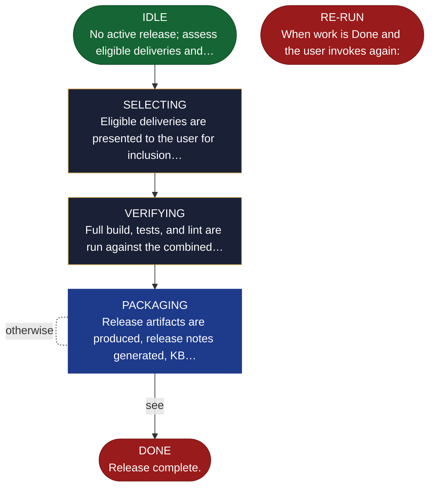

<!-- generated — do not edit; source: canonical/skills/aid-deploy/SKILL.md -->

## Frontmatter

- **`name`** — aid-deploy
- **`description`** — Package completed deliveries into a release. Selects eligible deliveries, verifies the combined build, packages according to project infrastructure, generates release notes, and updates artifact statuses. Use when deliveries are complete and ready to ship. State machine: IDLE → SELECTING → VERIFYING → PACKAGING → DONE.
- **`allowed-tools`** — Read, Glob, Grep, Bash, Write

[Definition: `canonical/skills/aid-deploy/SKILL.md`](https://github.com/AndreVianna/aid-methodology/blob/master/canonical/skills/aid-deploy/SKILL.md)

## Flow

