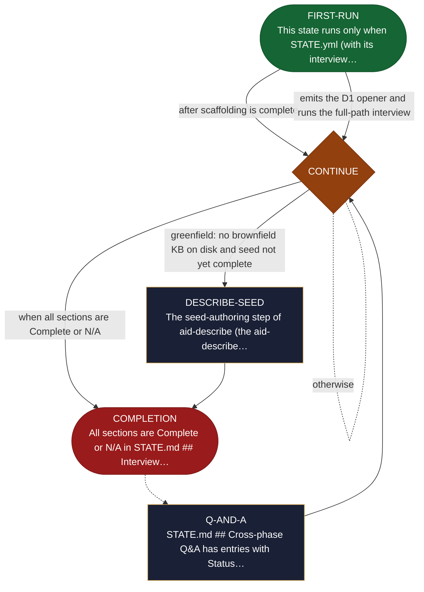

<!-- generated — do not edit; source: canonical/skills/aid-describe/SKILL.md -->

## Frontmatter

- **`name`** — aid-describe
- **`description`** — Gather requirements through an adaptive interview and write them to REQUIREMENTS.md. Use this skill when you know roughly what you want built but the scope, the users, and the acceptance criteria are not yet pinned down. It asks one question at a time, each chosen by a seasoned-analyst elicitation engine that picks its next move from the gaps in what you have said so far. The first run builds the document incrementally; a later run resumes wherever it is still incomplete. It ends by presenting the finished requirements for your approval and handing off to /aid-define.
- **`allowed-tools`** — Read, Glob, Grep, Bash, Write, Edit
- **`argument-hint`** — [work-001] resume work  [--reset work-001] clear and restart

[Definition: `canonical/skills/aid-describe/SKILL.md`](https://github.com/AndreVianna/aid-methodology/blob/master/canonical/skills/aid-describe/SKILL.md)

## Flow

## Source fragments

Every node in the chart above, in chart order, with the exact `canonical/` text it was derived from.

**1 · `FIRST-RUN`** — This state runs only when STATE.yml (with its interview… · _entry_

~~~~plaintext title="canonical/skills/aid-describe/SKILL.md#L274" wrap
| FIRST-RUN | `references/state-first-run.md` | `aid-interviewer` | → CONTINUE |
~~~~

[Source: `canonical/skills/aid-describe/SKILL.md#L274`](https://github.com/AndreVianna/aid-methodology/blob/master/canonical/skills/aid-describe/SKILL.md#L274) · [full step: `canonical/skills/aid-describe/references/state-first-run.md#L1-L111`](https://github.com/AndreVianna/aid-methodology/blob/master/canonical/skills/aid-describe/references/state-first-run.md#L1-L111)

**2 · `Q-AND-A`** — STATE.md ## Cross-phase Q&amp;A has entries with Status… · _step_

~~~~plaintext title="canonical/skills/aid-describe/SKILL.md#L275" wrap
| Q-AND-A | `references/state-q-and-a.md` | `aid-interviewer` | → CONTINUE |
~~~~

[Source: `canonical/skills/aid-describe/SKILL.md#L275`](https://github.com/AndreVianna/aid-methodology/blob/master/canonical/skills/aid-describe/SKILL.md#L275) · [full step: `canonical/skills/aid-describe/references/state-q-and-a.md#L1-L65`](https://github.com/AndreVianna/aid-methodology/blob/master/canonical/skills/aid-describe/references/state-q-and-a.md#L1-L65)

**3 · `CONTINUE`** — Resume the conversational interview; STATE.yml's… · _decision_

~~~~plaintext title="canonical/skills/aid-describe/SKILL.md#L276" wrap
| CONTINUE | `references/state-continue.md` | `aid-interviewer` | → DESCRIBE-SEED (greenfield: no brownfield KB on disk and seed not yet complete) / → COMPLETION (brownfield or seed already complete) |
~~~~

[Source: `canonical/skills/aid-describe/SKILL.md#L276`](https://github.com/AndreVianna/aid-methodology/blob/master/canonical/skills/aid-describe/SKILL.md#L276) · [full step: `canonical/skills/aid-describe/references/state-continue.md#L1-L44`](https://github.com/AndreVianna/aid-methodology/blob/master/canonical/skills/aid-describe/references/state-continue.md#L1-L44)

**4 · `DESCRIBE-SEED`** — The seed-authoring step of aid-describe (the aid-describe… · _step_

~~~~plaintext title="canonical/skills/aid-describe/SKILL.md#L277" wrap
| DESCRIBE-SEED | `references/state-describe-seed.md` | `aid-interviewer` | → COMPLETION |
~~~~

[Source: `canonical/skills/aid-describe/SKILL.md#L277`](https://github.com/AndreVianna/aid-methodology/blob/master/canonical/skills/aid-describe/SKILL.md#L277) · [full step: `canonical/skills/aid-describe/references/state-describe-seed.md#L1-L527`](https://github.com/AndreVianna/aid-methodology/blob/master/canonical/skills/aid-describe/references/state-describe-seed.md#L1-L527)

**5 · `COMPLETION`** — All sections are Complete or N/A in STATE.md ## Interview… · _exit_ · PAUSE-FOR-USER-DECISION

~~~~plaintext title="canonical/skills/aid-describe/SKILL.md#L278" wrap
| COMPLETION | `references/state-completion.md` | `aid-interviewer` | PAUSE-FOR-USER-DECISION → Run /aid-define {work} |
~~~~

[Source: `canonical/skills/aid-describe/SKILL.md#L278`](https://github.com/AndreVianna/aid-methodology/blob/master/canonical/skills/aid-describe/SKILL.md#L278) · [full step: `canonical/skills/aid-describe/references/state-completion.md#L1-L140`](https://github.com/AndreVianna/aid-methodology/blob/master/canonical/skills/aid-describe/references/state-completion.md#L1-L140)
