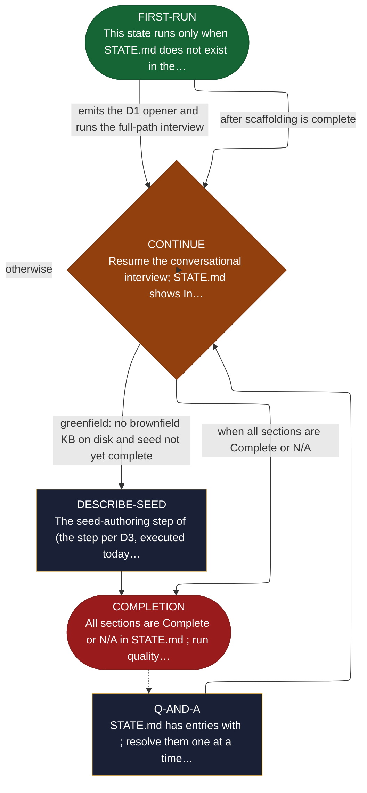

<!-- generated — do not edit; source: canonical/skills/aid-describe/SKILL.md -->

## Frontmatter

- **`name`** — aid-describe
- **`description`** — Conversational requirements gathering through adaptive interview, driven by the seasoned-analyst elicitation engine (references/elicitation-engine.md): one fixed D1 opener plus a deterministic five-step next-move selector (stop check, gap selection, move selection, calibration shaping, NFR-7 envelope + emit). First run builds REQUIREMENTS.md incrementally. Subsequent runs resume the interview for incomplete sections. Final step presents approved requirements for handoff to /aid-define. State machine: FIRST-RUN -> Q-AND-A -> CONTINUE -> {greenfield: DESCRIBE-SEED ->} COMPLETION [PAUSE -> /aid-define].
- **`allowed-tools`** — Read, Glob, Grep, Bash, Write, Edit
- **`argument-hint`** — [work-001] resume work  [--reset work-001] clear and restart

[Definition: `canonical/skills/aid-describe/SKILL.md`](https://github.com/AndreVianna/aid-methodology/blob/master/canonical/skills/aid-describe/SKILL.md)

## Flow

