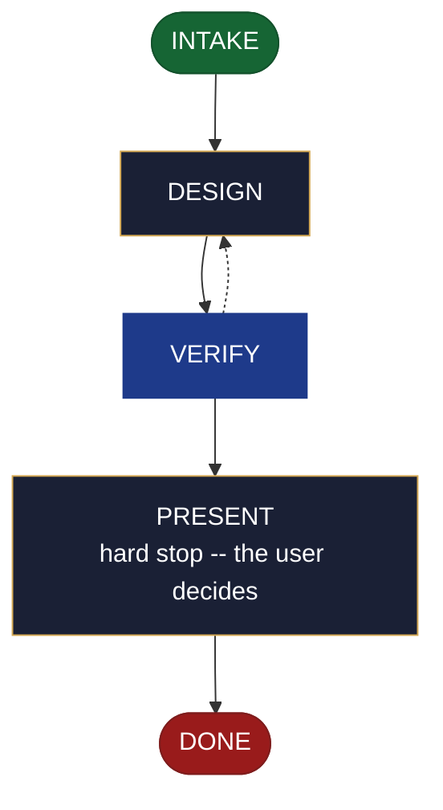

<!-- generated — do not edit; source: canonical/skills/aid-design-api/SKILL.md -->

## Frontmatter

- **`name`** — aid-design-api
- **`description`** — Develop an API design as a DESIGN SEED in `.aid/design/api.md` -- the resource shape, the request/response contract, and the error model. Use this skill when an endpoint's shape is still being worked out and you want the contract settled before anyone writes the handler. Grounded in the Knowledge Base (`.aid/knowledge/`) and the project source. It WRITES NO production code and NO KB document -- realize the seed into the built endpoint with `/aid-create-api` once it is ready. Produced by the aid-architect agent and independently verified by aid-reviewer (full verify). Allocates a work-NNN folder.
- **`allowed-tools`** — Read, Glob, Grep, Bash, Write, Edit, Agent
- **`argument-hint`** — &lt;subject> -- the API to design (resource shape, contract, error model)

[Definition: `canonical/skills/aid-design-api/SKILL.md`](https://github.com/AndreVianna/aid-methodology/blob/master/canonical/skills/aid-design-api/SKILL.md)

## Flow

## Source fragments

Every node in the chart above, in chart order, with the exact `canonical/` text it was derived from.

**1 · `INTAKE`** · _entry_

~~~~plaintext title="canonical/skills/aid-design-api/SKILL.md#L34-L43" wrap
## State: INTAKE

1. **Require a subject.** Empty argument -> ask one bootstrapping question ("What API do
   you want to design -- its resources, contract, and error model?") and wait.
2. **Allocate** through the Work Initiation Gate exactly as the contract's Allocation rule
   requires (`canonical/skills/aid-design/SKILL.md` INTAKE step 4 is the shape), with
   `initiator: aid-design-api`. `phase` is not driven.
3. **Acquire `.aid/design/`** per the contract, then read `.aid/design/api.md` if a prior
   seed exists -- re-invocation iterates it rather than starting over.
4. **Classify complexity** for the `aid-architect` dispatch (verifier tier >= producer).
~~~~

[Source: `canonical/skills/aid-design-api/SKILL.md#L34-L43`](https://github.com/AndreVianna/aid-methodology/blob/master/canonical/skills/aid-design-api/SKILL.md#L34-L43) · [full step: `canonical/skills/aid-design-api/SKILL.md#L34-L45`](https://github.com/AndreVianna/aid-methodology/blob/master/canonical/skills/aid-design-api/SKILL.md#L34-L45)

**2 · `DESIGN`** · _step_

~~~~plaintext title="canonical/skills/aid-design-api/SKILL.md#L49-L57" wrap
## State: DESIGN

Dispatch **`aid-architect`** (clean context, tiered) to write or iterate
`.aid/design/api.md` in the seed shape the contract fixes (`design-seed.md`;
feature-002 §4), grounded in `.aid/knowledge/` and the project source plus any seed read
in INTAKE. What this artifact's seed must settle: **the resource shape, the
request/response contract, and the error model**; its `## Destination` names where the
built endpoint lands. **Never writes `.aid/knowledge/` and never writes production code**
-- the `design` invariant (`design-lifecycle.md`).
~~~~

[Source: `canonical/skills/aid-design-api/SKILL.md#L49-L57`](https://github.com/AndreVianna/aid-methodology/blob/master/canonical/skills/aid-design-api/SKILL.md#L49-L57) · [full step: `canonical/skills/aid-design-api/SKILL.md#L49-L59`](https://github.com/AndreVianna/aid-methodology/blob/master/canonical/skills/aid-design-api/SKILL.md#L49-L59)

**3 · `VERIFY`** · _loop-back_

~~~~plaintext title="canonical/skills/aid-design-api/SKILL.md#L63-L66" wrap
## State: VERIFY

**Full verify**, as `design-lifecycle.md` defines it. Not clean -> loop to DESIGN; the
3-cycle circuit breaker there escalates to IMPEDIMENT + `lifecycle: Blocked`.
~~~~

[Source: `canonical/skills/aid-design-api/SKILL.md#L63-L66`](https://github.com/AndreVianna/aid-methodology/blob/master/canonical/skills/aid-design-api/SKILL.md#L63-L66) · [full step: `canonical/skills/aid-design-api/SKILL.md#L63-L68`](https://github.com/AndreVianna/aid-methodology/blob/master/canonical/skills/aid-design-api/SKILL.md#L63-L68)

**4 · `PRESENT`** — hard stop -- the user decides · _step_

~~~~plaintext title="canonical/skills/aid-design-api/SKILL.md#L72-L75" wrap
## State: PRESENT (hard stop -- the user decides)

Set `lifecycle: Paused-Awaiting-Input`. Present the seed clearly. Assert no resolution --
the user iterates (re-invoke this skill) or realizes it now (`/aid-create-api`).
~~~~

[Source: `canonical/skills/aid-design-api/SKILL.md#L72-L75`](https://github.com/AndreVianna/aid-methodology/blob/master/canonical/skills/aid-design-api/SKILL.md#L72-L75) · [full step: `canonical/skills/aid-design-api/SKILL.md#L72-L77`](https://github.com/AndreVianna/aid-methodology/blob/master/canonical/skills/aid-design-api/SKILL.md#L72-L77)

**5 · `DONE`** · _exit_ · UNSPECIFIED

~~~~plaintext title="canonical/skills/aid-design-api/SKILL.md#L81-L84" wrap
## State: DONE

Set `lifecycle: Completed`, `updated` now, append a `## Lifecycle History` row. The seed
persists at `.aid/design/api.md`; consumption happens at `/aid-create-api`.
~~~~

[Source: `canonical/skills/aid-design-api/SKILL.md#L81-L84`](https://github.com/AndreVianna/aid-methodology/blob/master/canonical/skills/aid-design-api/SKILL.md#L81-L84) · [full step: `canonical/skills/aid-design-api/SKILL.md#L81-L84`](https://github.com/AndreVianna/aid-methodology/blob/master/canonical/skills/aid-design-api/SKILL.md#L81-L84)
