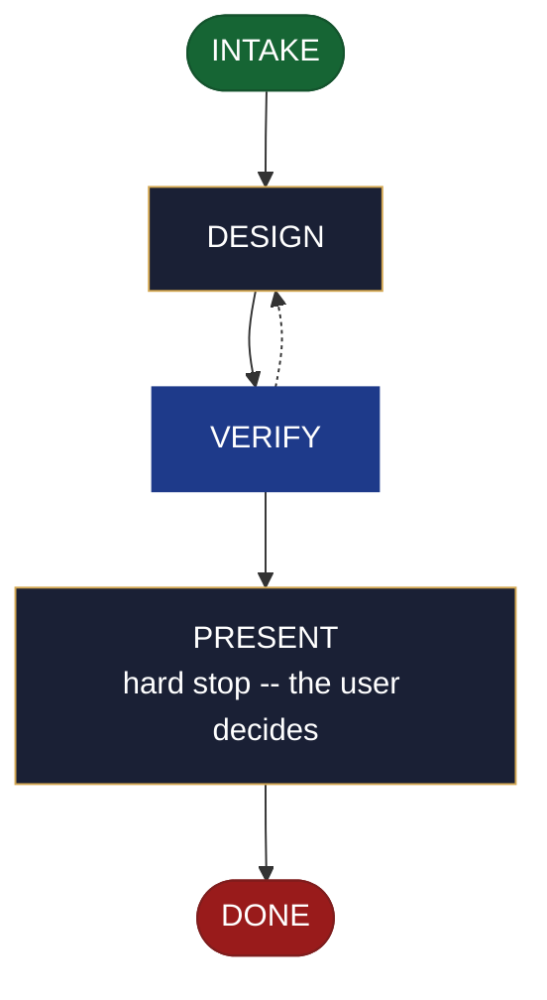

<!-- generated — do not edit; source: canonical/skills/aid-design-backlog/SKILL.md -->

## Frontmatter

- **`name`** — aid-design-backlog
- **`description`** — Develop the defined-and-prioritized item set as a DESIGN SEED in .aid/design/backlog.md -- item definitions, done-conditions, priorities, and which tech-debt.md rows the user is accepting into the plan. Use this skill when what belongs in the backlog is still being decided, and you want that thinking captured as a seed before the document is written. Grounded in the Knowledge Base (.aid/knowledge/, including tech-debt.md) and the project source. It WRITES NO KB DOCUMENT and NO production code -- realize the seed into backlog.md with /aid-create-backlog once it is ready. For direction rather than items, use /aid-design-roadmap instead. Produced by the aid-architect agent and independently verified by aid-reviewer (full verify). Allocates a work-NNN folder.
- **`allowed-tools`** — Read, Glob, Grep, Bash, Write, Edit, Agent
- **`argument-hint`** — &lt;items> -- the items to define and prioritize, and any tech-debt.md rows to accept

[Definition: `canonical/skills/aid-design-backlog/SKILL.md`](https://github.com/AndreVianna/aid-methodology/blob/master/canonical/skills/aid-design-backlog/SKILL.md)

## Flow

## Source fragments

Every node in the chart above, in chart order, with the exact `canonical/` text it was derived from.

**1 · `INTAKE`** · _entry_

~~~~plaintext title="canonical/skills/aid-design-backlog/SKILL.md#L41-L55" wrap
## State: INTAKE

1. **Require a subject.** Empty argument -> ask one bootstrapping question ("What items do
   you want to define and prioritize, and are there `tech-debt.md` rows you're ready to
   accept into the plan?") and wait.
2. **Allocate, exactly per `design-lifecycle.md § Skill shape -- Allocation`** -- the Work
   Initiation Gate, then `initiator: aid-design-backlog`, `active_skill:
   aid-design-backlog`, `pipeline.path: lite`, `lifecycle: Running`. `phase` is not
   driven.
3. **Acquire `.aid/design/`.** Per `design-lifecycle.md § Before writing a seed` -- ensure
   the folder exists and seed its `README.md` on first use, before writing anything.
4. **Read the existing seed, if one is present.** `.aid/design/backlog.md` --
   re-invocation iterates the same seed rather than starting over.
5. **Classify complexity (model + effort)** for the `aid-architect` dispatch below;
   verifier tier >= producer tier (`agent-dispatch-tiering.md`).
~~~~

[Source: `canonical/skills/aid-design-backlog/SKILL.md#L41-L55`](https://github.com/AndreVianna/aid-methodology/blob/master/canonical/skills/aid-design-backlog/SKILL.md#L41-L55) · [full step: `canonical/skills/aid-design-backlog/SKILL.md#L41-L57`](https://github.com/AndreVianna/aid-methodology/blob/master/canonical/skills/aid-design-backlog/SKILL.md#L41-L57)

**2 · `DESIGN`** · _step_

~~~~plaintext title="canonical/skills/aid-design-backlog/SKILL.md#L61-L67" wrap
## State: DESIGN

Dispatch **`aid-architect`** (clean context, tiered) to develop or iterate the seed,
grounded in `.aid/knowledge/` (including `tech-debt.md`'s open inventory) and the project
source, plus the seed read in INTAKE if one exists. Draws out: **item definitions,
done-conditions and priorities; which `tech-debt.md` rows the user is accepting into the
plan.**
~~~~

[Source: `canonical/skills/aid-design-backlog/SKILL.md#L61-L67`](https://github.com/AndreVianna/aid-methodology/blob/master/canonical/skills/aid-design-backlog/SKILL.md#L61-L67) · [full step: `canonical/skills/aid-design-backlog/SKILL.md#L61-L76`](https://github.com/AndreVianna/aid-methodology/blob/master/canonical/skills/aid-design-backlog/SKILL.md#L61-L76)

**3 · `VERIFY`** · _loop-back_

~~~~plaintext title="canonical/skills/aid-design-backlog/SKILL.md#L80-L84" wrap
## State: VERIFY

**Full verify** -- exactly as `design-lifecycle.md § Skill shape -- "Full verify"`
defines it. Not clean -> loop to DESIGN; the circuit-breaker there governs escalation to
IMPEDIMENT + `lifecycle: Blocked`.
~~~~

[Source: `canonical/skills/aid-design-backlog/SKILL.md#L80-L84`](https://github.com/AndreVianna/aid-methodology/blob/master/canonical/skills/aid-design-backlog/SKILL.md#L80-L84) · [full step: `canonical/skills/aid-design-backlog/SKILL.md#L80-L86`](https://github.com/AndreVianna/aid-methodology/blob/master/canonical/skills/aid-design-backlog/SKILL.md#L80-L86)

**4 · `PRESENT`** — hard stop -- the user decides · _step_

~~~~plaintext title="canonical/skills/aid-design-backlog/SKILL.md#L90-L94" wrap
## State: PRESENT (hard stop -- the user decides)

Set `lifecycle: Paused-Awaiting-Input`. Present the seed clearly. Assert no resolution --
the user decides whether to iterate further (re-invoke this skill) or realize it now
(`/aid-create-backlog`).
~~~~

[Source: `canonical/skills/aid-design-backlog/SKILL.md#L90-L94`](https://github.com/AndreVianna/aid-methodology/blob/master/canonical/skills/aid-design-backlog/SKILL.md#L90-L94) · [full step: `canonical/skills/aid-design-backlog/SKILL.md#L90-L96`](https://github.com/AndreVianna/aid-methodology/blob/master/canonical/skills/aid-design-backlog/SKILL.md#L90-L96)

**5 · `DONE`** · _exit_ · UNSPECIFIED

~~~~plaintext title="canonical/skills/aid-design-backlog/SKILL.md#L100-L104" wrap
## State: DONE

Set `lifecycle: Completed`, `updated` now, append a `## Lifecycle History` row. The seed
stays at `.aid/design/backlog.md` -- consumption happens at `/aid-create-backlog`, not
here.
~~~~

[Source: `canonical/skills/aid-design-backlog/SKILL.md#L100-L104`](https://github.com/AndreVianna/aid-methodology/blob/master/canonical/skills/aid-design-backlog/SKILL.md#L100-L104) · [full step: `canonical/skills/aid-design-backlog/SKILL.md#L100-L104`](https://github.com/AndreVianna/aid-methodology/blob/master/canonical/skills/aid-design-backlog/SKILL.md#L100-L104)
