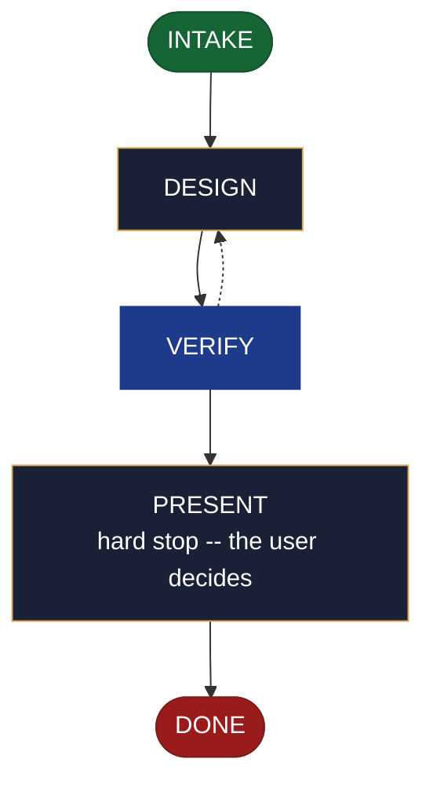

<!-- generated — do not edit; source: canonical/skills/aid-design-cicd/SKILL.md -->

## Frontmatter

- **`name`** — aid-design-cicd
- **`description`** — Develop the delivery pipeline as a DESIGN SEED in `.aid/design/cicd.md` -- stages, triggers, environments, promotion, and release flow. Use this skill when how the project should be built, gated and shipped is still being worked out. Grounded in the Knowledge Base (`.aid/knowledge/`) and the project source. It WRITES NO KB document, NO production code, and NO workflow file -- realize the seed into the project's C8 document with `/aid-create-cicd` once it is ready. To design a resource the pipeline ships to, use `/aid-design-infra`; to design a data pipeline rather than a delivery one, use `/aid-design-data-pipeline`; to ship a built artifact now, use `/aid-deploy`. Produced by the aid-architect agent and independently verified by aid-reviewer (full verify). Allocates a work-NNN folder.
- **`allowed-tools`** — Read, Glob, Grep, Bash, Write, Edit, Agent
- **`argument-hint`** — &lt;subject> -- the delivery pipeline to design (stages, triggers, environments, promotion)

[Definition: `canonical/skills/aid-design-cicd/SKILL.md`](https://github.com/AndreVianna/aid-methodology/blob/master/canonical/skills/aid-design-cicd/SKILL.md)

## Flow

## Source fragments

Every node in the chart above, in chart order, with the exact `canonical/` text it was derived from.

**1 · `INTAKE`** · _entry_

~~~~plaintext title="canonical/skills/aid-design-cicd/SKILL.md#L39-L49" wrap
## State: INTAKE

1. **Require a subject.** Empty argument -> ask one bootstrapping question ("What delivery
   pipeline do you want to design -- its stages, triggers, environments, and promotion
   flow?") and wait.
2. **Allocate** through the Work Initiation Gate exactly as the contract's Allocation rule
   requires (`canonical/skills/aid-design/SKILL.md` INTAKE step 4 is the shape), with
   `initiator: aid-design-cicd`. `phase` is not driven.
3. **Acquire `.aid/design/`** per the contract, then read `.aid/design/cicd.md` if a prior
   seed exists -- re-invocation iterates it rather than starting over.
4. **Classify complexity** for the `aid-architect` dispatch (verifier tier >= producer).
~~~~

[Source: `canonical/skills/aid-design-cicd/SKILL.md#L39-L49`](https://github.com/AndreVianna/aid-methodology/blob/master/canonical/skills/aid-design-cicd/SKILL.md#L39-L49) · [full step: `canonical/skills/aid-design-cicd/SKILL.md#L39-L51`](https://github.com/AndreVianna/aid-methodology/blob/master/canonical/skills/aid-design-cicd/SKILL.md#L39-L51)

**2 · `DESIGN`** · _step_

~~~~plaintext title="canonical/skills/aid-design-cicd/SKILL.md#L55-L61" wrap
## State: DESIGN

Dispatch **`aid-architect`** (clean context, tiered) to write or iterate
`.aid/design/cicd.md` in the seed shape the contract fixes (`design-seed.md`;
feature-002 §4), grounded in `.aid/knowledge/` and the project source plus any seed read
in INTAKE. What this artifact's seed must settle: **the pipeline stages, triggers,
environments, and promotion and release flow**.
~~~~

[Source: `canonical/skills/aid-design-cicd/SKILL.md#L55-L61`](https://github.com/AndreVianna/aid-methodology/blob/master/canonical/skills/aid-design-cicd/SKILL.md#L55-L61) · [full step: `canonical/skills/aid-design-cicd/SKILL.md#L55-L75`](https://github.com/AndreVianna/aid-methodology/blob/master/canonical/skills/aid-design-cicd/SKILL.md#L55-L75)

**3 · `VERIFY`** · _loop-back_

~~~~plaintext title="canonical/skills/aid-design-cicd/SKILL.md#L79-L82" wrap
## State: VERIFY

**Full verify**, as `design-lifecycle.md` defines it. Not clean -> loop to DESIGN; the
3-cycle circuit breaker there escalates to IMPEDIMENT + `lifecycle: Blocked`.
~~~~

[Source: `canonical/skills/aid-design-cicd/SKILL.md#L79-L82`](https://github.com/AndreVianna/aid-methodology/blob/master/canonical/skills/aid-design-cicd/SKILL.md#L79-L82) · [full step: `canonical/skills/aid-design-cicd/SKILL.md#L79-L84`](https://github.com/AndreVianna/aid-methodology/blob/master/canonical/skills/aid-design-cicd/SKILL.md#L79-L84)

**4 · `PRESENT`** — hard stop -- the user decides · _step_

~~~~plaintext title="canonical/skills/aid-design-cicd/SKILL.md#L88-L91" wrap
## State: PRESENT (hard stop -- the user decides)

Set `lifecycle: Paused-Awaiting-Input`. Present the seed clearly. Assert no resolution --
the user iterates (re-invoke this skill) or realizes it now (`/aid-create-cicd`).
~~~~

[Source: `canonical/skills/aid-design-cicd/SKILL.md#L88-L91`](https://github.com/AndreVianna/aid-methodology/blob/master/canonical/skills/aid-design-cicd/SKILL.md#L88-L91) · [full step: `canonical/skills/aid-design-cicd/SKILL.md#L88-L93`](https://github.com/AndreVianna/aid-methodology/blob/master/canonical/skills/aid-design-cicd/SKILL.md#L88-L93)

**5 · `DONE`** · _exit_ · UNSPECIFIED

~~~~plaintext title="canonical/skills/aid-design-cicd/SKILL.md#L97-L100" wrap
## State: DONE

Set `lifecycle: Completed`, `updated` now, append a `## Lifecycle History` row. The seed
persists at `.aid/design/cicd.md`; consumption happens at `/aid-create-cicd`.
~~~~

[Source: `canonical/skills/aid-design-cicd/SKILL.md#L97-L100`](https://github.com/AndreVianna/aid-methodology/blob/master/canonical/skills/aid-design-cicd/SKILL.md#L97-L100) · [full step: `canonical/skills/aid-design-cicd/SKILL.md#L97-L100`](https://github.com/AndreVianna/aid-methodology/blob/master/canonical/skills/aid-design-cicd/SKILL.md#L97-L100)
