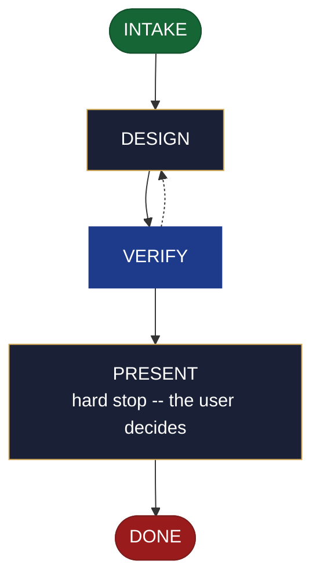

<!-- generated — do not edit; source: canonical/skills/aid-design-roadmap/SKILL.md -->

## Frontmatter

- **`name`** — aid-design-roadmap
- **`description`** — Develop the project's committed direction as a DESIGN SEED in .aid/design/roadmap.md -- what is committed vs. merely wanted, the sequencing rationale, and the alternatives being rejected and why. Use this skill when the direction for the coming horizons is still being argued out, and you want it settled as a seed before it becomes the roadmap. Grounded in the Knowledge Base (.aid/knowledge/) and the project source. It WRITES NO KB DOCUMENT and NO production code -- realize the seed into roadmap.md with /aid-create-roadmap once it is ready. For drawing the MVP line as its own act, use /aid-design-mvp instead. Produced by the aid-architect agent and independently verified by aid-reviewer (full verify). Allocates a work-NNN folder.
- **`allowed-tools`** — Read, Glob, Grep, Bash, Write, Edit, Agent
- **`argument-hint`** — &lt;direction> -- what to develop (committed vs. wanted, sequencing, rejected alternatives)

[Definition: `canonical/skills/aid-design-roadmap/SKILL.md`](https://github.com/AndreVianna/aid-methodology/blob/master/canonical/skills/aid-design-roadmap/SKILL.md)

## Flow

## Source fragments

Every node in the chart above, in chart order, with the exact `canonical/` text it was derived from.

**1 · `INTAKE`** · _entry_

~~~~plaintext title="canonical/skills/aid-design-roadmap/SKILL.md#L39-L53" wrap
## State: INTAKE

1. **Require a subject.** Empty argument -> ask one bootstrapping question ("What
   direction do you want to develop -- what's committed, what's merely wanted, and why?")
   and wait.
2. **Allocate, exactly per `design-lifecycle.md § Skill shape -- Allocation`** -- the Work
   Initiation Gate, then `initiator: aid-design-roadmap`, `active_skill:
   aid-design-roadmap`, `pipeline.path: lite`, `lifecycle: Running`. `phase` is not
   driven.
3. **Acquire `.aid/design/`.** Per `design-lifecycle.md § Before writing a seed` -- ensure
   the folder exists and seed its `README.md` on first use, before writing anything.
4. **Read the existing seed, if one is present.** `.aid/design/roadmap.md` --
   re-invocation iterates the same seed rather than starting over.
5. **Classify complexity (model + effort)** for the `aid-architect` dispatch below;
   verifier tier >= producer tier (`agent-dispatch-tiering.md`).
~~~~

[Source: `canonical/skills/aid-design-roadmap/SKILL.md#L39-L53`](https://github.com/AndreVianna/aid-methodology/blob/master/canonical/skills/aid-design-roadmap/SKILL.md#L39-L53) · [full step: `canonical/skills/aid-design-roadmap/SKILL.md#L39-L55`](https://github.com/AndreVianna/aid-methodology/blob/master/canonical/skills/aid-design-roadmap/SKILL.md#L39-L55)

**2 · `DESIGN`** · _step_

~~~~plaintext title="canonical/skills/aid-design-roadmap/SKILL.md#L59-L64" wrap
## State: DESIGN

Dispatch **`aid-architect`** (clean context, tiered) to develop or iterate the seed,
grounded in `.aid/knowledge/` and the project source, plus the seed read in INTAKE if one
exists. Draws out: **direction and its *why*; what is committed vs. merely wanted;
sequencing rationale; the alternatives being rejected and why.**
~~~~

[Source: `canonical/skills/aid-design-roadmap/SKILL.md#L59-L64`](https://github.com/AndreVianna/aid-methodology/blob/master/canonical/skills/aid-design-roadmap/SKILL.md#L59-L64) · [full step: `canonical/skills/aid-design-roadmap/SKILL.md#L59-L71`](https://github.com/AndreVianna/aid-methodology/blob/master/canonical/skills/aid-design-roadmap/SKILL.md#L59-L71)

**3 · `VERIFY`** · _loop-back_

~~~~plaintext title="canonical/skills/aid-design-roadmap/SKILL.md#L75-L79" wrap
## State: VERIFY

**Full verify** -- exactly as `design-lifecycle.md § Skill shape -- "Full verify"`
defines it. Not clean -> loop to DESIGN; the circuit-breaker there governs escalation to
IMPEDIMENT + `lifecycle: Blocked`.
~~~~

[Source: `canonical/skills/aid-design-roadmap/SKILL.md#L75-L79`](https://github.com/AndreVianna/aid-methodology/blob/master/canonical/skills/aid-design-roadmap/SKILL.md#L75-L79) · [full step: `canonical/skills/aid-design-roadmap/SKILL.md#L75-L81`](https://github.com/AndreVianna/aid-methodology/blob/master/canonical/skills/aid-design-roadmap/SKILL.md#L75-L81)

**4 · `PRESENT`** — hard stop -- the user decides · _step_

~~~~plaintext title="canonical/skills/aid-design-roadmap/SKILL.md#L85-L89" wrap
## State: PRESENT (hard stop -- the user decides)

Set `lifecycle: Paused-Awaiting-Input`. Present the seed clearly. Assert no resolution --
the user decides whether to iterate further (re-invoke this skill) or realize it now
(`/aid-create-roadmap`).
~~~~

[Source: `canonical/skills/aid-design-roadmap/SKILL.md#L85-L89`](https://github.com/AndreVianna/aid-methodology/blob/master/canonical/skills/aid-design-roadmap/SKILL.md#L85-L89) · [full step: `canonical/skills/aid-design-roadmap/SKILL.md#L85-L91`](https://github.com/AndreVianna/aid-methodology/blob/master/canonical/skills/aid-design-roadmap/SKILL.md#L85-L91)

**5 · `DONE`** · _exit_ · UNSPECIFIED

~~~~plaintext title="canonical/skills/aid-design-roadmap/SKILL.md#L95-L99" wrap
## State: DONE

Set `lifecycle: Completed`, `updated` now, append a `## Lifecycle History` row. The seed
stays at `.aid/design/roadmap.md` -- consumption happens at `/aid-create-roadmap`, not
here.
~~~~

[Source: `canonical/skills/aid-design-roadmap/SKILL.md#L95-L99`](https://github.com/AndreVianna/aid-methodology/blob/master/canonical/skills/aid-design-roadmap/SKILL.md#L95-L99) · [full step: `canonical/skills/aid-design-roadmap/SKILL.md#L95-L99`](https://github.com/AndreVianna/aid-methodology/blob/master/canonical/skills/aid-design-roadmap/SKILL.md#L95-L99)
