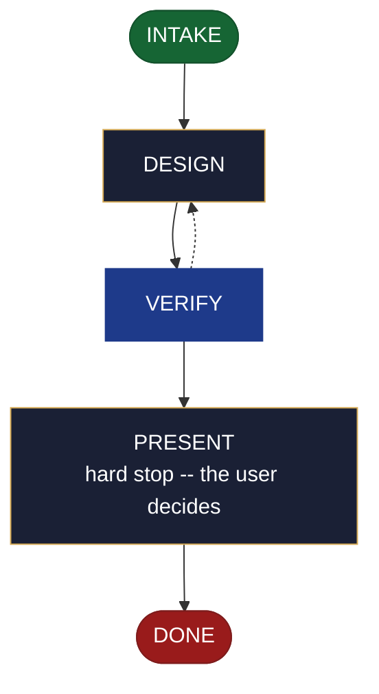

<!-- generated — do not edit; source: canonical/skills/aid-design-stack/SKILL.md -->

## Frontmatter

- **`name`** — aid-design-stack
- **`description`** — Develop the technology choice as a DESIGN SEED in .aid/design/stack.md -- languages, runtimes, frameworks, and build and test tooling with versions, plus the alternatives rejected and why. Use this skill when which technologies to build on is still an open choice. Grounded in the Knowledge Base (.aid/knowledge/) and the project source. It WRITES NO KB document and NO production code -- realize the seed into the project's C0 document with /aid-create-stack once it is ready. To design a configuration option within a stack rather than choose the stack, use /aid-design-config; for an open question with a researchable answer, use /aid-research. Produced by the aid-architect agent and independently verified by aid-reviewer (full verify). Allocates a work-NNN folder.
- **`allowed-tools`** — Read, Glob, Grep, Bash, Write, Edit, Agent
- **`argument-hint`** — &lt;subject> -- the technology stack to design (languages, runtimes, frameworks, tooling with versions)

[Definition: `canonical/skills/aid-design-stack/SKILL.md`](https://github.com/AndreVianna/aid-methodology/blob/master/canonical/skills/aid-design-stack/SKILL.md)

## Flow

## Source fragments

Every node in the chart above, in chart order, with the exact `canonical/` text it was derived from.

**1 · `INTAKE`** · _entry_

~~~~plaintext title="canonical/skills/aid-design-stack/SKILL.md#L38-L48" wrap
## State: INTAKE

1. **Require a subject.** Empty argument -> ask one bootstrapping question ("What technology
   stack do you want to design -- its languages, runtimes, frameworks, and tooling?") and
   wait.
2. **Allocate** through the Work Initiation Gate exactly as the contract's Allocation rule
   requires (`canonical/skills/aid-design/SKILL.md` INTAKE step 4 is the shape), with
   `initiator: aid-design-stack`. `phase` is not driven.
3. **Acquire `.aid/design/`** per the contract, then read `.aid/design/stack.md` if a prior
   seed exists -- re-invocation iterates it rather than starting over.
4. **Classify complexity** for the `aid-architect` dispatch (verifier tier >= producer).
~~~~

[Source: `canonical/skills/aid-design-stack/SKILL.md#L38-L48`](https://github.com/AndreVianna/aid-methodology/blob/master/canonical/skills/aid-design-stack/SKILL.md#L38-L48) · [full step: `canonical/skills/aid-design-stack/SKILL.md#L38-L50`](https://github.com/AndreVianna/aid-methodology/blob/master/canonical/skills/aid-design-stack/SKILL.md#L38-L50)

**2 · `DESIGN`** · _step_

~~~~plaintext title="canonical/skills/aid-design-stack/SKILL.md#L54-L60" wrap
## State: DESIGN

Dispatch **`aid-architect`** (clean context, tiered) to write or iterate
`.aid/design/stack.md` in the seed shape the contract fixes (`design-seed.md`;
feature-002 §4), grounded in `.aid/knowledge/` and the project source plus any seed read
in INTAKE. What this artifact's seed must settle: **the languages, runtimes, frameworks and
build/test tooling WITH VERSIONS, plus the alternatives rejected and why**.
~~~~

[Source: `canonical/skills/aid-design-stack/SKILL.md#L54-L60`](https://github.com/AndreVianna/aid-methodology/blob/master/canonical/skills/aid-design-stack/SKILL.md#L54-L60) · [full step: `canonical/skills/aid-design-stack/SKILL.md#L54-L74`](https://github.com/AndreVianna/aid-methodology/blob/master/canonical/skills/aid-design-stack/SKILL.md#L54-L74)

**3 · `VERIFY`** · _loop-back_

~~~~plaintext title="canonical/skills/aid-design-stack/SKILL.md#L78-L81" wrap
## State: VERIFY

**Full verify**, as `design-lifecycle.md` defines it. Not clean -> loop to DESIGN; the
3-cycle circuit breaker there escalates to IMPEDIMENT + `lifecycle: Blocked`.
~~~~

[Source: `canonical/skills/aid-design-stack/SKILL.md#L78-L81`](https://github.com/AndreVianna/aid-methodology/blob/master/canonical/skills/aid-design-stack/SKILL.md#L78-L81) · [full step: `canonical/skills/aid-design-stack/SKILL.md#L78-L83`](https://github.com/AndreVianna/aid-methodology/blob/master/canonical/skills/aid-design-stack/SKILL.md#L78-L83)

**4 · `PRESENT`** — hard stop -- the user decides · _step_

~~~~plaintext title="canonical/skills/aid-design-stack/SKILL.md#L87-L90" wrap
## State: PRESENT (hard stop -- the user decides)

Set `lifecycle: Paused-Awaiting-Input`. Present the seed clearly. Assert no resolution --
the user iterates (re-invoke this skill) or realizes it now (`/aid-create-stack`).
~~~~

[Source: `canonical/skills/aid-design-stack/SKILL.md#L87-L90`](https://github.com/AndreVianna/aid-methodology/blob/master/canonical/skills/aid-design-stack/SKILL.md#L87-L90) · [full step: `canonical/skills/aid-design-stack/SKILL.md#L87-L92`](https://github.com/AndreVianna/aid-methodology/blob/master/canonical/skills/aid-design-stack/SKILL.md#L87-L92)

**5 · `DONE`** · _exit_ · UNSPECIFIED

~~~~plaintext title="canonical/skills/aid-design-stack/SKILL.md#L96-L99" wrap
## State: DONE

Set `lifecycle: Completed`, `updated` now, append a `## Lifecycle History` row. The seed
persists at `.aid/design/stack.md`; consumption happens at `/aid-create-stack`.
~~~~

[Source: `canonical/skills/aid-design-stack/SKILL.md#L96-L99`](https://github.com/AndreVianna/aid-methodology/blob/master/canonical/skills/aid-design-stack/SKILL.md#L96-L99) · [full step: `canonical/skills/aid-design-stack/SKILL.md#L96-L99`](https://github.com/AndreVianna/aid-methodology/blob/master/canonical/skills/aid-design-stack/SKILL.md#L96-L99)
