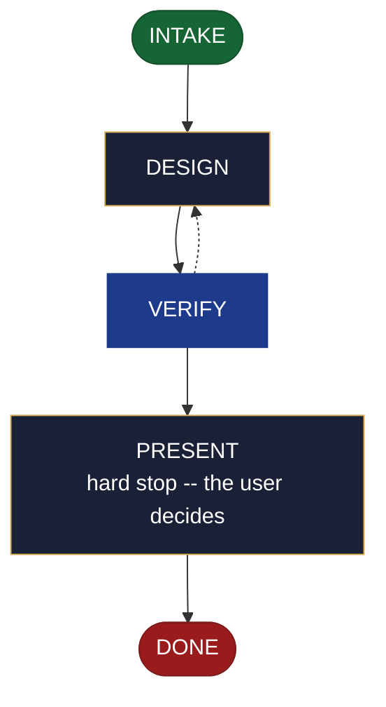

<!-- generated — do not edit; source: canonical/skills/aid-design-ui/SKILL.md -->

## Frontmatter

- **`name`** — aid-design-ui
- **`description`** — Develop a UI design as a DESIGN SEED in .aid/design/ui.md -- the screen/flow structure, the interaction model, and accessibility notes. Use this skill when a screen's layout and behaviour are still being worked out and you want a design you intend to keep. Grounded in the Knowledge Base (.aid/knowledge/) and the project source. It WRITES NO production code and NO KB document -- realize the seed into the built component/page with /aid-create-ui once it is ready. For a THROWAWAY low-fidelity mock that merely validates a UX direction rather than a kept design, use /aid-prototype-ui instead. Produced by the aid-architect agent and independently verified by aid-reviewer (full verify). Allocates a work-NNN folder.
- **`allowed-tools`** — Read, Glob, Grep, Bash, Write, Edit, Agent
- **`argument-hint`** — &lt;subject> -- the UI screen(s)/flow to design (structure, interaction, accessibility)

[Definition: `canonical/skills/aid-design-ui/SKILL.md`](https://github.com/AndreVianna/aid-methodology/blob/master/canonical/skills/aid-design-ui/SKILL.md)

## Flow

## Source fragments

Every node in the chart above, in chart order, with the exact `canonical/` text it was derived from.

**1 · `INTAKE`** · _entry_

~~~~plaintext title="canonical/skills/aid-design-ui/SKILL.md#L39-L48" wrap
## State: INTAKE

1. **Require a subject.** Empty argument -> ask one bootstrapping question ("What UI
   screen(s) or flow do you want to design, and what must it support?") and wait.
2. **Allocate** through the Work Initiation Gate exactly as the contract's Allocation rule
   requires (`canonical/skills/aid-design/SKILL.md` INTAKE step 4 is the shape), with
   `initiator: aid-design-ui`. `phase` is not driven.
3. **Acquire `.aid/design/`** per the contract, then read `.aid/design/ui.md` if a prior
   seed exists -- re-invocation iterates it rather than starting over.
4. **Classify complexity** for the `aid-architect` dispatch (verifier tier >= producer).
~~~~

[Source: `canonical/skills/aid-design-ui/SKILL.md#L39-L48`](https://github.com/AndreVianna/aid-methodology/blob/master/canonical/skills/aid-design-ui/SKILL.md#L39-L48) · [full step: `canonical/skills/aid-design-ui/SKILL.md#L39-L50`](https://github.com/AndreVianna/aid-methodology/blob/master/canonical/skills/aid-design-ui/SKILL.md#L39-L50)

**2 · `DESIGN`** · _step_

~~~~plaintext title="canonical/skills/aid-design-ui/SKILL.md#L54-L62" wrap
## State: DESIGN

Dispatch **`aid-architect`** (clean context, tiered) to write or iterate
`.aid/design/ui.md` in the seed shape the contract fixes (`design-seed.md`;
feature-002 §4), grounded in `.aid/knowledge/` and the project source plus any seed read
in INTAKE. What this artifact's seed must settle: **the screen and flow structure, the
interaction model, and accessibility notes**; its `## Destination` names where the built
component/page lands. **Never writes `.aid/knowledge/` and never writes production code**
-- the `design` invariant (`design-lifecycle.md`).
~~~~

[Source: `canonical/skills/aid-design-ui/SKILL.md#L54-L62`](https://github.com/AndreVianna/aid-methodology/blob/master/canonical/skills/aid-design-ui/SKILL.md#L54-L62) · [full step: `canonical/skills/aid-design-ui/SKILL.md#L54-L64`](https://github.com/AndreVianna/aid-methodology/blob/master/canonical/skills/aid-design-ui/SKILL.md#L54-L64)

**3 · `VERIFY`** · _loop-back_

~~~~plaintext title="canonical/skills/aid-design-ui/SKILL.md#L68-L71" wrap
## State: VERIFY

**Full verify**, as `design-lifecycle.md` defines it. Not clean -> loop to DESIGN; the
3-cycle circuit breaker there escalates to IMPEDIMENT + `lifecycle: Blocked`.
~~~~

[Source: `canonical/skills/aid-design-ui/SKILL.md#L68-L71`](https://github.com/AndreVianna/aid-methodology/blob/master/canonical/skills/aid-design-ui/SKILL.md#L68-L71) · [full step: `canonical/skills/aid-design-ui/SKILL.md#L68-L73`](https://github.com/AndreVianna/aid-methodology/blob/master/canonical/skills/aid-design-ui/SKILL.md#L68-L73)

**4 · `PRESENT`** — hard stop -- the user decides · _step_

~~~~plaintext title="canonical/skills/aid-design-ui/SKILL.md#L77-L80" wrap
## State: PRESENT (hard stop -- the user decides)

Set `lifecycle: Paused-Awaiting-Input`. Present the seed clearly. Assert no resolution --
the user iterates (re-invoke this skill) or realizes it now (`/aid-create-ui`).
~~~~

[Source: `canonical/skills/aid-design-ui/SKILL.md#L77-L80`](https://github.com/AndreVianna/aid-methodology/blob/master/canonical/skills/aid-design-ui/SKILL.md#L77-L80) · [full step: `canonical/skills/aid-design-ui/SKILL.md#L77-L82`](https://github.com/AndreVianna/aid-methodology/blob/master/canonical/skills/aid-design-ui/SKILL.md#L77-L82)

**5 · `DONE`** · _exit_ · UNSPECIFIED

~~~~plaintext title="canonical/skills/aid-design-ui/SKILL.md#L86-L89" wrap
## State: DONE

Set `lifecycle: Completed`, `updated` now, append a `## Lifecycle History` row. The seed
persists at `.aid/design/ui.md`; consumption happens at `/aid-create-ui`.
~~~~

[Source: `canonical/skills/aid-design-ui/SKILL.md#L86-L89`](https://github.com/AndreVianna/aid-methodology/blob/master/canonical/skills/aid-design-ui/SKILL.md#L86-L89) · [full step: `canonical/skills/aid-design-ui/SKILL.md#L86-L89`](https://github.com/AndreVianna/aid-methodology/blob/master/canonical/skills/aid-design-ui/SKILL.md#L86-L89)
