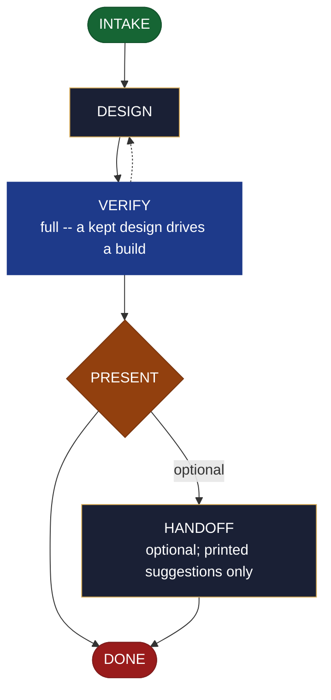

<!-- generated — do not edit; source: canonical/skills/aid-design/SKILL.md -->

## Frontmatter

- **`name`** — aid-design
- **`description`** — Produce a KEPT design artifact NOW -- a UX/interaction flow, a component or interface design, an architecture sketch, with accessibility notes -- meant to inform the real build. Single-shot; grounded in the Knowledge Base (.aid/knowledge/) and the project source (patterns, conventions, architecture). It RESOLVES NOTHING: it presents the design; you decide, and the build is a separate /aid-create* step. Produced by the aid-architect agent and independently verified by aid-reviewer (full verify -- a kept design drives a build, so its correctness matters). For a THROWAWAY model to merely validate a direction, use /aid-prototype instead. Allocates a work-NNN folder.
- **`allowed-tools`** — Read, Glob, Grep, Bash, Write, Edit, Agent
- **`argument-hint`** — &lt;subject> -- what to design (a flow, a component/interface, a UI, an architecture sketch)

[Definition: `canonical/skills/aid-design/SKILL.md`](https://github.com/AndreVianna/aid-methodology/blob/master/canonical/skills/aid-design/SKILL.md)

## Flow

## Source fragments

Every node in the chart above, in chart order, with the exact `canonical/` text it was derived from.

**1 · `INTAKE`** · _entry_

~~~~plaintext title="canonical/skills/aid-design/SKILL.md#L36-L54" wrap
## State: INTAKE

1. **Require a subject.** Empty argument -> ask one bootstrapping question ("What do you
   want designed, and what will it need to support?") and wait.
2. **Pick the path:** **Fast** -- a clear thing to design ("design the checkout flow",
   "design this service's interface") -> design now. **Guided** -- open-ended ("design our
   onboarding") -> scope the subject, constraints, and success criteria first.
3. **Classify complexity (model + effort):** simple (one component/flow) -> `aid-architect`
   at **sonnet / medium**; complex (a system architecture, a multi-screen flow) -> **opus /
   high**. Verifier tier >= producer tier.
4. **Consult the Work Initiation Gate, then allocate the work folder + STATE.** First run
   the gate (`canonical/aid/templates/work-initiation-gate.md`):
   `bash canonical/aid/scripts/works/enumerate-works.sh` (main tree + every git worktree).
   Empty -> allocate, no prompt. Works exist -> ask new-vs-continuation; on **continuation**
   route to the chosen work's resume door and STOP (allocate nothing); on **new work**:
   create and enter the worktree per the gate's `§ 3a` step 2
   (`worktree-lifecycle.sh create <work-id> <name>`, STOP on a non-zero exit or empty path,
   else enter the resolved path), **then** allocate (`pipeline.path: lite`, `initiator:
   aid-design`, `lifecycle: Running`, `active_skill: aid-design`; `phase` not driven).
~~~~

[Source: `canonical/skills/aid-design/SKILL.md#L36-L54`](https://github.com/AndreVianna/aid-methodology/blob/master/canonical/skills/aid-design/SKILL.md#L36-L54) · [full step: `canonical/skills/aid-design/SKILL.md#L36-L56`](https://github.com/AndreVianna/aid-methodology/blob/master/canonical/skills/aid-design/SKILL.md#L36-L56)

**2 · `DESIGN`** · _step_

~~~~plaintext title="canonical/skills/aid-design/SKILL.md#L60-L66" wrap
## State: DESIGN

Dispatch **`aid-architect`** (clean context, tiered) to produce the design, **grounded in
the KB** (existing patterns, conventions, `architecture.md`) + the request: variables/flow,
control/interaction, component or interface shape, and **accessibility notes**
(`task-type-rules.md ## DESIGN`). It writes `DESIGN.md` into the work folder (the design's
kept record).
~~~~

[Source: `canonical/skills/aid-design/SKILL.md#L60-L66`](https://github.com/AndreVianna/aid-methodology/blob/master/canonical/skills/aid-design/SKILL.md#L60-L66) · [full step: `canonical/skills/aid-design/SKILL.md#L60-L68`](https://github.com/AndreVianna/aid-methodology/blob/master/canonical/skills/aid-design/SKILL.md#L60-L68)

**3 · `VERIFY`** — full -- a kept design drives a build · _loop-back_

~~~~plaintext title="canonical/skills/aid-design/SKILL.md#L72-L80" wrap
## State: VERIFY  (full -- a kept design drives a build)

1. **Mechanical grounding check** (no dispatch): design decisions cite the KB/source they
   build on; accessibility is addressed.
2. **Adversarial verification** -- clean-context **`aid-reviewer`** checks `DESIGN.md`:
   grounded, complete, internally consistent, consistent with KB conventions + a11y, and
   buildable. Writes a review-quality ledger to `.aid/.temp/review-pending/<work>-verify.md`.
3. **Gate, then grade:** `bash canonical/aid/scripts/review/check-gaps.sh --ledger <ledger>` (exit 1 = an open criteria gap; do not grade), then `bash canonical/aid/scripts/grade.sh --explain <ledger>`. Not clean -> loop
   to DESIGN. Circuit-breaker: 3 cycles -> IMPEDIMENT + `lifecycle: Blocked`.
~~~~

[Source: `canonical/skills/aid-design/SKILL.md#L72-L80`](https://github.com/AndreVianna/aid-methodology/blob/master/canonical/skills/aid-design/SKILL.md#L72-L80) · [full step: `canonical/skills/aid-design/SKILL.md#L72-L82`](https://github.com/AndreVianna/aid-methodology/blob/master/canonical/skills/aid-design/SKILL.md#L72-L82)

**4 · `PRESENT`** — hard stop -- the user decides · _decision_

~~~~plaintext title="canonical/skills/aid-design/SKILL.md#L86-L89" wrap
## State: PRESENT  (hard stop -- the user decides)

Set `lifecycle: Paused-Awaiting-Input`. Present `DESIGN.md` clearly. Assert no resolution --
the user decides whether/when to build it.
~~~~

[Source: `canonical/skills/aid-design/SKILL.md#L86-L89`](https://github.com/AndreVianna/aid-methodology/blob/master/canonical/skills/aid-design/SKILL.md#L86-L89) · [full step: `canonical/skills/aid-design/SKILL.md#L86-L91`](https://github.com/AndreVianna/aid-methodology/blob/master/canonical/skills/aid-design/SKILL.md#L86-L91)

**5 · `HANDOFF`** — optional; printed suggestions only · _step_

~~~~plaintext title="canonical/skills/aid-design/SKILL.md#L95-L98" wrap
## State: HANDOFF  (optional; printed suggestions only)

Printed suggestions: build it (`/aid-create*` / `/aid-change*`, referencing the design), or
capture it as a formal doc (`/aid-create-document`). Never auto-invoked; never a resolution.
~~~~

[Source: `canonical/skills/aid-design/SKILL.md#L95-L98`](https://github.com/AndreVianna/aid-methodology/blob/master/canonical/skills/aid-design/SKILL.md#L95-L98) · [full step: `canonical/skills/aid-design/SKILL.md#L95-L100`](https://github.com/AndreVianna/aid-methodology/blob/master/canonical/skills/aid-design/SKILL.md#L95-L100)

**6 · `DONE`** · _exit_ · UNSPECIFIED

~~~~plaintext title="canonical/skills/aid-design/SKILL.md#L104-L107" wrap
## State: DONE

Set `lifecycle: Completed`, `updated` now, append a `## Lifecycle History` row. Keep
`DESIGN.md` in the work folder as the kept design record.
~~~~

[Source: `canonical/skills/aid-design/SKILL.md#L104-L107`](https://github.com/AndreVianna/aid-methodology/blob/master/canonical/skills/aid-design/SKILL.md#L104-L107) · [full step: `canonical/skills/aid-design/SKILL.md#L104-L107`](https://github.com/AndreVianna/aid-methodology/blob/master/canonical/skills/aid-design/SKILL.md#L104-L107)
