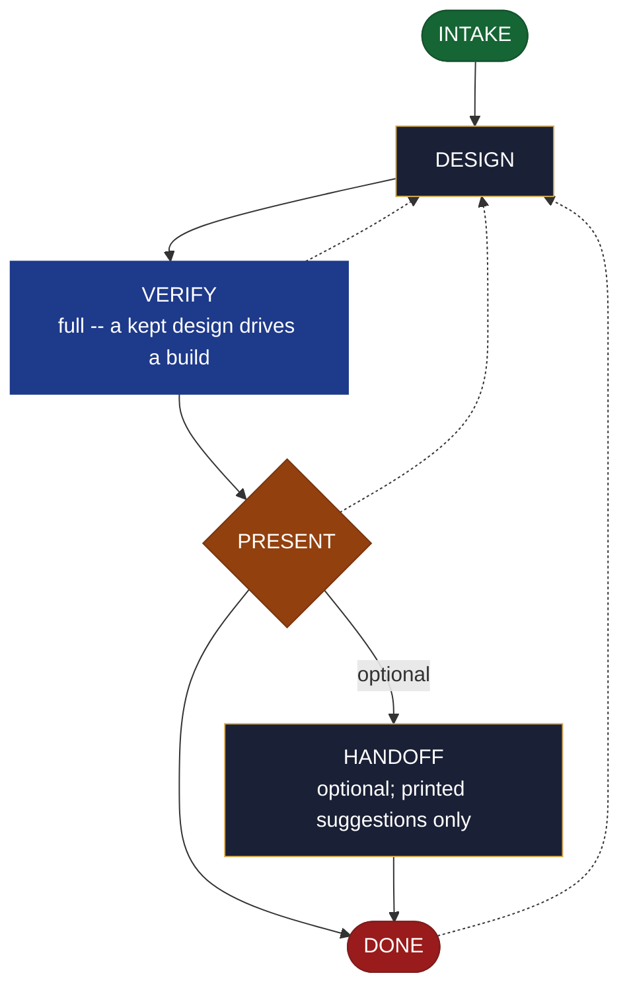

<!-- generated — do not edit; source: canonical/skills/aid-design/SKILL.md -->

## Frontmatter

- **`name`** — aid-design
- **`description`** — Produce a KEPT design artifact NOW -- a UX/interaction flow, a component or interface design, an architecture sketch, with accessibility notes -- meant to inform the real build. Single-shot; grounded in the Knowledge Base (.aid/knowledge/) and the project source (patterns, conventions, architecture). It RESOLVES NOTHING: it presents the design; you decide, and the build is a separate /aid-create* step. Produced by the aid-architect agent and independently verified by aid-reviewer (full verify -- a kept design drives a build, so its correctness matters). For a THROWAWAY model to merely validate a direction, use /aid-prototype instead. Allocates a work-NNN folder.
- **`allowed-tools`** — Read, Glob, Grep, Bash, Write, Edit, Agent
- **`argument-hint`** — &lt;subject> -- what to design (a flow, a component/interface, a UI, an architecture sketch)

[Definition: `canonical/skills/aid-design/SKILL.md`](https://github.com/AndreVianna/aid-methodology/blob/master/canonical/skills/aid-design/SKILL.md)

## Flow

