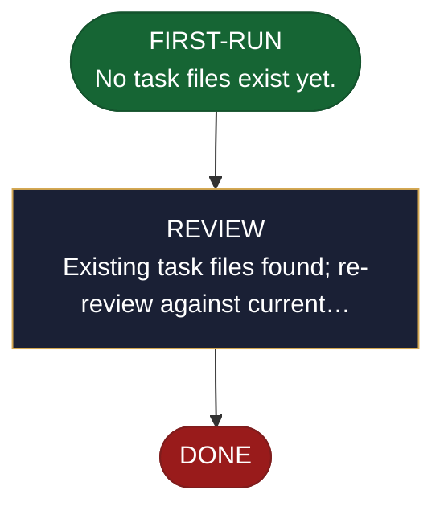

<!-- generated — do not edit; source: canonical/skills/aid-detail/SKILL.md -->

## Frontmatter

- **`name`** — aid-detail
- **`description`** — Break deliverables into small, dependency-driven, typed tasks — each one a reviewable unit. The ultimate breakdown. Detects task types (RESEARCH, DESIGN, IMPLEMENT, TEST, DOCUMENT, MIGRATE, REFACTOR, CONFIGURE) from SPEC signals. One type per task. Builds execution graph per delivery with explicit dependencies and parallelism. State machine: FIRST-RUN → REVIEW → DONE.
- **`allowed-tools`** — Read, Glob, Grep, Write, Edit, Bash
- **`argument-hint`** — work-001 (required if multiple works)  [--reset] clear deliveries/delivery-NNN/tasks/

[Definition: `canonical/skills/aid-detail/SKILL.md`](https://github.com/AndreVianna/aid-methodology/blob/master/canonical/skills/aid-detail/SKILL.md)

## Flow

