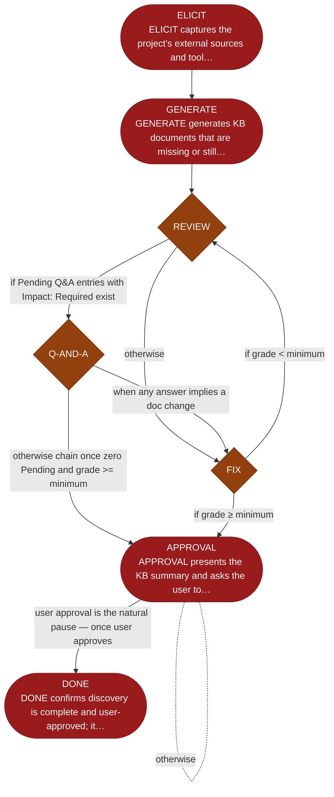

<!-- generated — do not edit; source: canonical/skills/aid-discover/SKILL.md -->

## Frontmatter

- **`name`** — aid-discover
- **`description`** — Populate the Knowledge Base from a codebase that already exists. Use this skill when you are starting AID on a project with existing code, and its architecture, conventions, and patterns need to be written down before any later phase can rely on them. It reads all repository content -- code, configuration, and documentation -- drafts the KB documents, reviews them, asks you what it could not infer, fixes what it finds, and takes your approval. It advances one step per run, so you can stop and resume. Run /aid-config first to scaffold the KB.
- **`allowed-tools`** — Read, Glob, Grep, Bash, Write, Edit, Agent
- **`argument-hint`** — [--grade A] minimum acceptable grade (default: A)  [--reset] clear KB and restart

[Definition: `canonical/skills/aid-discover/SKILL.md`](https://github.com/AndreVianna/aid-methodology/blob/master/canonical/skills/aid-discover/SKILL.md)

## Flow

## Source fragments

Every node in the chart above, in chart order, with the exact `canonical/` text it was derived from.

**1 · `ELICIT`** — ELICIT captures the project's external sources and tool… · _exit_ · PAUSE-FOR-USER-ACTION

~~~~plaintext title="canonical/skills/aid-discover/SKILL.md#L265" wrap
| ELICIT | `references/state-elicit.md` | inline | → GENERATE |
~~~~

[Source: `canonical/skills/aid-discover/SKILL.md#L265`](https://github.com/AndreVianna/aid-methodology/blob/master/canonical/skills/aid-discover/SKILL.md#L265) · [full step: `canonical/skills/aid-discover/references/state-elicit.md#L1-L329`](https://github.com/AndreVianna/aid-methodology/blob/master/canonical/skills/aid-discover/references/state-elicit.md#L1-L329)

**2 · `GENERATE`** — GENERATE generates KB documents that are missing or still… · _exit_ · PAUSE-FOR-USER-ACTION

~~~~plaintext title="canonical/skills/aid-discover/SKILL.md#L266" wrap
| GENERATE | `references/state-generate.md` | `aid-architect` | → REVIEW |
~~~~

[Source: `canonical/skills/aid-discover/SKILL.md#L266`](https://github.com/AndreVianna/aid-methodology/blob/master/canonical/skills/aid-discover/SKILL.md#L266) · [full step: `canonical/skills/aid-discover/references/state-generate.md#L1-L1072`](https://github.com/AndreVianna/aid-methodology/blob/master/canonical/skills/aid-discover/references/state-generate.md#L1-L1072)

**3 · `REVIEW`** — REVIEW grades all declared KB documents for accuracy… · _decision_

~~~~plaintext title="canonical/skills/aid-discover/SKILL.md#L267" wrap
| REVIEW | `references/state-review.md` | `aid-architect` | → Q-AND-A |
~~~~

[Source: `canonical/skills/aid-discover/SKILL.md#L267`](https://github.com/AndreVianna/aid-methodology/blob/master/canonical/skills/aid-discover/SKILL.md#L267) · [full step: `canonical/skills/aid-discover/references/state-review.md#L1-L648`](https://github.com/AndreVianna/aid-methodology/blob/master/canonical/skills/aid-discover/references/state-review.md#L1-L648)

**4 · `Q-AND-A`** — Q-AND-A drives EVERY pending question to a terminal answer. · _decision_

~~~~plaintext title="canonical/skills/aid-discover/SKILL.md#L268" wrap
| Q-AND-A | `references/state-q-and-a.md` | inline | → FIX |
~~~~

[Source: `canonical/skills/aid-discover/SKILL.md#L268`](https://github.com/AndreVianna/aid-methodology/blob/master/canonical/skills/aid-discover/SKILL.md#L268) · [full step: `canonical/skills/aid-discover/references/state-q-and-a.md#L1-L66`](https://github.com/AndreVianna/aid-methodology/blob/master/canonical/skills/aid-discover/references/state-q-and-a.md#L1-L66)

**5 · `FIX`** — FIX applies Q&amp;A answers and reviewer feedback to bring KB… · _decision_

~~~~plaintext title="canonical/skills/aid-discover/SKILL.md#L269" wrap
| FIX | `references/state-fix.md` | `aid-architect` | → APPROVAL |
~~~~

[Source: `canonical/skills/aid-discover/SKILL.md#L269`](https://github.com/AndreVianna/aid-methodology/blob/master/canonical/skills/aid-discover/SKILL.md#L269) · [full step: `canonical/skills/aid-discover/references/state-fix.md#L1-L126`](https://github.com/AndreVianna/aid-methodology/blob/master/canonical/skills/aid-discover/references/state-fix.md#L1-L126)

**6 · `APPROVAL`** — APPROVAL presents the KB summary and asks the user to… · _exit_ · HALT

~~~~plaintext title="canonical/skills/aid-discover/SKILL.md#L270" wrap
| APPROVAL | `references/state-approval.md` | inline | → halt |
~~~~

[Source: `canonical/skills/aid-discover/SKILL.md#L270`](https://github.com/AndreVianna/aid-methodology/blob/master/canonical/skills/aid-discover/SKILL.md#L270) · [full step: `canonical/skills/aid-discover/references/state-approval.md#L1-L40`](https://github.com/AndreVianna/aid-methodology/blob/master/canonical/skills/aid-discover/references/state-approval.md#L1-L40)

**7 · `DONE`** — DONE confirms discovery is complete and user-approved; it… · _exit_ · HALT

~~~~plaintext title="canonical/skills/aid-discover/SKILL.md#L271" wrap
| DONE | `references/state-done.md` | inline | → halt |
~~~~

[Source: `canonical/skills/aid-discover/SKILL.md#L271`](https://github.com/AndreVianna/aid-methodology/blob/master/canonical/skills/aid-discover/SKILL.md#L271) · [full step: `canonical/skills/aid-discover/references/state-done.md#L1-L73`](https://github.com/AndreVianna/aid-methodology/blob/master/canonical/skills/aid-discover/references/state-done.md#L1-L73)
