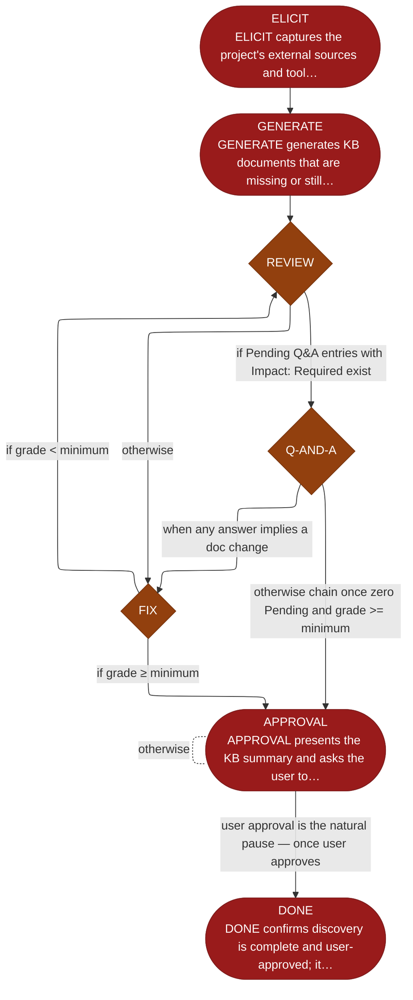

<!-- generated — do not edit; source: canonical/skills/aid-discover/SKILL.md -->

## Frontmatter

- **`name`** — aid-discover
- **`description`** — Brownfield project discovery with built-in quality gate. Run `/aid-config` first to scaffold the KB. Analyzes all repository content (code, configuration, and documentation) to populate KB documents. Reviews, collects user input, fixes issues, and gets user approval — one step per run. State-machine: ELICIT → GENERATE → REVIEW → Q-AND-A → FIX → APPROVAL → DONE.
- **`allowed-tools`** — Read, Glob, Grep, Bash, Write, Edit, Agent
- **`argument-hint`** — [--grade A] minimum acceptable grade (default: A)  [--reset] clear KB and restart

[Definition: `canonical/skills/aid-discover/SKILL.md`](https://github.com/AndreVianna/aid-methodology/blob/master/canonical/skills/aid-discover/SKILL.md)

## Flow

