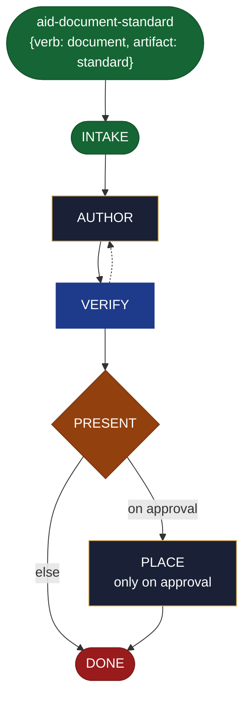

<!-- generated — do not edit; source: canonical/skills/aid-document-standard/SKILL.md -->

## Frontmatter

- **`name`** — aid-document-standard
- **`description`** — Write a standard NOW -- a mandatory rule (rule -> scope -> compliance/enforcement -> exceptions) -- in one pass. A thin kind-sibling of /aid-create-document with the document genre bound to standard. Grounded in and accuracy-checked against the Knowledge Base (.aid/knowledge/) and the project source; produced by aid-tech-writer, verified by aid-reviewer. It RESOLVES NOTHING -- drafts, you approve, then it is placed. NEVER writes into .aid/knowledge/. This file carries no logic of its own -- its full behavior is defined by canonical/skills/aid-create-document/SKILL.md.
- **`allowed-tools`** — Read, Glob, Grep, Bash, Write, Edit, Agent
- **`argument-hint`** — &lt;rule> -- the standard

[Definition: `canonical/skills/aid-document-standard/SKILL.md`](https://github.com/AndreVianna/aid-methodology/blob/master/canonical/skills/aid-document-standard/SKILL.md)

## Flow

## Source fragments

Every node in the chart above, in chart order, with the exact `canonical/` text it was derived from.

**1 · `aid-document-standard`** — {verb: document, artifact: standard} · _entry_

~~~~plaintext title="canonical/skills/aid-document-standard/SKILL.md#L19" wrap
row (`alias_of: null`, its own `{verb: document, artifact: standard}`), `repurpose: true`
~~~~

[Source: `canonical/skills/aid-document-standard/SKILL.md#L19`](https://github.com/AndreVianna/aid-methodology/blob/master/canonical/skills/aid-document-standard/SKILL.md#L19)

**2 · `INTAKE`** · _entry_

~~~~plaintext title="canonical/skills/aid-create-document/SKILL.md#L40-L60" wrap
## State: INTAKE

1. **Require a subject.** Empty argument -> ask one bootstrapping question ("What do you
   want documented, and for whom?") and wait.
2. **Resolve format + genre** from the request (or the hint a kind-sibling bound): e.g. "an
   ADR for X" -> markdown ADR; "a diagram of the pipeline" -> mermaid; "the release notes"
   -> changelog. Use the genre structures in `document.md`.
3. **Pick the path:** **Fast** -- a clear subject + kind -> author now. **Guided** -- vague
   -> scope subject / audience / kind first.
4. **Classify complexity (model + effort):** most docs -> `aid-tech-writer` at **sonnet /
   medium**; a heavy architecture write-up -> **opus / high**. Verifier tier >= producer.
5. **Consult the Work Initiation Gate, then allocate the work folder + STATE.** First run
   the gate (`canonical/aid/templates/work-initiation-gate.md`):
   `bash canonical/aid/scripts/works/enumerate-works.sh` (main tree + every git worktree).
   Empty -> allocate, no prompt. Works exist -> ask new-vs-continuation; on **continuation**
   route to the chosen work's resume door and STOP (allocate nothing); on **new work**:
   create and enter the worktree per the gate's `§ 3a` step 2
   (`worktree-lifecycle.sh create <work-id> <name>`, STOP on a non-zero exit or empty path,
   else enter the resolved path), **then** allocate (`pipeline.path: lite`, `initiator:
   aid-create-document`, `lifecycle: Running`, `active_skill: aid-create-document`;
   `phase` not driven).
~~~~

[Source: `canonical/skills/aid-create-document/SKILL.md#L40-L60`](https://github.com/AndreVianna/aid-methodology/blob/master/canonical/skills/aid-create-document/SKILL.md#L40-L60) · [full step: `canonical/skills/aid-create-document/SKILL.md#L40-L62`](https://github.com/AndreVianna/aid-methodology/blob/master/canonical/skills/aid-create-document/SKILL.md#L40-L62)

**3 · `AUTHOR`** · _step_

~~~~plaintext title="canonical/skills/aid-create-document/SKILL.md#L66-L73" wrap
## State: AUTHOR

Dispatch **`aid-tech-writer`** (clean context, tiered) to write the document in the resolved
format + genre structure, **grounded in and accurate to** the KB + project source
(`task-type-rules.md ## DOCUMENT` -- verify accuracy against the current codebase and KB).
It drafts into the work folder (not yet placed). Text formats are produced natively
(markdown, mermaid, HTML, CSV/tables); for a format it cannot cleanly emit (native
`.pptx`/`.xlsx`), it produces the best text form and notes the conversion handoff.
~~~~

[Source: `canonical/skills/aid-create-document/SKILL.md#L66-L73`](https://github.com/AndreVianna/aid-methodology/blob/master/canonical/skills/aid-create-document/SKILL.md#L66-L73) · [full step: `canonical/skills/aid-create-document/SKILL.md#L66-L75`](https://github.com/AndreVianna/aid-methodology/blob/master/canonical/skills/aid-create-document/SKILL.md#L66-L75)

**4 · `VERIFY`** · _loop-back_

~~~~plaintext title="canonical/skills/aid-create-document/SKILL.md#L79-L87" wrap
## State: VERIFY

1. **Mechanical grounding check** (no dispatch): claims about the project cite a KB doc or
   `file:line`; the genre's required structure is present.
2. **Adversarial verification** -- clean-context **`aid-reviewer`** checks the draft:
   accurate against KB + codebase, complete for its genre, no fabricated content. Writes a
   review-quality ledger to `.aid/.temp/review-pending/<work>-verify.md`.
3. **Grade:** `bash canonical/aid/scripts/grade.sh --explain <ledger>`. Not clean -> loop
   to AUTHOR. Circuit-breaker: 3 cycles -> IMPEDIMENT + `lifecycle: Blocked`.
~~~~

[Source: `canonical/skills/aid-create-document/SKILL.md#L79-L87`](https://github.com/AndreVianna/aid-methodology/blob/master/canonical/skills/aid-create-document/SKILL.md#L79-L87) · [full step: `canonical/skills/aid-create-document/SKILL.md#L79-L89`](https://github.com/AndreVianna/aid-methodology/blob/master/canonical/skills/aid-create-document/SKILL.md#L79-L89)

**5 · `PRESENT`** — hard stop -- human final say before placing · _decision_

~~~~plaintext title="canonical/skills/aid-create-document/SKILL.md#L93-L97" wrap
## State: PRESENT  (hard stop -- human final say before placing)

Set `lifecycle: Paused-Awaiting-Input`. Present the drafted document **and the proposed
target location** (KB-informed: `docs/`, an ADR dir, `CHANGELOG.md`, a runbook path, ...).
Await approval. **Never writes `.aid/knowledge/`.**
~~~~

[Source: `canonical/skills/aid-create-document/SKILL.md#L93-L97`](https://github.com/AndreVianna/aid-methodology/blob/master/canonical/skills/aid-create-document/SKILL.md#L93-L97) · [full step: `canonical/skills/aid-create-document/SKILL.md#L93-L99`](https://github.com/AndreVianna/aid-methodology/blob/master/canonical/skills/aid-create-document/SKILL.md#L93-L99)

**6 · `PLACE`** — only on approval · _step_

~~~~plaintext title="canonical/skills/aid-create-document/SKILL.md#L103-L109" wrap
## State: PLACE  (only on approval)

Write the document to its approved target location. **Extra care on overwrite or on the
published `docs/` tree:** inspect the target first and show the diff -- never silently
overwrite an existing doc. Then optionally print handoffs the user may act on: `/aid-update-kb`
(if it belongs in the KB), `/aid-create*` (if it describes something not yet built),
`/aid-refactor` (an ADR mandating a refactor).
~~~~

[Source: `canonical/skills/aid-create-document/SKILL.md#L103-L109`](https://github.com/AndreVianna/aid-methodology/blob/master/canonical/skills/aid-create-document/SKILL.md#L103-L109) · [full step: `canonical/skills/aid-create-document/SKILL.md#L103-L111`](https://github.com/AndreVianna/aid-methodology/blob/master/canonical/skills/aid-create-document/SKILL.md#L103-L111)

**7 · `DONE`** · _exit_ · UNSPECIFIED

~~~~plaintext title="canonical/skills/aid-create-document/SKILL.md#L115-L118" wrap
## State: DONE

Set `lifecycle: Completed`, `updated` now, append a `## Lifecycle History` row. Keep the
work folder (draft + verify ledger) as the audit record.
~~~~

[Source: `canonical/skills/aid-create-document/SKILL.md#L115-L118`](https://github.com/AndreVianna/aid-methodology/blob/master/canonical/skills/aid-create-document/SKILL.md#L115-L118) · [full step: `canonical/skills/aid-create-document/SKILL.md#L115-L118`](https://github.com/AndreVianna/aid-methodology/blob/master/canonical/skills/aid-create-document/SKILL.md#L115-L118)
