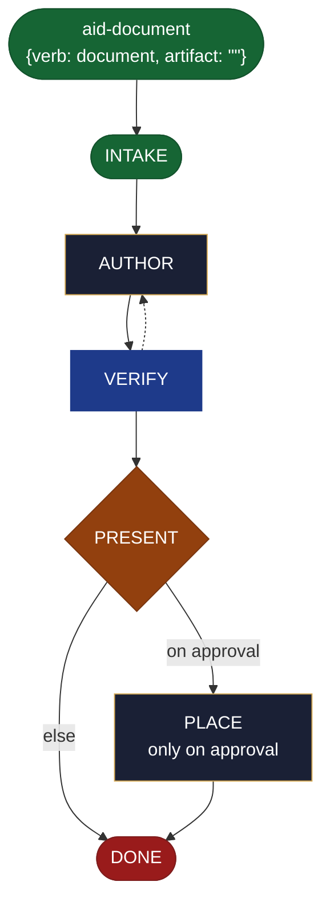

<!-- generated — do not edit; source: canonical/skills/aid-document/SKILL.md -->

## Frontmatter

- **`name`** — aid-document
- **`description`** — Write a general document NOW -- a Diataxis how-to / reference / explanation, or a status/progress report -- in one pass. A thin kind-sibling of /aid-create-document with the document genre bound to general. Grounded in and accuracy-checked against the Knowledge Base (.aid/knowledge/) and the project source; produced by aid-tech-writer, verified by aid-reviewer. It RESOLVES NOTHING -- drafts, you approve, then it is placed. NEVER writes into .aid/knowledge/. This file carries no logic of its own -- its full behavior is defined by canonical/skills/aid-create-document/SKILL.md.
- **`allowed-tools`** — Read, Glob, Grep, Bash, Write, Edit, Agent
- **`argument-hint`** — &lt;subject> -- what to document

[Definition: `canonical/skills/aid-document/SKILL.md`](https://github.com/AndreVianna/aid-methodology/blob/master/canonical/skills/aid-document/SKILL.md)

## Flow

