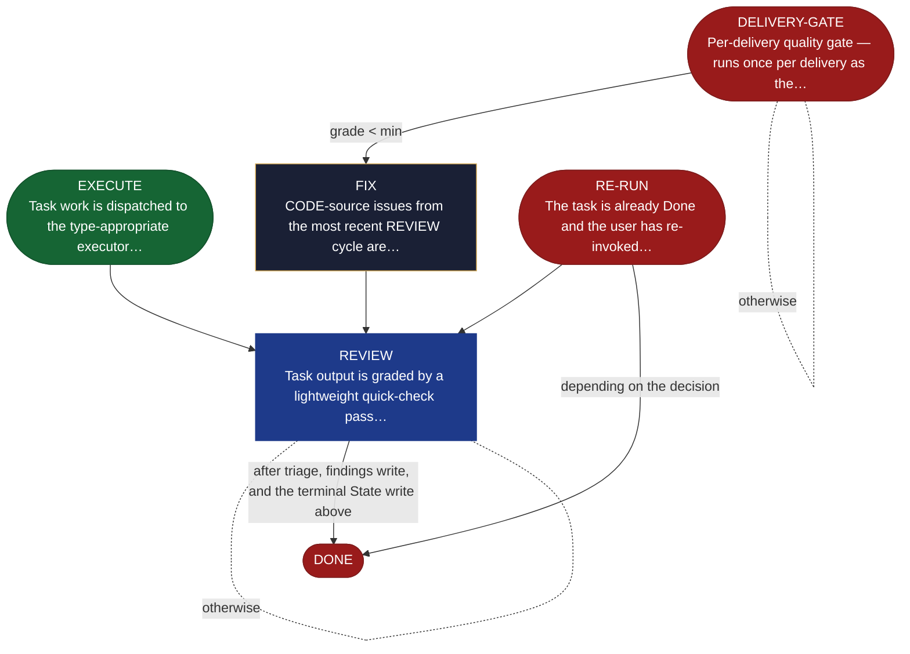

<!-- generated — do not edit; source: canonical/skills/aid-execute/SKILL.md -->

## Frontmatter

- **`name`** — aid-execute
- **`description`** — Execute a task based on its type: RESEARCH, DESIGN, IMPLEMENT, TEST, DOCUMENT, MIGRATE, REFACTOR, or CONFIGURE. Built-in review loop per type. State machine: EXECUTE → REVIEW → FIX → back to REVIEW → DONE when grade ≥ minimum. Branch per delivery for isolation.
- **`allowed-tools`** — Read, Glob, Grep, Write, Edit, Bash
- **`argument-hint`** — work-001 (required if multiple works)  task-001 (required)

[Definition: `canonical/skills/aid-execute/SKILL.md`](https://github.com/AndreVianna/aid-methodology/blob/master/canonical/skills/aid-execute/SKILL.md)

## Flow

## Source fragments

Every node in the chart above, in chart order, with the exact `canonical/` text it was derived from.

**1 · `EXECUTE`** — Task work is dispatched to the type-appropriate executor… · _entry_

~~~~plaintext title="canonical/skills/aid-execute/SKILL.md#L197" wrap
| EXECUTE | `references/state-execute.md` | _(type-specific — see state file; delivery-mode uses pool dispatch PD-0→PD-6)_ | → REVIEW |
~~~~

[Source: `canonical/skills/aid-execute/SKILL.md#L197`](https://github.com/AndreVianna/aid-methodology/blob/master/canonical/skills/aid-execute/SKILL.md#L197) · [full step: `canonical/skills/aid-execute/references/state-execute.md#L1-L772`](https://github.com/AndreVianna/aid-methodology/blob/master/canonical/skills/aid-execute/references/state-execute.md#L1-L772)

**2 · `REVIEW`** — Task output is graded by a lightweight quick-check pass… · _loop-back_

~~~~plaintext title="canonical/skills/aid-execute/SKILL.md#L198" wrap
| REVIEW | `references/state-review.md` | `aid-reviewer` (Small tier, quick-check only — no grade loop per FR2) | → DONE |
~~~~

[Source: `canonical/skills/aid-execute/SKILL.md#L198`](https://github.com/AndreVianna/aid-methodology/blob/master/canonical/skills/aid-execute/SKILL.md#L198) · [full step: `canonical/skills/aid-execute/references/state-review.md#L1-L187`](https://github.com/AndreVianna/aid-methodology/blob/master/canonical/skills/aid-execute/references/state-review.md#L1-L187)

**3 · `FIX`** — CODE-source issues from the most recent REVIEW cycle are… · _step_

~~~~plaintext title="canonical/skills/aid-execute/SKILL.md#L199" wrap
| FIX | `references/state-fix.md` | _(same type as EXECUTE)_ | → REVIEW |
~~~~

[Source: `canonical/skills/aid-execute/SKILL.md#L199`](https://github.com/AndreVianna/aid-methodology/blob/master/canonical/skills/aid-execute/SKILL.md#L199) · [full step: `canonical/skills/aid-execute/references/state-fix.md#L1-L34`](https://github.com/AndreVianna/aid-methodology/blob/master/canonical/skills/aid-execute/references/state-fix.md#L1-L34)

**4 · `DONE`** · _exit_ · HALT

~~~~plaintext title="canonical/skills/aid-execute/SKILL.md#L200" wrap
| DONE | _(inline — task complete)_ | `inline` | → halt |
~~~~

[Source: `canonical/skills/aid-execute/SKILL.md#L200`](https://github.com/AndreVianna/aid-methodology/blob/master/canonical/skills/aid-execute/SKILL.md#L200)

**5 · `RE-RUN`** — The task is already Done and the user has re-invoked… · _exit_ · PAUSE-FOR-USER-DECISION

~~~~plaintext title="canonical/skills/aid-execute/SKILL.md#L201" wrap
| RE-RUN | `references/state-re-run.md` | `inline` | → halt |
~~~~

[Source: `canonical/skills/aid-execute/SKILL.md#L201`](https://github.com/AndreVianna/aid-methodology/blob/master/canonical/skills/aid-execute/SKILL.md#L201) · [full step: `canonical/skills/aid-execute/references/state-re-run.md#L1-L21`](https://github.com/AndreVianna/aid-methodology/blob/master/canonical/skills/aid-execute/references/state-re-run.md#L1-L21)

**6 · `DELIVERY-GATE`** — Per-delivery quality gate — runs once per delivery as the… · _exit_ · CHAIN

~~~~plaintext title="canonical/skills/aid-execute/SKILL.md#L202" wrap
| DELIVERY-GATE | `references/state-delivery-gate.md` | `aid-reviewer` (tier = complexity score) | → halt (grade ≥ min) / → FIX (grade < min) |
~~~~

[Source: `canonical/skills/aid-execute/SKILL.md#L202`](https://github.com/AndreVianna/aid-methodology/blob/master/canonical/skills/aid-execute/SKILL.md#L202) · [full step: `canonical/skills/aid-execute/references/state-delivery-gate.md#L1-L487`](https://github.com/AndreVianna/aid-methodology/blob/master/canonical/skills/aid-execute/references/state-delivery-gate.md#L1-L487)
