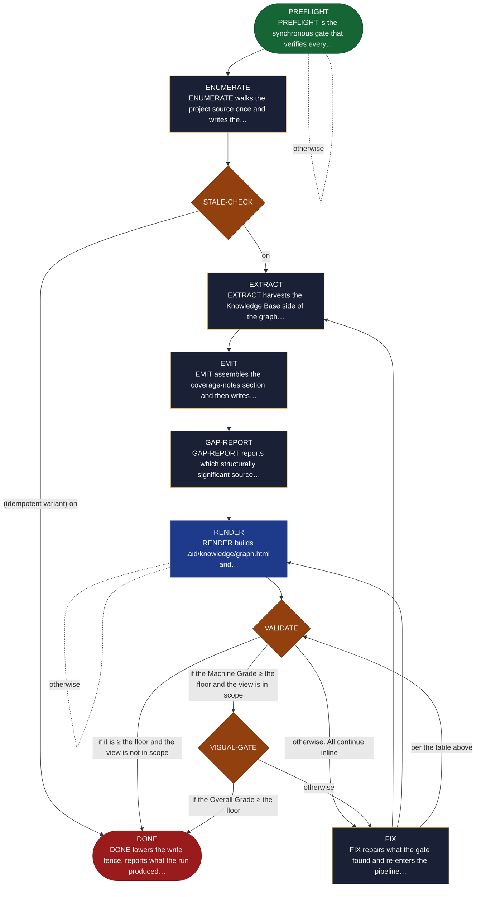

<!-- generated — do not edit; source: canonical/skills/aid-graph/SKILL.md -->

## Frontmatter

- **`name`** — aid-graph
- **`description`** — Build .aid/knowledge/relationships.md and .aid/knowledge/graph.html from an approved Knowledge Base and the project source. On demand, never fired by discovery, and a sibling of aid-summarize rather than a phase of it. Reads widely and writes narrowly: the Knowledge Base is read-only for the whole run, and that guarantee is a fence raised before the first write and verified before the run ends. Idempotent and content-addressed: a re-run on an unchanged project is a true no-op, and when it does regenerate it names which input changed. Two-grade quality gate (Machine + Human) over THIS SKILL'S OWN artifacts only -- never over the Knowledge Base's completeness. Knowledge Base gaps are REPORTED and routed onward, never gated on and never fixed here. State machine: PREFLIGHT -> ENUMERATE -> STALE-CHECK -> EXTRACT -> EMIT -> GAP-REPORT -> RENDER -> VALIDATE -> VISUAL-GATE -> FIX -> DONE.
- **`allowed-tools`** — Read, Glob, Grep, Bash, Write, Edit, Agent
- **`argument-hint`** — [--reset] force regeneration  [--grade X] override the minimum for this run only

[Definition: `canonical/skills/aid-graph/SKILL.md`](https://github.com/AndreVianna/aid-methodology/blob/master/canonical/skills/aid-graph/SKILL.md)

## Flow

## Source fragments

Every node in the chart above, in chart order, with the exact `canonical/` text it was derived from.

**1 · `PREFLIGHT`** — PREFLIGHT is the synchronous gate that verifies every… · _entry_

~~~~plaintext title="canonical/skills/aid-graph/SKILL.md#L126" wrap
| PREFLIGHT | `references/state-preflight.md` | inline | → ENUMERATE (exit `0`) / abort the run, naming the failing check (exit `1`) |
~~~~

[Source: `canonical/skills/aid-graph/SKILL.md#L126`](https://github.com/AndreVianna/aid-methodology/blob/master/canonical/skills/aid-graph/SKILL.md#L126) · [full step: `canonical/skills/aid-graph/references/state-preflight.md#L1-L48`](https://github.com/AndreVianna/aid-methodology/blob/master/canonical/skills/aid-graph/references/state-preflight.md#L1-L48)

**2 · `ENUMERATE`** — ENUMERATE walks the project source once and writes the… · _step_

~~~~plaintext title="canonical/skills/aid-graph/SKILL.md#L127" wrap
| ENUMERATE | `references/state-enumerate.md` | inline | → STALE-CHECK |
~~~~

[Source: `canonical/skills/aid-graph/SKILL.md#L127`](https://github.com/AndreVianna/aid-methodology/blob/master/canonical/skills/aid-graph/SKILL.md#L127) · [full step: `canonical/skills/aid-graph/references/state-enumerate.md#L1-L36`](https://github.com/AndreVianna/aid-methodology/blob/master/canonical/skills/aid-graph/references/state-enumerate.md#L1-L36)

**3 · `STALE-CHECK`** — STALE-CHECK decides whether this run must regenerate, and… · _decision_

~~~~plaintext title="canonical/skills/aid-graph/SKILL.md#L128" wrap
| STALE-CHECK | `references/state-stale-check.md` | inline | → EXTRACT (`STALE` / `FIRST_RUN`) / → DONE, idempotent variant (`CURRENT`) |
~~~~

[Source: `canonical/skills/aid-graph/SKILL.md#L128`](https://github.com/AndreVianna/aid-methodology/blob/master/canonical/skills/aid-graph/SKILL.md#L128) · [full step: `canonical/skills/aid-graph/references/state-stale-check.md#L1-L53`](https://github.com/AndreVianna/aid-methodology/blob/master/canonical/skills/aid-graph/references/state-stale-check.md#L1-L53)

**4 · `EXTRACT`** — EXTRACT harvests the Knowledge Base side of the graph… · _step_

~~~~plaintext title="canonical/skills/aid-graph/SKILL.md#L129" wrap
| EXTRACT | `references/state-extract.md` | inline + `Agent` dispatches per `references/agent-pass.md` | → EMIT |
~~~~

[Source: `canonical/skills/aid-graph/SKILL.md#L129`](https://github.com/AndreVianna/aid-methodology/blob/master/canonical/skills/aid-graph/SKILL.md#L129) · [full step: `canonical/skills/aid-graph/references/state-extract.md#L1-L125`](https://github.com/AndreVianna/aid-methodology/blob/master/canonical/skills/aid-graph/references/state-extract.md#L1-L125)

**5 · `EMIT`** — EMIT assembles the coverage-notes section and then writes… · _step_

~~~~plaintext title="canonical/skills/aid-graph/SKILL.md#L130" wrap
| EMIT | `references/state-emit.md` | inline | → GAP-REPORT |
~~~~

[Source: `canonical/skills/aid-graph/SKILL.md#L130`](https://github.com/AndreVianna/aid-methodology/blob/master/canonical/skills/aid-graph/SKILL.md#L130) · [full step: `canonical/skills/aid-graph/references/state-emit.md#L1-L62`](https://github.com/AndreVianna/aid-methodology/blob/master/canonical/skills/aid-graph/references/state-emit.md#L1-L62)

**6 · `GAP-REPORT`** — GAP-REPORT reports which structurally significant source… · _step_

~~~~plaintext title="canonical/skills/aid-graph/SKILL.md#L131" wrap
| GAP-REPORT | `references/state-gap-report.md` | inline | → RENDER |
~~~~

[Source: `canonical/skills/aid-graph/SKILL.md#L131`](https://github.com/AndreVianna/aid-methodology/blob/master/canonical/skills/aid-graph/SKILL.md#L131) · [full step: `canonical/skills/aid-graph/references/state-gap-report.md#L1-L92`](https://github.com/AndreVianna/aid-methodology/blob/master/canonical/skills/aid-graph/references/state-gap-report.md#L1-L92)

**7 · `RENDER`** — RENDER builds .aid/knowledge/graph.html and… · _loop-back_

~~~~plaintext title="canonical/skills/aid-graph/SKILL.md#L132" wrap
| RENDER | `references/state-render.md` | inline | → VALIDATE. **Skipped when `view_expected` is false** |
~~~~

[Source: `canonical/skills/aid-graph/SKILL.md#L132`](https://github.com/AndreVianna/aid-methodology/blob/master/canonical/skills/aid-graph/SKILL.md#L132) · [full step: `canonical/skills/aid-graph/references/state-render.md#L1-L54`](https://github.com/AndreVianna/aid-methodology/blob/master/canonical/skills/aid-graph/references/state-render.md#L1-L54)

**8 · `VALIDATE`** — VALIDATE runs this skill's own quality rubric over its own… · _decision_

~~~~plaintext title="canonical/skills/aid-graph/SKILL.md#L133" wrap
| VALIDATE | `references/state-validate.md` | inline | → VISUAL-GATE (Machine Grade ≥ the resolved floor) / → FIX (below it) / → DONE (Machine Grade ≥ the floor and `view_expected` is false, VISUAL-GATE being N/A) |
~~~~

[Source: `canonical/skills/aid-graph/SKILL.md#L133`](https://github.com/AndreVianna/aid-methodology/blob/master/canonical/skills/aid-graph/SKILL.md#L133) · [full step: `canonical/skills/aid-graph/references/state-validate.md#L1-L60`](https://github.com/AndreVianna/aid-methodology/blob/master/canonical/skills/aid-graph/references/state-validate.md#L1-L60)

**9 · `VISUAL-GATE`** — VISUAL-GATE asks the one question about this artifact that… · _decision_

~~~~plaintext title="canonical/skills/aid-graph/SKILL.md#L134" wrap
| VISUAL-GATE | `references/state-visual-gate.md` | inline | → DONE (Overall Grade ≥ the floor) / → FIX (below it). **N/A when `view_expected` is false** |
~~~~

[Source: `canonical/skills/aid-graph/SKILL.md#L134`](https://github.com/AndreVianna/aid-methodology/blob/master/canonical/skills/aid-graph/SKILL.md#L134) · [full step: `canonical/skills/aid-graph/references/state-visual-gate.md#L1-L73`](https://github.com/AndreVianna/aid-methodology/blob/master/canonical/skills/aid-graph/references/state-visual-gate.md#L1-L73)

**10 · `FIX`** — FIX repairs what the gate found and re-enters the pipeline… · _step_

~~~~plaintext title="canonical/skills/aid-graph/SKILL.md#L135" wrap
| FIX | `references/state-fix.md` | inline | → RENDER / → EXTRACT / → VALIDATE, by where the repaired input lives |
~~~~

[Source: `canonical/skills/aid-graph/SKILL.md#L135`](https://github.com/AndreVianna/aid-methodology/blob/master/canonical/skills/aid-graph/SKILL.md#L135) · [full step: `canonical/skills/aid-graph/references/state-fix.md#L1-L57`](https://github.com/AndreVianna/aid-methodology/blob/master/canonical/skills/aid-graph/references/state-fix.md#L1-L57)

**11 · `DONE`** — DONE lowers the write fence, reports what the run produced… · _exit_ · HALT

~~~~plaintext title="canonical/skills/aid-graph/SKILL.md#L136" wrap
| DONE | `references/state-done.md` | inline | → halt, in one of two variants |
~~~~

[Source: `canonical/skills/aid-graph/SKILL.md#L136`](https://github.com/AndreVianna/aid-methodology/blob/master/canonical/skills/aid-graph/SKILL.md#L136) · [full step: `canonical/skills/aid-graph/references/state-done.md#L1-L98`](https://github.com/AndreVianna/aid-methodology/blob/master/canonical/skills/aid-graph/references/state-done.md#L1-L98)
