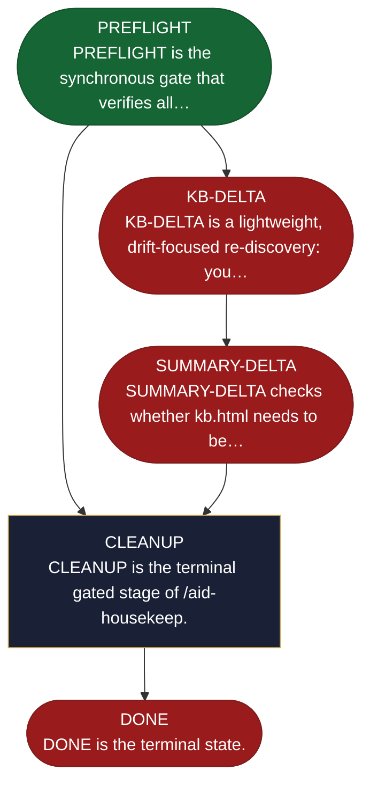

<!-- generated — do not edit; source: canonical/skills/aid-housekeep/SKILL.md -->

## Frontmatter

- **`name`** — aid-housekeep
- **`description`** — Optional on-demand housekeeping skill. Runs three gated jobs in strict order: KB-DELTA (re-discover changed docs since last KB approval; brownfield docs take the doc&lt;-code drift path, while source: forward-authored greenfield docs take the Conformance Lane -- a code->design shadow-extract that FLAGS design vs as-built divergence for human reconciliation and never auto-overwrites the design) → SUMMARY-DELTA (regenerate the visual summary if the KB changed) → CLEANUP (sweep stale work-area artifacts). Each stage commits its own changes on an aid/housekeep-* branch; the skill never pushes. Re-entrant: a stalled run resumes at the stalled stage on re-invocation. State-machine: PREFLIGHT → KB-DELTA → SUMMARY-DELTA → CLEANUP → DONE. Source-driven global reconcile; for a targeted prompt-named delta use /aid-update-kb.
- **`allowed-tools`** — Read, Glob, Grep, Bash, Write, Edit, Agent
- **`argument-hint`** — [--cleanup-only] [--grade X] jump to cleanup stage, or set minimum summary grade

[Definition: `canonical/skills/aid-housekeep/SKILL.md`](https://github.com/AndreVianna/aid-methodology/blob/master/canonical/skills/aid-housekeep/SKILL.md)

## Flow

## Source fragments

Every node in the chart above, in chart order, with the exact `canonical/` text it was derived from.

**1 · `PREFLIGHT`** — PREFLIGHT is the synchronous gate that verifies all… · _entry_

~~~~plaintext title="canonical/skills/aid-housekeep/SKILL.md#L222" wrap
| PREFLIGHT | `references/state-preflight.md` | inline | CHAIN → KB-DELTA (or CLEANUP if Mode=cleanup-only) |
~~~~

[Source: `canonical/skills/aid-housekeep/SKILL.md#L222`](https://github.com/AndreVianna/aid-methodology/blob/master/canonical/skills/aid-housekeep/SKILL.md#L222) · [full step: `canonical/skills/aid-housekeep/references/state-preflight.md#L1-L118`](https://github.com/AndreVianna/aid-methodology/blob/master/canonical/skills/aid-housekeep/references/state-preflight.md#L1-L118)

**2 · `KB-DELTA`** — KB-DELTA is a lightweight, drift-focused re-discovery: you… · _exit_ · PAUSE-FOR-USER-ACTION

~~~~plaintext title="canonical/skills/aid-housekeep/SKILL.md#L223" wrap
| KB-DELTA | `references/state-kb-delta.md` | `aid-architect` (feat-002 dispatches sub-agents via `/aid-discover`) | CHAIN → SUMMARY-DELTA / PAUSE-FOR-USER-ACTION if stalled |
~~~~

[Source: `canonical/skills/aid-housekeep/SKILL.md#L223`](https://github.com/AndreVianna/aid-methodology/blob/master/canonical/skills/aid-housekeep/SKILL.md#L223) · [full step: `canonical/skills/aid-housekeep/references/state-kb-delta.md#L1-L887`](https://github.com/AndreVianna/aid-methodology/blob/master/canonical/skills/aid-housekeep/references/state-kb-delta.md#L1-L887)

**3 · `SUMMARY-DELTA`** — SUMMARY-DELTA checks whether kb.html needs to be… · _exit_ · PAUSE-FOR-USER-ACTION

~~~~plaintext title="canonical/skills/aid-housekeep/SKILL.md#L224" wrap
| SUMMARY-DELTA | `references/state-summary-delta.md` | inline (delegates to `/aid-summarize`) | CHAIN → CLEANUP / PAUSE-FOR-USER-ACTION if stalled |
~~~~

[Source: `canonical/skills/aid-housekeep/SKILL.md#L224`](https://github.com/AndreVianna/aid-methodology/blob/master/canonical/skills/aid-housekeep/SKILL.md#L224) · [full step: `canonical/skills/aid-housekeep/references/state-summary-delta.md#L1-L357`](https://github.com/AndreVianna/aid-methodology/blob/master/canonical/skills/aid-housekeep/references/state-summary-delta.md#L1-L357)

**4 · `CLEANUP`** — CLEANUP is the terminal gated stage of /aid-housekeep. · _step_

~~~~plaintext title="canonical/skills/aid-housekeep/SKILL.md#L225" wrap
| CLEANUP | `references/state-cleanup.md` | inline | CHAIN → DONE |
~~~~

[Source: `canonical/skills/aid-housekeep/SKILL.md#L225`](https://github.com/AndreVianna/aid-methodology/blob/master/canonical/skills/aid-housekeep/SKILL.md#L225) · [full step: `canonical/skills/aid-housekeep/references/state-cleanup.md#L1-L535`](https://github.com/AndreVianna/aid-methodology/blob/master/canonical/skills/aid-housekeep/references/state-cleanup.md#L1-L535)

**5 · `DONE`** — DONE is the terminal state. · _exit_ · HALT

~~~~plaintext title="canonical/skills/aid-housekeep/SKILL.md#L226" wrap
| DONE | `references/state-done.md` | inline | HALT |
~~~~

[Source: `canonical/skills/aid-housekeep/SKILL.md#L226`](https://github.com/AndreVianna/aid-methodology/blob/master/canonical/skills/aid-housekeep/SKILL.md#L226) · [full step: `canonical/skills/aid-housekeep/references/state-done.md#L1-L73`](https://github.com/AndreVianna/aid-methodology/blob/master/canonical/skills/aid-housekeep/references/state-done.md#L1-L73)
