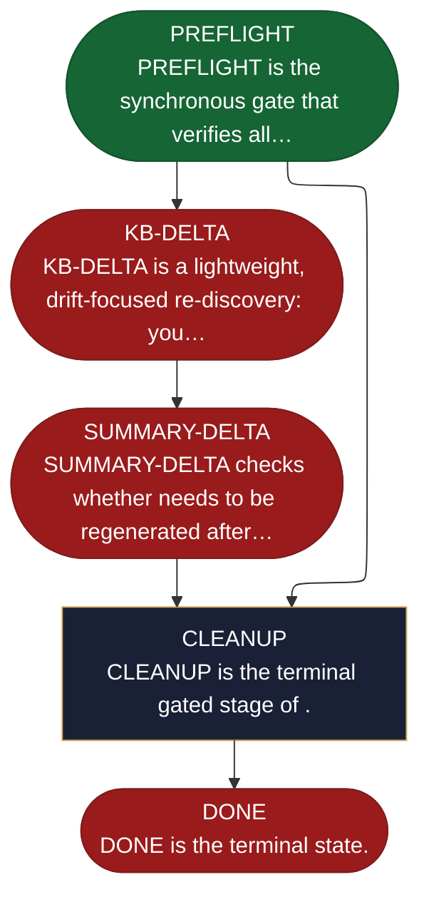

<!-- generated — do not edit; source: canonical/skills/aid-housekeep/SKILL.md -->

## Frontmatter

- **`name`** — aid-housekeep
- **`description`** — Optional on-demand housekeeping skill. Runs three gated jobs in strict order: KB-DELTA (re-discover changed docs since last KB approval; brownfield docs take the doc&lt;-code drift path, while source: forward-authored greenfield docs take the Conformance Lane -- a code->design shadow-extract that FLAGS design vs as-built divergence for human reconciliation and never auto-overwrites the design) → SUMMARY-DELTA (regenerate the visual summary if the KB changed) → CLEANUP (sweep stale work-area artifacts). Each stage commits its own changes on an aid/housekeep-* branch; the skill never pushes. Re-entrant: a stalled run resumes at the stalled stage on re-invocation. State-machine: PREFLIGHT → KB-DELTA → SUMMARY-DELTA → CLEANUP → DONE. Source-driven global reconcile; for a targeted prompt-named delta use /aid-update-kb.
- **`allowed-tools`** — Read, Glob, Grep, Bash, Write, Edit, Agent
- **`argument-hint`** — [--cleanup-only] [--grade X] jump to cleanup stage, or set minimum summary grade

[Definition: `canonical/skills/aid-housekeep/SKILL.md`](https://github.com/AndreVianna/aid-methodology/blob/master/canonical/skills/aid-housekeep/SKILL.md)

## Flow

