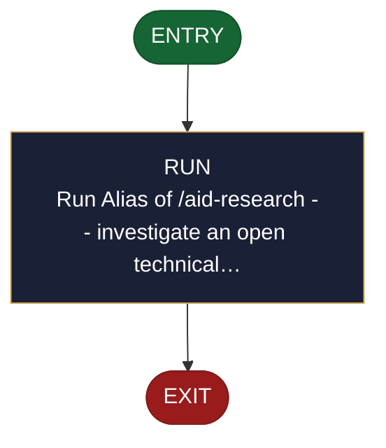

<!-- generated — do not edit; source: canonical/skills/aid-investigate/SKILL.md -->

## Frontmatter

- **`name`** — aid-investigate
- **`description`** — Alias of /aid-research -- investigate an open technical question NOW and return a curated, verified answer that RESOLVES NOTHING (presents conclusions +/-, conflicts with their reasons, and gaps for you to resolve). Grounded in the Knowledge Base + project source (authoritative) with supplementary cited web sources; produced by aid-researcher, verified by aid-reviewer. This file carries no logic of its own -- its full behavior is defined by canonical/skills/aid-research/SKILL.md.
- **`allowed-tools`** — Read, Glob, Grep, Bash, Write, Edit, Agent
- **`argument-hint`** — &lt;question> -- an open technical question to investigate

[Definition: `canonical/skills/aid-investigate/SKILL.md`](https://github.com/AndreVianna/aid-methodology/blob/master/canonical/skills/aid-investigate/SKILL.md)

## Flow

> **Approximate:** This chart is derived by heuristic; exact transitions may differ from runtime behaviour.

