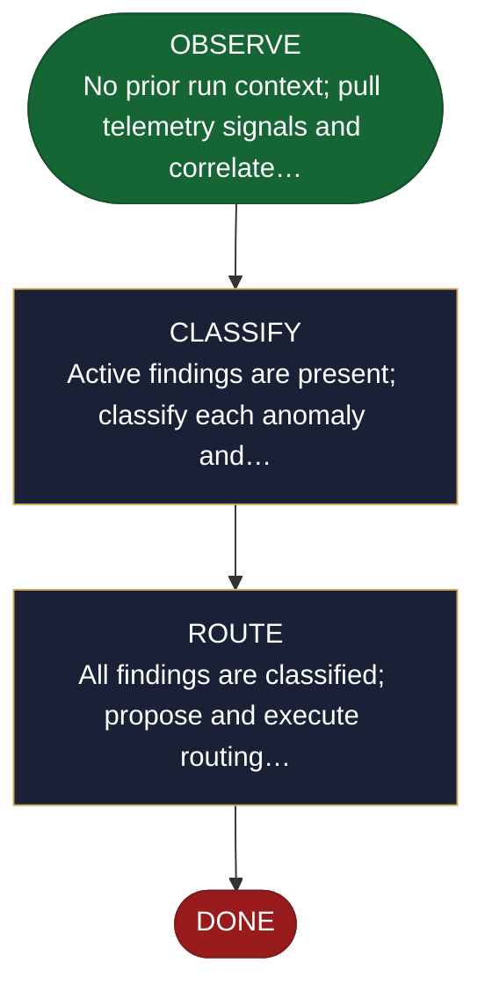

<!-- generated — do not edit; source: canonical/skills/aid-monitor/SKILL.md -->

## Frontmatter

- **`name`** — aid-monitor
- **`description`** — Watch production, classify what you find, and route it to whoever should act. Use this skill after a deployment, on a schedule, or whenever something looks wrong in the field. It reads telemetry, detects anomalies, performs root-cause analysis on the ones that are bugs, and then routes: bugs to `/aid-fix`, change requests to `/aid-triage`. Scoped to one work at a time.
- **`allowed-tools`** — Read, Glob, Grep, Bash, Write

[Definition: `canonical/skills/aid-monitor/SKILL.md`](https://github.com/AndreVianna/aid-methodology/blob/master/canonical/skills/aid-monitor/SKILL.md)

## Flow

## Source fragments

Every node in the chart above, in chart order, with the exact `canonical/` text it was derived from.

**1 · `OBSERVE`** — No prior run context; pull telemetry signals and correlate… · _entry_

~~~~plaintext title="canonical/skills/aid-monitor/SKILL.md#L219" wrap
| OBSERVE | `references/state-observe.md` | `aid-researcher` | → CLASSIFY |
~~~~

[Source: `canonical/skills/aid-monitor/SKILL.md#L219`](https://github.com/AndreVianna/aid-methodology/blob/master/canonical/skills/aid-monitor/SKILL.md#L219) · [full step: `canonical/skills/aid-monitor/references/state-observe.md#L1-L35`](https://github.com/AndreVianna/aid-methodology/blob/master/canonical/skills/aid-monitor/references/state-observe.md#L1-L35)

**2 · `CLASSIFY`** — Active findings are present; classify each anomaly and… · _step_

~~~~plaintext title="canonical/skills/aid-monitor/SKILL.md#L220" wrap
| CLASSIFY | `references/state-classify.md` | `aid-researcher` | → ROUTE |
~~~~

[Source: `canonical/skills/aid-monitor/SKILL.md#L220`](https://github.com/AndreVianna/aid-methodology/blob/master/canonical/skills/aid-monitor/SKILL.md#L220) · [full step: `canonical/skills/aid-monitor/references/state-classify.md#L1-L46`](https://github.com/AndreVianna/aid-methodology/blob/master/canonical/skills/aid-monitor/references/state-classify.md#L1-L46)

**3 · `ROUTE`** — All findings are classified; propose and execute routing… · _step_

~~~~plaintext title="canonical/skills/aid-monitor/SKILL.md#L221" wrap
| ROUTE | `references/state-route.md` | `aid-orchestrator` | → DONE |
~~~~

[Source: `canonical/skills/aid-monitor/SKILL.md#L221`](https://github.com/AndreVianna/aid-methodology/blob/master/canonical/skills/aid-monitor/SKILL.md#L221) · [full step: `canonical/skills/aid-monitor/references/state-route.md#L1-L60`](https://github.com/AndreVianna/aid-methodology/blob/master/canonical/skills/aid-monitor/references/state-route.md#L1-L60)

**4 · `DONE`** · _exit_ · HALT

~~~~plaintext title="canonical/skills/aid-monitor/SKILL.md#L222" wrap
| DONE | _(inline — see Re-run below)_ | `inline` | → halt |
~~~~

[Source: `canonical/skills/aid-monitor/SKILL.md#L222`](https://github.com/AndreVianna/aid-methodology/blob/master/canonical/skills/aid-monitor/SKILL.md#L222)
