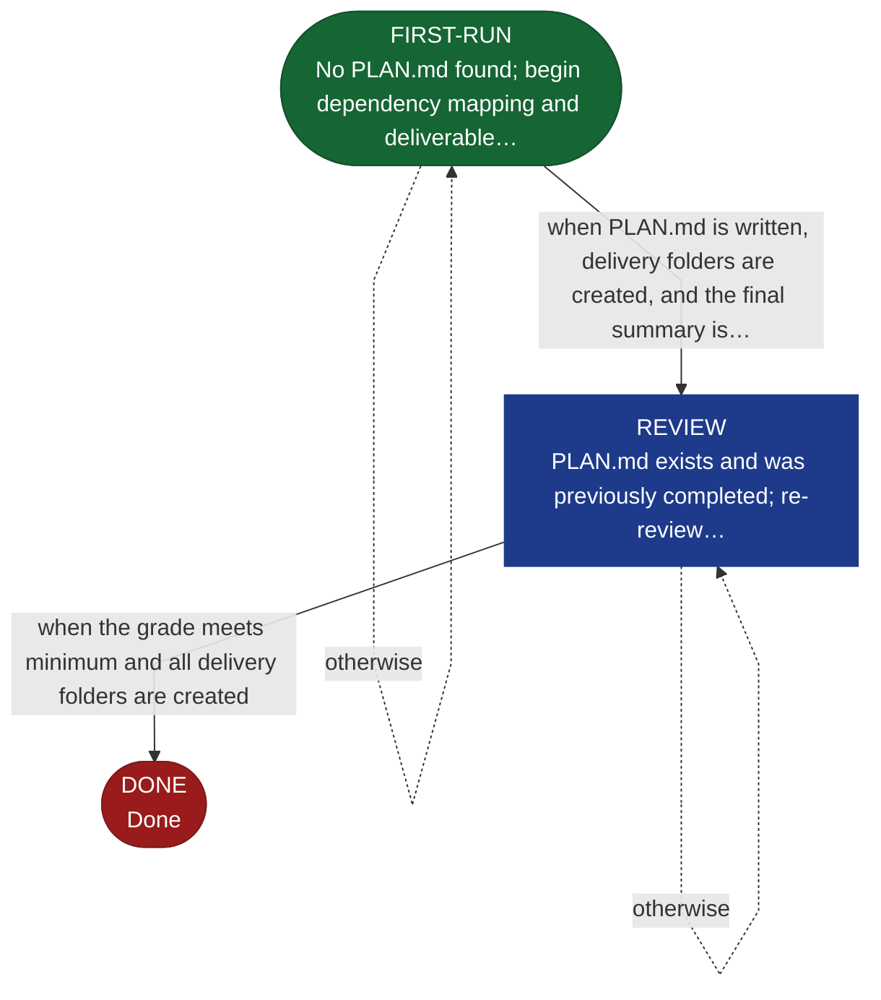

<!-- generated — do not edit; source: canonical/skills/aid-plan/SKILL.md -->

## Frontmatter

- **`name`** — aid-plan
- **`description`** — Sequence feature SPECs into deliverables — each one a functional MVP that builds on the previous. Strategy, not tactics. Use when feature SPECs are complete and you need a delivery roadmap. State machine: FIRST-RUN → REVIEW → DONE.
- **`allowed-tools`** — Read, Glob, Grep, Write, Edit, Bash
- **`argument-hint`** — work-001 (required if multiple works)  [--reset] clear PLAN.md and restart

[Definition: `canonical/skills/aid-plan/SKILL.md`](https://github.com/AndreVianna/aid-methodology/blob/master/canonical/skills/aid-plan/SKILL.md)

## Flow

