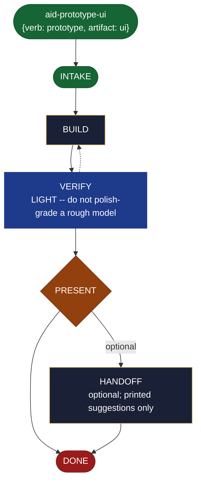

<!-- generated — do not edit; source: canonical/skills/aid-prototype-ui/SKILL.md -->

## Frontmatter

- **`name`** — aid-prototype-ui
- **`description`** — Build a throwaway, low-fidelity UI wireframe and interaction flow to test whether a UX direction actually works. Use this skill when you want to see a screen before committing to building it. Isolated and disposable: it never touches production, and it reports what the mock shows rather than deciding anything for you. For a kept UI design meant to inform the real build rather than a throwaway that validates a direction, use `/aid-design-ui` instead. A thin kind-sibling of `/aid-prototype`, which defines its full behavior.
- **`allowed-tools`** — Read, Glob, Grep, Bash, Write, Edit, Agent
- **`argument-hint`** — &lt;screen/flow> -- the UI screen(s)/flow whose direction to validate

[Definition: `canonical/skills/aid-prototype-ui/SKILL.md`](https://github.com/AndreVianna/aid-methodology/blob/master/canonical/skills/aid-prototype-ui/SKILL.md)

## Flow

## Source fragments

Every node in the chart above, in chart order, with the exact `canonical/` text it was derived from.

**1 · `aid-prototype-ui`** — {verb: prototype, artifact: ui} · _entry_

~~~~plaintext title="canonical/skills/aid-prototype-ui/SKILL.md#L18" wrap
(`alias_of: null`, its own `{verb: prototype, artifact: ui}`), `repurpose: true`
~~~~

[Source: `canonical/skills/aid-prototype-ui/SKILL.md#L18`](https://github.com/AndreVianna/aid-methodology/blob/master/canonical/skills/aid-prototype-ui/SKILL.md#L18)

**2 · `INTAKE`** · _entry_

~~~~plaintext title="canonical/skills/aid-prototype/SKILL.md#L30-L52" wrap
## State: INTAKE

1. **Require a direction.** Empty argument -> ask one bootstrapping question ("What
   direction do you want to validate, and what would tell you it works?") and wait.
2. **Capture (thin):** direction/hypothesis; fidelity (`paper` | `low-fi` | `runnable
   spike`, default `low-fi`); the success signal that would validate it; the scope
   boundary (what it does NOT attempt -- keeps it throwaway).
3. **Pick the path:** **Fast** -- a clear direction + success signal -> build now.
   **Guided** -- vague ("prototype something for onboarding") -> scope direction / success
   signal / fidelity first.
4. **Classify complexity (model + effort):** simple -> `aid-architect` at **sonnet /
   medium**; complex (a runnable spike, a rich flow) -> **opus / high**.
5. **Consult the Work Initiation Gate, then allocate the work folder + STATE.** First run
   the gate (`canonical/aid/templates/work-initiation-gate.md`):
   `bash canonical/aid/scripts/works/enumerate-works.sh` (main tree + every git worktree).
   Empty -> allocate, no prompt. Works exist -> ask new-vs-continuation; on **continuation**
   route to the chosen work's resume door and STOP (allocate nothing); on **new work**:
   create and enter the worktree per the gate's `§ 3a` step 2
   (`worktree-lifecycle.sh create <work-id> <name>`, STOP on a non-zero exit or empty path,
   else enter the resolved path), **then** allocate (`pipeline.path: lite`, `initiator:
   aid-prototype`, `lifecycle: Running`, `active_skill: aid-prototype`; `phase` not
   driven). For a **runnable spike**, associate an opt-in git worktree so the throwaway
   code is isolated.
~~~~

[Source: `canonical/skills/aid-prototype/SKILL.md#L30-L52`](https://github.com/AndreVianna/aid-methodology/blob/master/canonical/skills/aid-prototype/SKILL.md#L30-L52) · [full step: `canonical/skills/aid-prototype/SKILL.md#L30-L54`](https://github.com/AndreVianna/aid-methodology/blob/master/canonical/skills/aid-prototype/SKILL.md#L30-L54)

**3 · `BUILD`** · _step_

~~~~plaintext title="canonical/skills/aid-prototype/SKILL.md#L58-L65" wrap
## State: BUILD

Dispatch **`aid-architect`** (clean context, tiered) to build the low-fidelity model of
the direction and capture the validation signal. A "runnable spike" is **throwaway code
written by this same `aid-architect` dispatch** -- deliberately NOT `aid-developer` (whose
job is production code), keeping the throwaway/non-production boundary crisp. All artifacts
stay in the work folder / opt-in worktree and **never touch production modules**. It writes
a validation assessment (see [Deliverable](#deliverable)) into the work folder.
~~~~

[Source: `canonical/skills/aid-prototype/SKILL.md#L58-L65`](https://github.com/AndreVianna/aid-methodology/blob/master/canonical/skills/aid-prototype/SKILL.md#L58-L65) · [full step: `canonical/skills/aid-prototype/SKILL.md#L58-L67`](https://github.com/AndreVianna/aid-methodology/blob/master/canonical/skills/aid-prototype/SKILL.md#L58-L67)

**4 · `VERIFY`** — LIGHT -- do not polish-grade a rough model · _loop-back_

~~~~plaintext title="canonical/skills/aid-prototype/SKILL.md#L71-L78" wrap
## State: VERIFY  (LIGHT -- do not polish-grade a rough model)

A prototype is *deliberately* low-fidelity, so this is a single light clean-context check
(not the full adversarial loop the other collapses run): dispatch **`aid-reviewer`** once to
confirm (a) the **"success signal observed" claim is honest and grounded** in what was
actually built, and (b) the **throwaway scope was respected** -- no production code snuck in,
nothing was committed to real modules. If the check fails, return to BUILD once to correct;
do not loop on polish.
~~~~

[Source: `canonical/skills/aid-prototype/SKILL.md#L71-L78`](https://github.com/AndreVianna/aid-methodology/blob/master/canonical/skills/aid-prototype/SKILL.md#L71-L78) · [full step: `canonical/skills/aid-prototype/SKILL.md#L71-L80`](https://github.com/AndreVianna/aid-methodology/blob/master/canonical/skills/aid-prototype/SKILL.md#L71-L80)

**5 · `PRESENT`** — hard stop -- the user decides · _decision_

~~~~plaintext title="canonical/skills/aid-prototype/SKILL.md#L84-L88" wrap
## State: PRESENT  (hard stop -- the user decides)

Set `lifecycle: Paused-Awaiting-Input`. Present the throwaway model + the validation
assessment: **Direction · What was built (fidelity) · Success signal — observed or not ·
What we learned · viable? (a conclusion, not a resolution).** Assert no resolution.
~~~~

[Source: `canonical/skills/aid-prototype/SKILL.md#L84-L88`](https://github.com/AndreVianna/aid-methodology/blob/master/canonical/skills/aid-prototype/SKILL.md#L84-L88) · [full step: `canonical/skills/aid-prototype/SKILL.md#L84-L90`](https://github.com/AndreVianna/aid-methodology/blob/master/canonical/skills/aid-prototype/SKILL.md#L84-L90)

**6 · `HANDOFF`** — optional; printed suggestions only · _step_

~~~~plaintext title="canonical/skills/aid-prototype/SKILL.md#L94-L98" wrap
## State: HANDOFF  (optional; printed suggestions only)

Printed suggestions the user may act on: build the validated thing for real
(`/aid-create*`, or `/aid-design` first if a kept design is wanted), or test it with users
(`/aid-experiment` / `/aid-test`). Never auto-invoked; never a resolution.
~~~~

[Source: `canonical/skills/aid-prototype/SKILL.md#L94-L98`](https://github.com/AndreVianna/aid-methodology/blob/master/canonical/skills/aid-prototype/SKILL.md#L94-L98) · [full step: `canonical/skills/aid-prototype/SKILL.md#L94-L100`](https://github.com/AndreVianna/aid-methodology/blob/master/canonical/skills/aid-prototype/SKILL.md#L94-L100)

**7 · `DONE`** · _exit_ · UNSPECIFIED

~~~~plaintext title="canonical/skills/aid-prototype/SKILL.md#L104-L108" wrap
## State: DONE

Set `lifecycle: Completed`, `updated` now, append a `## Lifecycle History` row. Keep the
throwaway artifacts + assessment in the work folder as the audit record; nothing is promoted
to production.
~~~~

[Source: `canonical/skills/aid-prototype/SKILL.md#L104-L108`](https://github.com/AndreVianna/aid-methodology/blob/master/canonical/skills/aid-prototype/SKILL.md#L104-L108) · [full step: `canonical/skills/aid-prototype/SKILL.md#L104-L108`](https://github.com/AndreVianna/aid-methodology/blob/master/canonical/skills/aid-prototype/SKILL.md#L104-L108)
