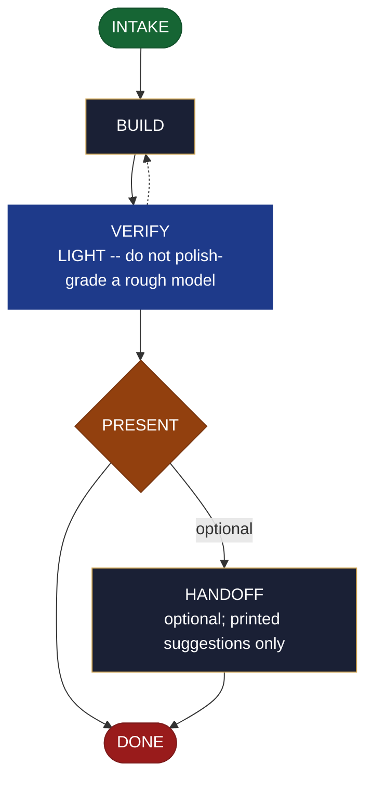

<!-- generated — do not edit; source: canonical/skills/aid-prototype/SKILL.md -->

## Frontmatter

- **`name`** — aid-prototype
- **`description`** — Build a THROWAWAY low-fidelity model NOW to validate a direction before committing to a full build -- then present what it shows and hand the real build off to /aid-create*. It RESOLVES NOTHING (states whether the direction holds + what was learned; you decide). Isolated and throwaway: artifacts live in the work folder / an opt-in worktree and never touch production. Produced by the aid-architect agent; the validation assessment gets a LIGHT verify (the model is deliberately rough -- it is not polish-graded). For a KEPT design meant to inform the build, use /aid-design instead. Allocates a work-NNN folder.
- **`allowed-tools`** — Read, Glob, Grep, Bash, Write, Edit, Agent
- **`argument-hint`** — &lt;direction> -- the direction/hypothesis to validate (optionally: fidelity paper|low-fi|runnable-spike)

[Definition: `canonical/skills/aid-prototype/SKILL.md`](https://github.com/AndreVianna/aid-methodology/blob/master/canonical/skills/aid-prototype/SKILL.md)

## Flow

