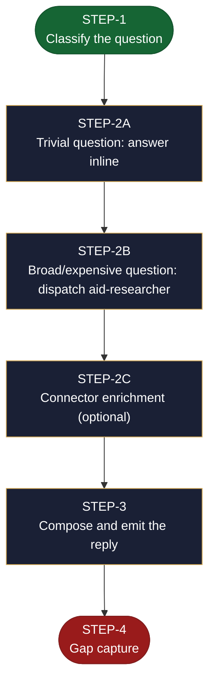

<!-- generated — do not edit; source: canonical/skills/aid-query-kb/SKILL.md -->

## Frontmatter

- **`name`** — aid-query-kb
- **`description`** — Optional on-demand Q&amp;A skill. Takes a free-form question and answers it in one pass, grounded in three context sources: the Knowledge Base (.aid/knowledge/), the live codebase, and in-flight AID works (.aid/works/work-*/STATE.md + progress). Returns an answer with source citations (KB doc names, file paths, or work-NNN STATE references). When the available context cannot answer the question, states the gap explicitly rather than fabricating an answer AND captures the gap as a Query-Gap entry in the STATE.md Q&amp;A (Pending) backlog so it feeds the KB-improvement loop. Trivial questions are answered inline (Read/Glob/Grep only); broad or expensive investigations dispatch aid-researcher in strictly read-only mode. Writes are restricted to appending a Query-Gap entry to a STATE.md Q&amp;A (Pending) section; no KB doc, settings, or code file is ever written.
- **`allowed-tools`** — Read, Glob, Grep, Agent, Write, Edit
- **`argument-hint`** — &lt;question>  — a free-form question about the project

[Definition: `canonical/skills/aid-query-kb/SKILL.md`](https://github.com/AndreVianna/aid-methodology/blob/master/canonical/skills/aid-query-kb/SKILL.md)

## Flow

> **Approximate:** This chart is derived by heuristic; exact transitions may differ from runtime behaviour.

