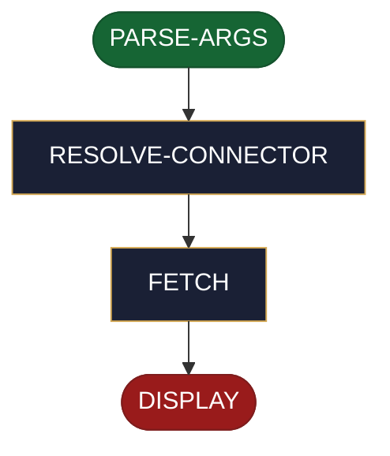

<!-- generated — do not edit; source: canonical/skills/aid-read-ticket/SKILL.md -->

## Frontmatter

- **`name`** — aid-read-ticket
- **`description`** — On-demand, non-destructive ticket read. `aid-read-ticket [<connector>:]<ticket-id>` parses the ref (an optional `<stem>:` prefix plus the tracker's own id), resolves which issue-tracker connector answers it via the shared connector-resolution ladder (explicit override; a single catalogued issue-tracker connector used silently; a choice asked when two or more are catalogued; the host tool's own tracker MCP as fallback; a "no issue-tracker connector found." notice otherwise), fetches the ticket through the host tool's own MCP -- AID resolves no credential and stores none -- and displays its fields. Never writes, locally or to the tracker, and never shows a confirmation prompt; a failed, not-found, unauthorized, or unavailable fetch surfaces the tracker's error verbatim and exits without side effects.
- **`allowed-tools`** — Read, Glob, Grep, AskUserQuestion
- **`argument-hint`** — [&lt;connector>:]&lt;ticket-id>

[Definition: `canonical/skills/aid-read-ticket/SKILL.md`](https://github.com/AndreVianna/aid-methodology/blob/master/canonical/skills/aid-read-ticket/SKILL.md)

## Flow

> **Approximate:** This chart is derived by heuristic; exact transitions may differ from runtime behaviour.

