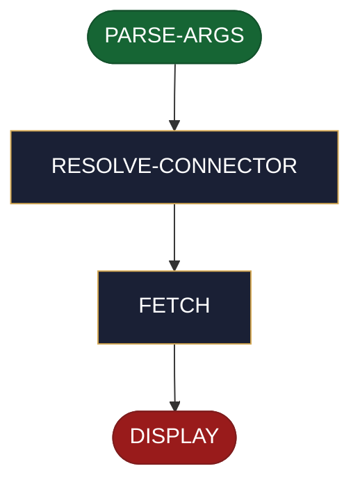

<!-- generated — do not edit; source: canonical/skills/aid-read-ticket/SKILL.md -->

## Frontmatter

- **`name`** — aid-read-ticket
- **`description`** — Read one ticket from the project's issue tracker and show its fields. Use this skill when you need a ticket's current contents -- during triage, before starting work, or while writing a change that references it. Give it a ticket id, optionally prefixed with a connector name when more than one tracker is catalogued. It resolves which tracker answers, fetches through your host tool's own MCP so AID never handles a credential, and displays the result. It never writes, locally or to the tracker, and never asks for confirmation; a failed, not-found, unauthorized or unavailable fetch surfaces the tracker's own error and exits without side effects.
- **`allowed-tools`** — Read, Glob, Grep, AskUserQuestion
- **`argument-hint`** — [&lt;connector>:]&lt;ticket-id>

[Definition: `canonical/skills/aid-read-ticket/SKILL.md`](https://github.com/AndreVianna/aid-methodology/blob/master/canonical/skills/aid-read-ticket/SKILL.md)

## Flow

> **Approximate:** This chart is derived by heuristic; exact transitions may differ from runtime behaviour.

## Source fragments

Every node in the chart above, in chart order, with the exact `canonical/` text it was derived from.

**1 · `PARSE-ARGS`** · _entry_

~~~~plaintext title="canonical/skills/aid-read-ticket/SKILL.md#L67" wrap
### State 1 — PARSE-ARGS
~~~~

[Source: `canonical/skills/aid-read-ticket/SKILL.md#L67`](https://github.com/AndreVianna/aid-methodology/blob/master/canonical/skills/aid-read-ticket/SKILL.md#L67)

**2 · `RESOLVE-CONNECTOR`** · _step_

~~~~plaintext title="canonical/skills/aid-read-ticket/SKILL.md#L76" wrap
### State 2 — RESOLVE-CONNECTOR
~~~~

[Source: `canonical/skills/aid-read-ticket/SKILL.md#L76`](https://github.com/AndreVianna/aid-methodology/blob/master/canonical/skills/aid-read-ticket/SKILL.md#L76)

**3 · `FETCH`** · _step_

~~~~plaintext title="canonical/skills/aid-read-ticket/SKILL.md#L102" wrap
### State 3 — FETCH
~~~~

[Source: `canonical/skills/aid-read-ticket/SKILL.md#L102`](https://github.com/AndreVianna/aid-methodology/blob/master/canonical/skills/aid-read-ticket/SKILL.md#L102)

**4 · `DISPLAY`** · _exit_ · UNSPECIFIED

~~~~plaintext title="canonical/skills/aid-read-ticket/SKILL.md#L116" wrap
### State 4 — DISPLAY
~~~~

[Source: `canonical/skills/aid-read-ticket/SKILL.md#L116`](https://github.com/AndreVianna/aid-methodology/blob/master/canonical/skills/aid-read-ticket/SKILL.md#L116)
