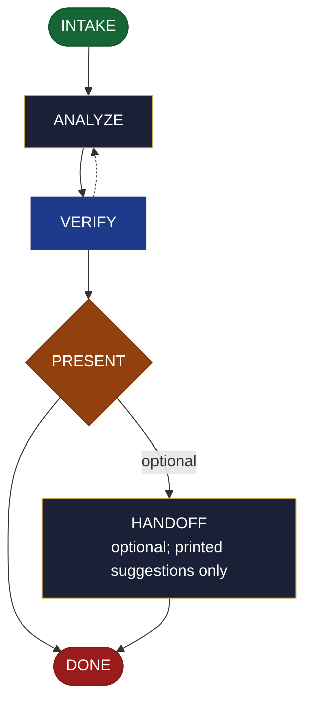

<!-- generated — do not edit; source: canonical/skills/aid-report/SKILL.md -->

## Frontmatter

- **`name`** — aid-report
- **`description`** — Analyse data or usage and return a verified insight report in one pass -- exploratory analysis, metrics, or an A/B result. Use this skill when you have data and need to know what it says, with the caveats stated rather than buried. It presents findings, conclusions both positive and negative, data-quality caveats, any conflicts with the reason for each, and the gaps; you decide what follows. The data itself, plus the Knowledge Base and project source for what the data means, are the authoritative grounding; external baselines are supplementary and cited with a URL and access date. It reads data read-only. For a durable dashboard rather than a one-off report, use `/aid-create-dashboard`.
- **`allowed-tools`** — Read, Glob, Grep, Bash, Write, Edit, Agent
- **`argument-hint`** — &lt;subject> -- the data/usage to analyze (a dataset, logs, metrics, an A/B result)

[Definition: `canonical/skills/aid-report/SKILL.md`](https://github.com/AndreVianna/aid-methodology/blob/master/canonical/skills/aid-report/SKILL.md)

## Flow

## Source fragments

Every node in the chart above, in chart order, with the exact `canonical/` text it was derived from.

**1 · `INTAKE`** · _entry_

~~~~plaintext title="canonical/skills/aid-report/SKILL.md#L34-L54" wrap
## State: INTAKE

1. **Require a subject.** Empty argument -> ask one bootstrapping question ("What data
   should I analyze, and what question about it?") and wait.
2. **Pick the path:** **Fast** -- a clear data source + a clear analytical ask ("analyze
   the A/B results in `results.csv`", "error-rate breakdown from these logs") -> analyze
   now. **Guided** -- vague ("analyze our usage") -> scope *which data, which metrics, what
   question* first, then analyze.
3. **Classify complexity (model + effort):** simple (small dataset, one metric) ->
   `aid-researcher` at **sonnet / medium**; standard/complex (large data, A/B significance,
   deep telemetry) -> **opus / high**. Verifier tier >= producer tier.
4. **Consult the Work Initiation Gate, then allocate the work folder + STATE.** First run
   the gate (`canonical/aid/templates/work-initiation-gate.md`):
   `bash canonical/aid/scripts/works/enumerate-works.sh` (main tree + every git worktree).
   Empty -> allocate, no prompt. Works exist -> ask new-vs-continuation; on **continuation**
   route to the chosen work's resume door and STOP (allocate nothing); on **new work**:
   create and enter the worktree per the gate's `§ 3a` step 2
   (`worktree-lifecycle.sh create <work-id> <name>`, STOP on a non-zero exit or empty path,
   else enter the resolved path), **then** allocate (`pipeline.path: lite`, `initiator:
   aid-report`, `lifecycle: Running`, `active_skill: aid-report`; `phase` not driven), same
   as the other collapse skills.
~~~~

[Source: `canonical/skills/aid-report/SKILL.md#L34-L54`](https://github.com/AndreVianna/aid-methodology/blob/master/canonical/skills/aid-report/SKILL.md#L34-L54) · [full step: `canonical/skills/aid-report/SKILL.md#L34-L56`](https://github.com/AndreVianna/aid-methodology/blob/master/canonical/skills/aid-report/SKILL.md#L34-L56)

**2 · `ANALYZE`** · _step_

~~~~plaintext title="canonical/skills/aid-report/SKILL.md#L60-L63" wrap
## State: ANALYZE

Access the data **read-only** and dispatch **`aid-researcher`** (clean context, tiered) to
analyze + consolidate:
~~~~

[Source: `canonical/skills/aid-report/SKILL.md#L60-L63`](https://github.com/AndreVianna/aid-methodology/blob/master/canonical/skills/aid-report/SKILL.md#L60-L63) · [full step: `canonical/skills/aid-report/SKILL.md#L60-L75`](https://github.com/AndreVianna/aid-methodology/blob/master/canonical/skills/aid-report/SKILL.md#L60-L75)

**3 · `VERIFY`** · _loop-back_

~~~~plaintext title="canonical/skills/aid-report/SKILL.md#L79-L89" wrap
## State: VERIFY

1. **Mechanical grounding check** (no dispatch): findings cite the data; external claims a
   URL+date; the **Caveats** and **Conflicts** sections exist.
2. **Adversarial verification** -- clean-context **`aid-reviewer`** checks `REPORT.md`:
   findings supported by the data; **no metric or A/B conclusion stated without its caveat**
   (sampling, significance, denominator, confounders); conflicts surfaced with reasons;
   conclusions not overstated into resolutions. Writes a review-quality ledger to
   `.aid/.temp/review-pending/<work>-verify.md`.
3. **Grade:** `bash canonical/aid/scripts/grade.sh --explain <ledger>`. Not clean -> loop
   to ANALYZE. Circuit-breaker: 3 cycles -> IMPEDIMENT + `lifecycle: Blocked`.
~~~~

[Source: `canonical/skills/aid-report/SKILL.md#L79-L89`](https://github.com/AndreVianna/aid-methodology/blob/master/canonical/skills/aid-report/SKILL.md#L79-L89) · [full step: `canonical/skills/aid-report/SKILL.md#L79-L91`](https://github.com/AndreVianna/aid-methodology/blob/master/canonical/skills/aid-report/SKILL.md#L79-L91)

**4 · `PRESENT`** — hard stop -- the user resolves · _decision_

~~~~plaintext title="canonical/skills/aid-report/SKILL.md#L95-L99" wrap
## State: PRESENT  (hard stop -- the user resolves)

Set `lifecycle: Paused-Awaiting-Input`. Present `REPORT.md` clearly: findings
(metrics/tables), conclusions (+/-), **caveats & data-quality gaps** (first-class),
conflicts with reasons, and gaps. Assert no resolution.
~~~~

[Source: `canonical/skills/aid-report/SKILL.md#L95-L99`](https://github.com/AndreVianna/aid-methodology/blob/master/canonical/skills/aid-report/SKILL.md#L95-L99) · [full step: `canonical/skills/aid-report/SKILL.md#L95-L101`](https://github.com/AndreVianna/aid-methodology/blob/master/canonical/skills/aid-report/SKILL.md#L95-L101)

**5 · `HANDOFF`** — optional; printed suggestions only · _step_

~~~~plaintext title="canonical/skills/aid-report/SKILL.md#L105-L110" wrap
## State: HANDOFF  (optional; printed suggestions only)

Printed suggestions the user may act on: make it recurring (`/aid-create-dashboard`), record
a decision (`/aid-document-decision`), act on a conclusion (`/aid-create*` / `/aid-update*`),
or comment on a source ticket (`/aid-update-ticket comment [<connector>:]<ticket-id> <text>`).
Never auto-invoked; never a resolution.
~~~~

[Source: `canonical/skills/aid-report/SKILL.md#L105-L110`](https://github.com/AndreVianna/aid-methodology/blob/master/canonical/skills/aid-report/SKILL.md#L105-L110) · [full step: `canonical/skills/aid-report/SKILL.md#L105-L112`](https://github.com/AndreVianna/aid-methodology/blob/master/canonical/skills/aid-report/SKILL.md#L105-L112)

**6 · `DONE`** · _exit_ · UNSPECIFIED

~~~~plaintext title="canonical/skills/aid-report/SKILL.md#L116-L119" wrap
## State: DONE

Set `lifecycle: Completed`, `updated` now, append a `## Lifecycle History` row. Keep the
work folder (`REPORT.md`, the verify ledger) as the audit record.
~~~~

[Source: `canonical/skills/aid-report/SKILL.md#L116-L119`](https://github.com/AndreVianna/aid-methodology/blob/master/canonical/skills/aid-report/SKILL.md#L116-L119) · [full step: `canonical/skills/aid-report/SKILL.md#L116-L119`](https://github.com/AndreVianna/aid-methodology/blob/master/canonical/skills/aid-report/SKILL.md#L116-L119)
