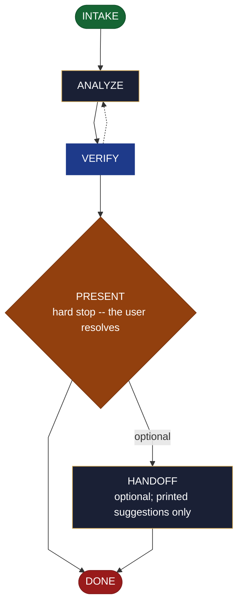

<!-- generated — do not edit; source: canonical/skills/aid-report/SKILL.md -->

## Frontmatter

- **`name`** — aid-report
- **`description`** — Analyze data or usage NOW -- EDA, metrics, or an A/B result -- and return a curated, verified insight report in one pass. It RESOLVES NOTHING: it presents findings, conclusions (positive AND negative), data-quality caveats, conflicts (each with its reason), and gaps, clearly and simply; you resolve. Grounded two ways: the data being analyzed plus the KB/project source (for what the data means) are the authoritative grounding truth; external baselines/benchmarks are supplementary, cited with URL + access date. Produced by aid-researcher and verified by aid-reviewer. Reads data read-only (files/logs directly; live sources via an MCP connector); never a durable dashboard -- that is /aid-create-dashboard. Allocates a work-NNN folder.
- **`allowed-tools`** — Read, Glob, Grep, Bash, Write, Edit, Agent
- **`argument-hint`** — &lt;subject> -- the data/usage to analyze (a dataset, logs, metrics, an A/B result)

[Definition: `canonical/skills/aid-report/SKILL.md`](https://github.com/AndreVianna/aid-methodology/blob/master/canonical/skills/aid-report/SKILL.md)

## Flow

