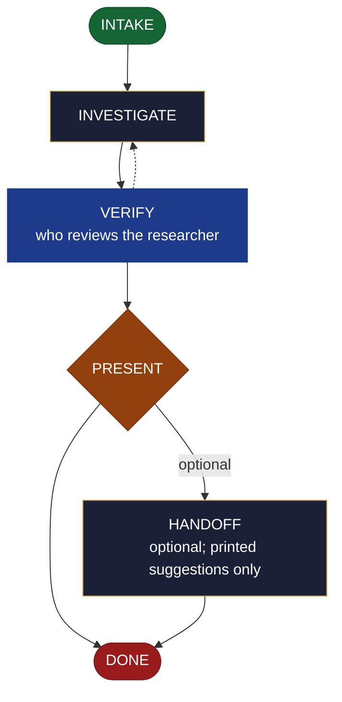

<!-- generated — do not edit; source: canonical/skills/aid-research/SKILL.md -->

## Frontmatter

- **`name`** — aid-research
- **`description`** — Investigate an open technical question and return a verified answer in one pass -- evaluating options, or running an isolated feasibility spike if you explicitly authorise one. Use this skill when a decision is blocked on something nobody has established yet. It presents the answer, the conclusions both positive and negative, any contradictions with the reason for each, and the gaps; you decide. The Knowledge Base and the project source are the authoritative grounding; web sources are encouraged but supplementary, cited with a URL and access date, and a contradiction between them is surfaced rather than silently resolved. For open-ended exploration of a problem space rather than a specific question, use `/aid-brainstorm`.
- **`allowed-tools`** — Read, Glob, Grep, Bash, Write, Edit, Agent
- **`argument-hint`** — &lt;question> -- an open technical question to investigate

[Definition: `canonical/skills/aid-research/SKILL.md`](https://github.com/AndreVianna/aid-methodology/blob/master/canonical/skills/aid-research/SKILL.md)

## Flow

## Source fragments

Every node in the chart above, in chart order, with the exact `canonical/` text it was derived from.

**1 · `INTAKE`** · _entry_

~~~~plaintext title="canonical/skills/aid-research/SKILL.md#L36-L66" wrap
## State: INTAKE

1. **Require a question.** If the argument is empty, ask one bootstrapping question ("What
   do you want investigated?") and wait.
2. **Pick the path (question scope):**
   - **Fast path** -- a concrete, well-scoped question with clear evaluation criteria
     ("Is lib X compatible with our Node 24 build?", "Postgres vs SQLite for use-case Y
     against criteria A/B/C") -> investigate immediately.
   - **Guided path** -- vague / broad / underspecified ("research our DB options") -> ask
     2-3 scoping questions first (narrow it), then investigate.
3. **Classify complexity (sets model + effort):** simple (bounded question, a few docs,
   <=1 web source) -> `aid-researcher` at **sonnet / medium**; standard/complex (broad
   options analysis, deep traversal, many web sources, a spike) -> **opus / high**.
   Verifier tier is always >= producer tier.
4. **Consult the Work Initiation Gate, then allocate the work folder + STATE.** First run
   the gate (`canonical/aid/templates/work-initiation-gate.md`):
   `bash canonical/aid/scripts/works/enumerate-works.sh` (main tree + every git worktree).
   Empty -> allocate below, no prompt. Works exist -> ask new-vs-continuation with the
   enumerated list; on **continuation** route to the chosen work's resume door and STOP
   (allocate nothing); on **new work**: resolve `<work-id>` as `work-{NNN+1}`, where `NNN`
   is the maximum `work-NNN` numeric prefix across every record the enumeration above
   already returned (cross-worktree by construction -- never a local `.aid/works/` glob;
   gate `§ 3a` step 1); create and enter the worktree per the gate's `§ 3a` step 2
   (`worktree-lifecycle.sh create <work-id> <name>`, STOP on a non-zero exit or empty path,
   else enter the resolved path); **only then** allocate: `.aid/works/<work-id>-<slug>/`
   under `.aid/works/`; slug from the question. Copy
   `canonical/aid/templates/work-state-template.yml` to
   `.aid/works/work-NNN-<slug>/STATE.yml`; write opening frontmatter (`pipeline.path: lite`,
   `initiator: aid-research`, `lifecycle: Running`, `active_skill: aid-research`,
   `started`/`updated`). Do NOT drive the 7-phase `phase` scalar. Associate a git worktree
   only if a spike is later authorized (INVESTIGATE).
~~~~

[Source: `canonical/skills/aid-research/SKILL.md#L36-L66`](https://github.com/AndreVianna/aid-methodology/blob/master/canonical/skills/aid-research/SKILL.md#L36-L66) · [full step: `canonical/skills/aid-research/SKILL.md#L36-L68`](https://github.com/AndreVianna/aid-methodology/blob/master/canonical/skills/aid-research/SKILL.md#L36-L68)

**2 · `INVESTIGATE`** · _step_

~~~~plaintext title="canonical/skills/aid-research/SKILL.md#L72-L75" wrap
## State: INVESTIGATE

Dispatch **`aid-researcher`** (clean context, model+effort from INTAKE Step 3) to gather
and curate the evidence:
~~~~

[Source: `canonical/skills/aid-research/SKILL.md#L72-L75`](https://github.com/AndreVianna/aid-methodology/blob/master/canonical/skills/aid-research/SKILL.md#L72-L75) · [full step: `canonical/skills/aid-research/SKILL.md#L72-L92`](https://github.com/AndreVianna/aid-methodology/blob/master/canonical/skills/aid-research/SKILL.md#L72-L92)

**3 · `VERIFY`** — who reviews the researcher · _loop-back_

~~~~plaintext title="canonical/skills/aid-research/SKILL.md#L96-L110" wrap
## State: VERIFY  (who reviews the researcher)

1. **Mechanical grounding check** (no dispatch): every project claim carries a KB/source
   cite; every external claim a URL+date; the **Conflicts** and **Gaps** sections exist
   (empty-but-present is allowed; silently-omitted is not).
2. **Adversarial verification** -- dispatch a clean-context **`aid-reviewer`** to check
   `RESEARCH.md`: claims grounded and correctly attributed; conclusions evidence-backed
   and **not overstated into resolutions**; every KB<->web conflict surfaced with its
   reason; no material angle of the question left silently unaddressed. It writes a
   review-quality 7-column ledger (`reviewer-ledger-schema.md`) to
   `.aid/.temp/review-pending/<work>-verify.md`.
3. **Grade the response:** `bash canonical/aid/scripts/grade.sh --explain <ledger>`. Not
   clean -> loop back to INVESTIGATE for the researcher to revise. **Circuit-breaker: 3
   cycles** -> write `.aid/works/{work}/IMPEDIMENT-research.md`, set STATE `lifecycle: Blocked`,
   surface it.
~~~~

[Source: `canonical/skills/aid-research/SKILL.md#L96-L110`](https://github.com/AndreVianna/aid-methodology/blob/master/canonical/skills/aid-research/SKILL.md#L96-L110) · [full step: `canonical/skills/aid-research/SKILL.md#L96-L114`](https://github.com/AndreVianna/aid-methodology/blob/master/canonical/skills/aid-research/SKILL.md#L96-L114)

**4 · `PRESENT`** — always a hard stop -- the user resolves · _decision_

~~~~plaintext title="canonical/skills/aid-research/SKILL.md#L118-L123" wrap
## State: PRESENT  (always a hard stop -- the user resolves)

Set STATE `lifecycle: Paused-Awaiting-Input`. Present `RESEARCH.md` **clearly and simply**:
the in-depth answer, conclusions (positive **and** negative), conflicts/contradictions
**with their reasons**, and gaps. Assert no resolution -- the user decides. Negatives and
gaps are first-class, never buried under positives.
~~~~

[Source: `canonical/skills/aid-research/SKILL.md#L118-L123`](https://github.com/AndreVianna/aid-methodology/blob/master/canonical/skills/aid-research/SKILL.md#L118-L123) · [full step: `canonical/skills/aid-research/SKILL.md#L118-L125`](https://github.com/AndreVianna/aid-methodology/blob/master/canonical/skills/aid-research/SKILL.md#L118-L125)

**5 · `HANDOFF`** — optional; printed suggestions only · _step_

~~~~plaintext title="canonical/skills/aid-research/SKILL.md#L129-L135" wrap
## State: HANDOFF  (optional; printed suggestions only)

Offer the natural next steps as **printed suggestions**, each requiring the user to act:
record an ADR (`/aid-document-decision` -> once landed, `/aid-create-document`), update the
KB (`/aid-update-kb`), act on a conclusion (`/aid-create*` / `/aid-update*`), or comment on
a source ticket (`/aid-update-ticket comment [<connector>:]<ticket-id> <text>`). Never
auto-invoked; never a resolution.
~~~~

[Source: `canonical/skills/aid-research/SKILL.md#L129-L135`](https://github.com/AndreVianna/aid-methodology/blob/master/canonical/skills/aid-research/SKILL.md#L129-L135) · [full step: `canonical/skills/aid-research/SKILL.md#L129-L137`](https://github.com/AndreVianna/aid-methodology/blob/master/canonical/skills/aid-research/SKILL.md#L129-L137)

**6 · `DONE`** · _exit_ · UNSPECIFIED

~~~~plaintext title="canonical/skills/aid-research/SKILL.md#L141-L144" wrap
## State: DONE

Set STATE `lifecycle: Completed`, `updated` now, append a `## Lifecycle History` row. Keep
the work folder (`RESEARCH.md`, any spike scratch, the verify ledger) as the audit record.
~~~~

[Source: `canonical/skills/aid-research/SKILL.md#L141-L144`](https://github.com/AndreVianna/aid-methodology/blob/master/canonical/skills/aid-research/SKILL.md#L141-L144) · [full step: `canonical/skills/aid-research/SKILL.md#L141-L144`](https://github.com/AndreVianna/aid-methodology/blob/master/canonical/skills/aid-research/SKILL.md#L141-L144)
