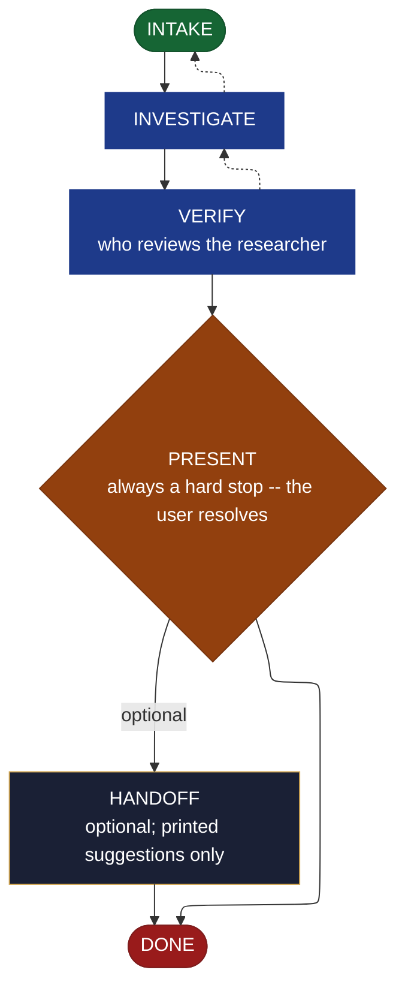

<!-- generated — do not edit; source: canonical/skills/aid-research/SKILL.md -->

## Frontmatter

- **`name`** — aid-research
- **`description`** — Investigate an open technical question NOW -- evaluate options, or (only with your explicit authorization) run an isolated feasibility spike -- and return a curated, verified answer in one pass. It RESOLVES NOTHING: it presents the in-depth answer plus conclusions (positive AND negative), conflicts / contradictions (each with its reason), and gaps, clearly and simply; you resolve. Grounded two ways: the Knowledge Base (.aid/knowledge/) and the project source/codebase are the authoritative grounding truth; external / web sources are allowed and encouraged but supplementary, cited with URL + access date. A KB&lt;->web contradiction is surfaced to you with its reason, never silently resolved. Produced by the aid-researcher agent and independently verified by aid-reviewer before you see it. Allocates a work-NNN folder. /aid-investigate and /aid-spike are aliases.
- **`allowed-tools`** — Read, Glob, Grep, Bash, Write, Edit, Agent
- **`argument-hint`** — &lt;question> -- an open technical question to investigate

[Definition: `canonical/skills/aid-research/SKILL.md`](https://github.com/AndreVianna/aid-methodology/blob/master/canonical/skills/aid-research/SKILL.md)

## Flow

