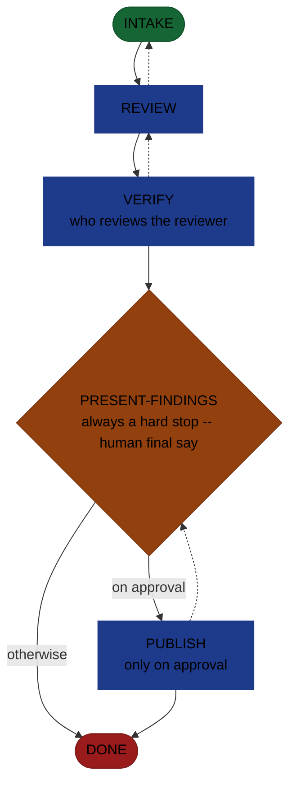

<!-- generated — do not edit; source: canonical/skills/aid-review/SKILL.md -->

## Frontmatter

- **`name`** — aid-review
- **`description`** — Review/assess an existing artifact -- code, a change/diff, a design, a PR, a ticket, a document, a UI, whatever the request names -- against criteria, and return findings + recommendations NOW, in one pass. Single-shot and (except the findings ledger + optional approved publish) read-only: it never plans-and-halts. Grounded in the Knowledge Base (.aid/knowledge/) and the project source -- every finding cites a KB doc or a file:line. The review is produced by the aid-reviewer agent in a clean context and independently verified before you see it; you approve before anything is published to an external target (PR/ticket/doc). Allocates a work-NNN folder for isolation; does not fix anything (findings hand off to /aid-fix).
- **`allowed-tools`** — Read, Glob, Grep, Bash, Write, Edit, Agent
- **`argument-hint`** — [target] -- what to review (a file/dir, PR link, ticket id, work-NNN, 'my changes', or a described target)

[Definition: `canonical/skills/aid-review/SKILL.md`](https://github.com/AndreVianna/aid-methodology/blob/master/canonical/skills/aid-review/SKILL.md)

## Flow

