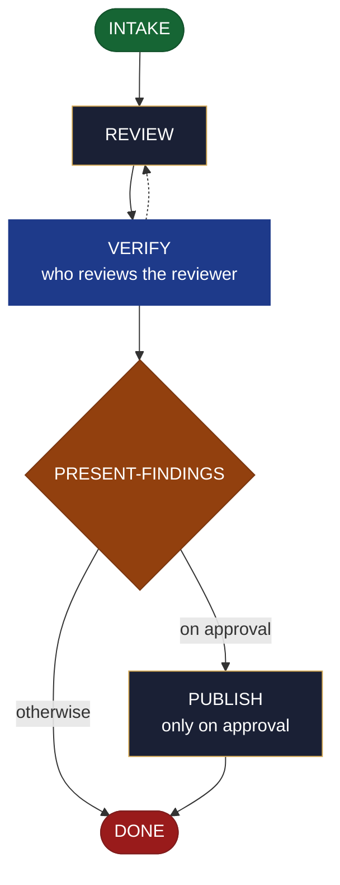

<!-- generated — do not edit; source: canonical/skills/aid-review/SKILL.md -->

## Frontmatter

- **`name`** — aid-review
- **`description`** — Review/assess an existing artifact -- code, a change/diff, a design, a PR, a ticket, a document, a UI, whatever the request names -- against criteria, and return findings + recommendations NOW, in one pass. Single-shot and (except the findings ledger + optional approved publish) read-only: it never plans-and-halts. Grounded in the Knowledge Base (.aid/knowledge/) and the project source -- every finding cites a KB doc or a file:line. The review is produced by the aid-reviewer agent in a clean context and independently verified before you see it; you approve before anything is published to an external target (PR/ticket/doc). Allocates a work-NNN folder for isolation; does not fix anything (findings hand off to /aid-fix).
- **`allowed-tools`** — Read, Glob, Grep, Bash, Write, Edit, Agent
- **`argument-hint`** — [target] -- what to review (a file/dir, PR link, ticket id, work-NNN, 'my changes', or a described target)

[Definition: `canonical/skills/aid-review/SKILL.md`](https://github.com/AndreVianna/aid-methodology/blob/master/canonical/skills/aid-review/SKILL.md)

## Flow

## Source fragments

Every node in the chart above, in chart order, with the exact `canonical/` text it was derived from.

**1 · `INTAKE`** · _entry_

~~~~plaintext title="canonical/skills/aid-review/SKILL.md#L39-L41" wrap
## State: INTAKE

Purpose: resolve the target + criteria, pick the path, allocate the work folder.
~~~~

[Source: `canonical/skills/aid-review/SKILL.md#L39-L41`](https://github.com/AndreVianna/aid-methodology/blob/master/canonical/skills/aid-review/SKILL.md#L39-L41) · [full step: `canonical/skills/aid-review/SKILL.md#L39-L119`](https://github.com/AndreVianna/aid-methodology/blob/master/canonical/skills/aid-review/SKILL.md#L39-L119)

**2 · `REVIEW`** · _step_

~~~~plaintext title="canonical/skills/aid-review/SKILL.md#L123-L125" wrap
## State: REVIEW

Purpose: gather evidence and produce the grounded findings ledger.
~~~~

[Source: `canonical/skills/aid-review/SKILL.md#L123-L125`](https://github.com/AndreVianna/aid-methodology/blob/master/canonical/skills/aid-review/SKILL.md#L123-L125) · [full step: `canonical/skills/aid-review/SKILL.md#L123-L144`](https://github.com/AndreVianna/aid-methodology/blob/master/canonical/skills/aid-review/SKILL.md#L123-L144)

**3 · `VERIFY`** — who reviews the reviewer · _loop-back_

~~~~plaintext title="canonical/skills/aid-review/SKILL.md#L148-L150" wrap
## State: VERIFY  (who reviews the reviewer)

Purpose: ensure the review is grounded, correct, and complete before the human sees it.
~~~~

[Source: `canonical/skills/aid-review/SKILL.md#L148-L150`](https://github.com/AndreVianna/aid-methodology/blob/master/canonical/skills/aid-review/SKILL.md#L148-L150) · [full step: `canonical/skills/aid-review/SKILL.md#L148-L168`](https://github.com/AndreVianna/aid-methodology/blob/master/canonical/skills/aid-review/SKILL.md#L148-L168)

**4 · `PRESENT-FINDINGS`** — always a hard stop -- human final say · _decision_

~~~~plaintext title="canonical/skills/aid-review/SKILL.md#L172-L174" wrap
## State: PRESENT-FINDINGS  (always a hard stop -- human final say)

Set STATE `lifecycle: Paused-Awaiting-Input`. Present:
~~~~

[Source: `canonical/skills/aid-review/SKILL.md#L172-L174`](https://github.com/AndreVianna/aid-methodology/blob/master/canonical/skills/aid-review/SKILL.md#L172-L174) · [full step: `canonical/skills/aid-review/SKILL.md#L172-L185`](https://github.com/AndreVianna/aid-methodology/blob/master/canonical/skills/aid-review/SKILL.md#L172-L185)

**5 · `PUBLISH`** — only on approval · _step_

~~~~plaintext title="canonical/skills/aid-review/SKILL.md#L189-L198" wrap
## State: PUBLISH  (only on approval)

Deliver by the method appropriate to the target, chosen by judgment (not a hardcoded
enum): a PR comment via `gh`; a ticket comment via `/aid-update-ticket comment
[<connector>:]<ticket-id> <text>` (still user-authorized -- the approval just given at
PRESENT-FINDINGS is what authorizes this call, and the skill previews the exact payload again
at its own CONFIRM before posting); a findings report in the work folder (+ optional
inline-comment suggestions) for code; inline notes for a document. **Graceful fallback:** no PR /
no catalogued connector / unknown target -> present the exact text for the human to paste.
Publishing is optional and never blocks DONE.
~~~~

[Source: `canonical/skills/aid-review/SKILL.md#L189-L198`](https://github.com/AndreVianna/aid-methodology/blob/master/canonical/skills/aid-review/SKILL.md#L189-L198) · [full step: `canonical/skills/aid-review/SKILL.md#L189-L200`](https://github.com/AndreVianna/aid-methodology/blob/master/canonical/skills/aid-review/SKILL.md#L189-L200)

**6 · `DONE`** · _exit_ · UNSPECIFIED

~~~~plaintext title="canonical/skills/aid-review/SKILL.md#L204-L208" wrap
## State: DONE

Set STATE `lifecycle: Completed`, `updated` now, append a `## Lifecycle History` row.
Leave the findings ledger on disk (`.aid/.temp/review-pending/<work>-review.md`) so a
follow-up `/aid-fix` can consume it. Keep the work folder as the audit record.
~~~~

[Source: `canonical/skills/aid-review/SKILL.md#L204-L208`](https://github.com/AndreVianna/aid-methodology/blob/master/canonical/skills/aid-review/SKILL.md#L204-L208) · [full step: `canonical/skills/aid-review/SKILL.md#L204-L208`](https://github.com/AndreVianna/aid-methodology/blob/master/canonical/skills/aid-review/SKILL.md#L204-L208)
