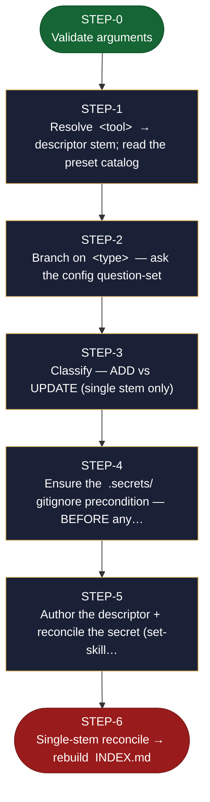

<!-- generated — do not edit; source: canonical/skills/aid-set-connector/SKILL.md -->

## Frontmatter

- **`name`** — aid-set-connector
- **`description`** — On-demand, off-pipeline upsert into the connector catalog. `aid-set-connector <tool> <type>` creates `.aid/connectors/<stem>.md` when the stem is absent, or updates that SAME descriptor in place when present (including an in-place connection_type transition) -- never invokes /aid-discover. Branches on &lt;type> (mcp|api|ssh|cli) to ask the matching config question-set, prefilled from canonical/aid/templates/connectors/preset-catalog.md when &lt;tool> matches a preset; the user confirms or edits. Reconciles the secret (connector-secret write/purge) per set-skill logic and runs reconcile.md's single-stem mode, so every OTHER catalogued connector is left byte-for-byte untouched.
- **`allowed-tools`** — Read, Glob, Grep, Bash, Write, Edit, AskUserQuestion
- **`argument-hint`** — &lt;tool> &lt;type> [--rotate-secret]  -- e.g. aid-set-connector Jira mcp   (type: mcp|api|ssh|cli)

[Definition: `canonical/skills/aid-set-connector/SKILL.md`](https://github.com/AndreVianna/aid-methodology/blob/master/canonical/skills/aid-set-connector/SKILL.md)

## Flow

> **Approximate:** This chart is derived by heuristic; exact transitions may differ from runtime behaviour.

