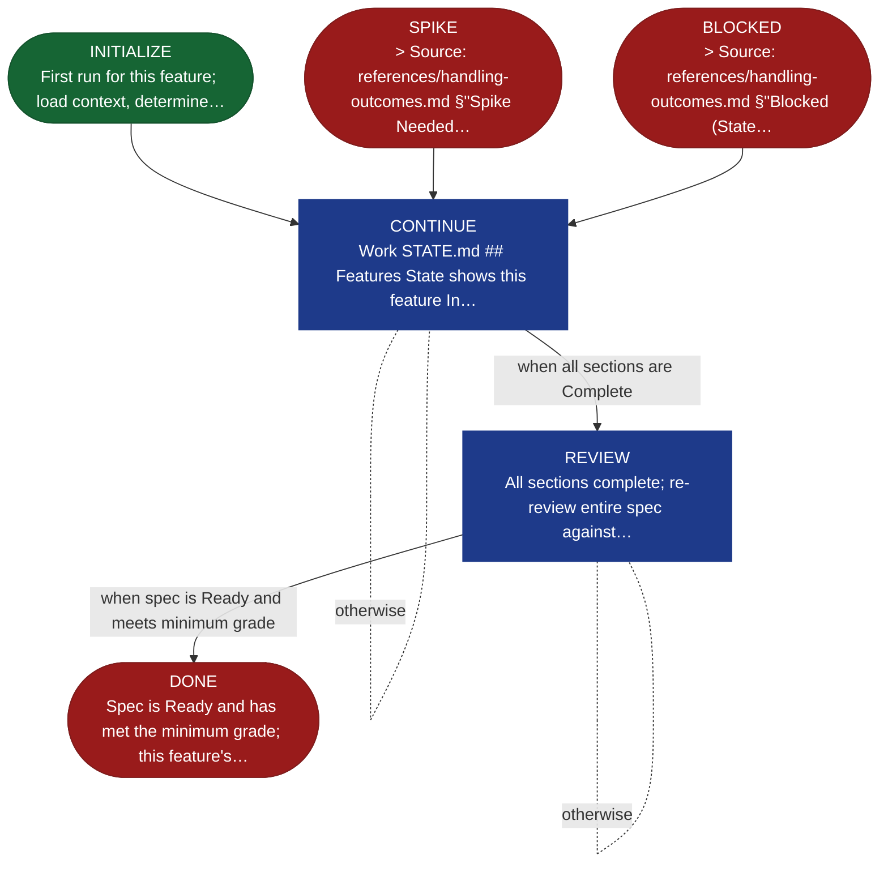

<!-- generated — do not edit; source: canonical/skills/aid-specify/SKILL.md -->

## Frontmatter

- **`name`** — aid-specify
- **`description`** — Technical specification through conversational refinement, one feature at a time. The agent acts as a tech lead — reads KB, Requirements, and codebase, proposes technical solutions, and builds the spec collaboratively with the user. Writes to SPEC.md in the feature folder. State machine: INITIALIZE → CONTINUE → REVIEW → DONE (SPIKE / BLOCKED are loopback states that return to CONTINUE).
- **`allowed-tools`** — Read, Glob, Grep, Bash, Write, Edit
- **`argument-hint`** — work-001/feature-001 (required)  [--reset] clear technical spec for this feature

[Definition: `canonical/skills/aid-specify/SKILL.md`](https://github.com/AndreVianna/aid-methodology/blob/master/canonical/skills/aid-specify/SKILL.md)

## Flow

## Source fragments

Every node in the chart above, in chart order, with the exact `canonical/` text it was derived from.

**1 · `INITIALIZE`** — First run for this feature; load context, determine… · _entry_

~~~~plaintext title="canonical/skills/aid-specify/SKILL.md#L198" wrap
| INITIALIZE | `references/state-initialize.md` | `aid-architect` | → CONTINUE |
~~~~

[Source: `canonical/skills/aid-specify/SKILL.md#L198`](https://github.com/AndreVianna/aid-methodology/blob/master/canonical/skills/aid-specify/SKILL.md#L198) · [full step: `canonical/skills/aid-specify/references/state-initialize.md#L1-L129`](https://github.com/AndreVianna/aid-methodology/blob/master/canonical/skills/aid-specify/references/state-initialize.md#L1-L129)

**2 · `CONTINUE`** — Work STATE.md ## Features State shows this feature In… · _loop-back_

~~~~plaintext title="canonical/skills/aid-specify/SKILL.md#L199" wrap
| CONTINUE | `references/state-continue.md` | `aid-architect` | → REVIEW |
~~~~

[Source: `canonical/skills/aid-specify/SKILL.md#L199`](https://github.com/AndreVianna/aid-methodology/blob/master/canonical/skills/aid-specify/SKILL.md#L199) · [full step: `canonical/skills/aid-specify/references/state-continue.md#L1-L112`](https://github.com/AndreVianna/aid-methodology/blob/master/canonical/skills/aid-specify/references/state-continue.md#L1-L112)

**3 · `SPIKE`** — > Source: references/handling-outcomes.md §"Spike Needed… · _exit_ · PAUSE-FOR-USER-ACTION

~~~~plaintext title="canonical/skills/aid-specify/SKILL.md#L200" wrap
| SPIKE | `references/state-spike.md` | `inline` | → CONTINUE |
~~~~

[Source: `canonical/skills/aid-specify/SKILL.md#L200`](https://github.com/AndreVianna/aid-methodology/blob/master/canonical/skills/aid-specify/SKILL.md#L200) · [full step: `canonical/skills/aid-specify/references/state-spike.md#L1-L20`](https://github.com/AndreVianna/aid-methodology/blob/master/canonical/skills/aid-specify/references/state-spike.md#L1-L20)

**4 · `BLOCKED`** — > Source: references/handling-outcomes.md §"Blocked (State… · _exit_ · PAUSE-FOR-USER-ACTION

~~~~plaintext title="canonical/skills/aid-specify/SKILL.md#L201" wrap
| BLOCKED | `references/state-blocked.md` | `inline` | → CONTINUE |
~~~~

[Source: `canonical/skills/aid-specify/SKILL.md#L201`](https://github.com/AndreVianna/aid-methodology/blob/master/canonical/skills/aid-specify/SKILL.md#L201) · [full step: `canonical/skills/aid-specify/references/state-blocked.md#L1-L17`](https://github.com/AndreVianna/aid-methodology/blob/master/canonical/skills/aid-specify/references/state-blocked.md#L1-L17)

**5 · `REVIEW`** — All sections complete; re-review entire spec against… · _loop-back_

~~~~plaintext title="canonical/skills/aid-specify/SKILL.md#L202" wrap
| REVIEW | `references/state-review.md` | `aid-reviewer` | → DONE |
~~~~

[Source: `canonical/skills/aid-specify/SKILL.md#L202`](https://github.com/AndreVianna/aid-methodology/blob/master/canonical/skills/aid-specify/SKILL.md#L202) · [full step: `canonical/skills/aid-specify/references/state-review.md#L1-L74`](https://github.com/AndreVianna/aid-methodology/blob/master/canonical/skills/aid-specify/references/state-review.md#L1-L74)

**6 · `DONE`** — Spec is Ready and has met the minimum grade; this feature's… · _exit_ · HALT

~~~~plaintext title="canonical/skills/aid-specify/SKILL.md#L203" wrap
| DONE | `references/state-done.md` | `inline` | → halt |
~~~~

[Source: `canonical/skills/aid-specify/SKILL.md#L203`](https://github.com/AndreVianna/aid-methodology/blob/master/canonical/skills/aid-specify/SKILL.md#L203) · [full step: `canonical/skills/aid-specify/references/state-done.md#L1-L19`](https://github.com/AndreVianna/aid-methodology/blob/master/canonical/skills/aid-specify/references/state-done.md#L1-L19)
