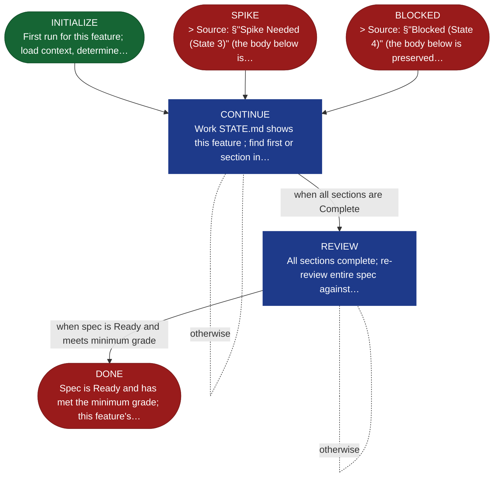

<!-- generated — do not edit; source: canonical/skills/aid-specify/SKILL.md -->

## Frontmatter

- **`name`** — aid-specify
- **`description`** — Technical specification through conversational refinement, one feature at a time. The agent acts as a tech lead — reads KB, Requirements, and codebase, proposes technical solutions, and builds the spec collaboratively with the user. Writes to SPEC.md in the feature folder. State machine: INITIALIZE → CONTINUE → REVIEW → DONE (SPIKE / BLOCKED are loopback states that return to CONTINUE).
- **`allowed-tools`** — Read, Glob, Grep, Bash, Write, Edit
- **`argument-hint`** — work-001/feature-001 (required)  [--reset] clear technical spec for this feature

[Definition: `canonical/skills/aid-specify/SKILL.md`](https://github.com/AndreVianna/aid-methodology/blob/master/canonical/skills/aid-specify/SKILL.md)

## Flow

