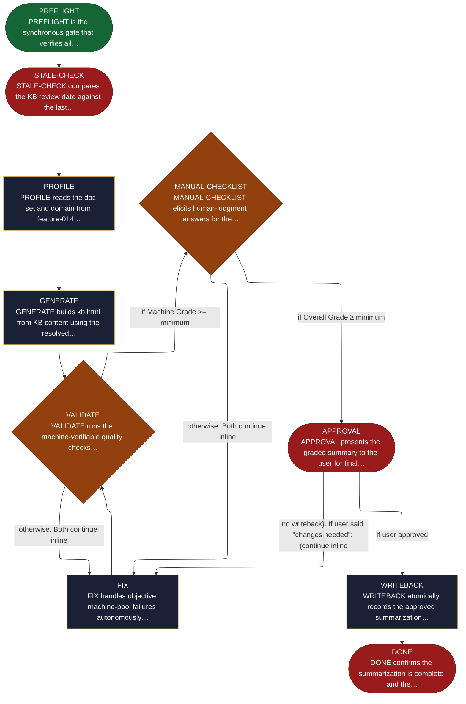

<!-- generated — do not edit; source: canonical/skills/aid-summarize/SKILL.md -->

## Frontmatter

- **`name`** — aid-summarize
- **`description`** — Generate a single-file kb.html from .aid/knowledge/. Domain-driven, doc-set-based: one section per resolved doc derived from frontmatter (kb-category, objective, summary, tags, see_also). Audience: non-technical newcomer (visually rich; no KB authoring-rules leakage). Light/dark theme, click-to-expand lightbox, accessibility-first (WCAG AA). Two-grade quality gate (Machine + Human): script-verifiable checks score the Machine Grade; an interactive checklist scores the Human Grade (K1 KB-completeness, K2 fact-grounding, V1 mandatory human visual gate). APPROVAL requires BOTH grades >= minimum. Idempotent: re-running on an unchanged KB does nothing. State-machine: PREFLIGHT -> STALE-CHECK -> PROFILE -> GENERATE -> VALIDATE -> MANUAL-CHECKLIST -> FIX -> APPROVAL -> WRITEBACK -> DONE.
- **`allowed-tools`** — Read, Glob, Grep, Bash, Write, Edit
- **`argument-hint`** — [--grade X] override minimum  [--theme default|brand-X]  [--reset]

[Definition: `canonical/skills/aid-summarize/SKILL.md`](https://github.com/AndreVianna/aid-methodology/blob/master/canonical/skills/aid-summarize/SKILL.md)

## Flow

