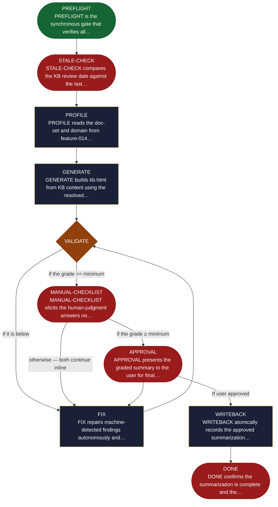

<!-- generated — do not edit; source: canonical/skills/aid-summarize/SKILL.md -->

## Frontmatter

- **`name`** — aid-summarize
- **`description`** — Generate a single-file kb.html from .aid/knowledge/. Domain-driven, doc-set-based: one section per resolved doc derived from frontmatter (kb-category, objective, summary, tags, see_also). Audience: non-technical newcomer (visually rich; no KB authoring-rules leakage). Light/dark theme, click-to-expand lightbox, accessibility-first (WCAG AA). One grading backend: script-verifiable checks and an interactive human checklist (KB completeness, fact-grounding, V1 mandatory human visual check) both write findings to the review ledger, and grade.sh derives the single letter from it. APPROVAL requires that grade >= minimum AND the checklist to have been completed; an unanswered checklist produces no grade at all and pauses for the human. Idempotent: re-running on an unchanged KB does nothing. State-machine: PREFLIGHT -> STALE-CHECK -> PROFILE -> GENERATE -> VALIDATE -> MANUAL-CHECKLIST -> FIX -> APPROVAL -> WRITEBACK -> DONE.
- **`allowed-tools`** — Read, Glob, Grep, Bash, Write, Edit
- **`argument-hint`** — [--grade X] override minimum  [--theme default|brand-X]  [--reset]

[Definition: `canonical/skills/aid-summarize/SKILL.md`](https://github.com/AndreVianna/aid-methodology/blob/master/canonical/skills/aid-summarize/SKILL.md)

## Flow

## Source fragments

Every node in the chart above, in chart order, with the exact `canonical/` text it was derived from.

**1 · `PREFLIGHT`** — PREFLIGHT is the synchronous gate that verifies all… · _entry_

~~~~plaintext title="canonical/skills/aid-summarize/SKILL.md#L183" wrap
| PREFLIGHT | `references/state-preflight.md` | inline | → STALE-CHECK |
~~~~

[Source: `canonical/skills/aid-summarize/SKILL.md#L183`](https://github.com/AndreVianna/aid-methodology/blob/master/canonical/skills/aid-summarize/SKILL.md#L183) · [full step: `canonical/skills/aid-summarize/references/state-preflight.md#L1-L24`](https://github.com/AndreVianna/aid-methodology/blob/master/canonical/skills/aid-summarize/references/state-preflight.md#L1-L24)

**2 · `STALE-CHECK`** — STALE-CHECK compares the KB review date against the last… · _exit_ · HALT

~~~~plaintext title="canonical/skills/aid-summarize/SKILL.md#L184" wrap
| STALE-CHECK | `references/state-stale-check.md` | inline | → PROFILE |
~~~~

[Source: `canonical/skills/aid-summarize/SKILL.md#L184`](https://github.com/AndreVianna/aid-methodology/blob/master/canonical/skills/aid-summarize/SKILL.md#L184) · [full step: `canonical/skills/aid-summarize/references/state-stale-check.md#L1-L33`](https://github.com/AndreVianna/aid-methodology/blob/master/canonical/skills/aid-summarize/references/state-stale-check.md#L1-L33)

**3 · `PROFILE`** — PROFILE reads the doc-set and domain from feature-014… · _step_

~~~~plaintext title="canonical/skills/aid-summarize/SKILL.md#L185" wrap
| PROFILE | `references/state-profile.md` | inline | → GENERATE |
~~~~

[Source: `canonical/skills/aid-summarize/SKILL.md#L185`](https://github.com/AndreVianna/aid-methodology/blob/master/canonical/skills/aid-summarize/SKILL.md#L185) · [full step: `canonical/skills/aid-summarize/references/state-profile.md#L1-L163`](https://github.com/AndreVianna/aid-methodology/blob/master/canonical/skills/aid-summarize/references/state-profile.md#L1-L163)

**4 · `GENERATE`** — GENERATE builds kb.html from KB content using the resolved… · _step_

~~~~plaintext title="canonical/skills/aid-summarize/SKILL.md#L186" wrap
| GENERATE | `references/state-generate.md` | inline | → VALIDATE |
~~~~

[Source: `canonical/skills/aid-summarize/SKILL.md#L186`](https://github.com/AndreVianna/aid-methodology/blob/master/canonical/skills/aid-summarize/SKILL.md#L186) · [full step: `canonical/skills/aid-summarize/references/state-generate.md#L1-L380`](https://github.com/AndreVianna/aid-methodology/blob/master/canonical/skills/aid-summarize/references/state-generate.md#L1-L380)

**5 · `VALIDATE`** — VALIDATE runs the machine-verifiable quality checks… · _decision_

~~~~plaintext title="canonical/skills/aid-summarize/SKILL.md#L187" wrap
| VALIDATE | `references/state-validate.md` | inline | → MANUAL-CHECKLIST (grade ≥ min) / → FIX (grade < min) |
~~~~

[Source: `canonical/skills/aid-summarize/SKILL.md#L187`](https://github.com/AndreVianna/aid-methodology/blob/master/canonical/skills/aid-summarize/SKILL.md#L187) · [full step: `canonical/skills/aid-summarize/references/state-validate.md#L1-L193`](https://github.com/AndreVianna/aid-methodology/blob/master/canonical/skills/aid-summarize/references/state-validate.md#L1-L193)

**6 · `MANUAL-CHECKLIST`** — MANUAL-CHECKLIST elicits the human-judgment answers no… · _exit_ · PAUSE-FOR-USER-ACTION

~~~~plaintext title="canonical/skills/aid-summarize/SKILL.md#L188" wrap
| MANUAL-CHECKLIST | `references/state-manual-checklist.md` | inline | → APPROVAL |
~~~~

[Source: `canonical/skills/aid-summarize/SKILL.md#L188`](https://github.com/AndreVianna/aid-methodology/blob/master/canonical/skills/aid-summarize/SKILL.md#L188) · [full step: `canonical/skills/aid-summarize/references/state-manual-checklist.md#L1-L79`](https://github.com/AndreVianna/aid-methodology/blob/master/canonical/skills/aid-summarize/references/state-manual-checklist.md#L1-L79)

**7 · `FIX`** — FIX repairs machine-detected findings autonomously and… · _step_

~~~~plaintext title="canonical/skills/aid-summarize/SKILL.md#L189" wrap
| FIX | `references/state-fix.md` | inline | → VALIDATE |
~~~~

[Source: `canonical/skills/aid-summarize/SKILL.md#L189`](https://github.com/AndreVianna/aid-methodology/blob/master/canonical/skills/aid-summarize/SKILL.md#L189) · [full step: `canonical/skills/aid-summarize/references/state-fix.md#L1-L51`](https://github.com/AndreVianna/aid-methodology/blob/master/canonical/skills/aid-summarize/references/state-fix.md#L1-L51)

**8 · `APPROVAL`** — APPROVAL presents the graded summary to the user for final… · _exit_ · HALT

~~~~plaintext title="canonical/skills/aid-summarize/SKILL.md#L190" wrap
| APPROVAL | `references/state-approval.md` | inline | → WRITEBACK |
~~~~

[Source: `canonical/skills/aid-summarize/SKILL.md#L190`](https://github.com/AndreVianna/aid-methodology/blob/master/canonical/skills/aid-summarize/SKILL.md#L190) · [full step: `canonical/skills/aid-summarize/references/state-approval.md#L1-L73`](https://github.com/AndreVianna/aid-methodology/blob/master/canonical/skills/aid-summarize/references/state-approval.md#L1-L73)

**9 · `WRITEBACK`** — WRITEBACK atomically records the approved summarization… · _step_

~~~~plaintext title="canonical/skills/aid-summarize/SKILL.md#L191" wrap
| WRITEBACK | `references/state-writeback.md` | inline | → DONE |
~~~~

[Source: `canonical/skills/aid-summarize/SKILL.md#L191`](https://github.com/AndreVianna/aid-methodology/blob/master/canonical/skills/aid-summarize/SKILL.md#L191) · [full step: `canonical/skills/aid-summarize/references/state-writeback.md#L1-L33`](https://github.com/AndreVianna/aid-methodology/blob/master/canonical/skills/aid-summarize/references/state-writeback.md#L1-L33)

**10 · `DONE`** — DONE confirms the summarization is complete and the… · _exit_ · HALT

~~~~plaintext title="canonical/skills/aid-summarize/SKILL.md#L192" wrap
| DONE | `references/state-done.md` | inline | → halt |
~~~~

[Source: `canonical/skills/aid-summarize/SKILL.md#L192`](https://github.com/AndreVianna/aid-methodology/blob/master/canonical/skills/aid-summarize/SKILL.md#L192) · [full step: `canonical/skills/aid-summarize/references/state-done.md#L1-L45`](https://github.com/AndreVianna/aid-methodology/blob/master/canonical/skills/aid-summarize/references/state-done.md#L1-L45)
