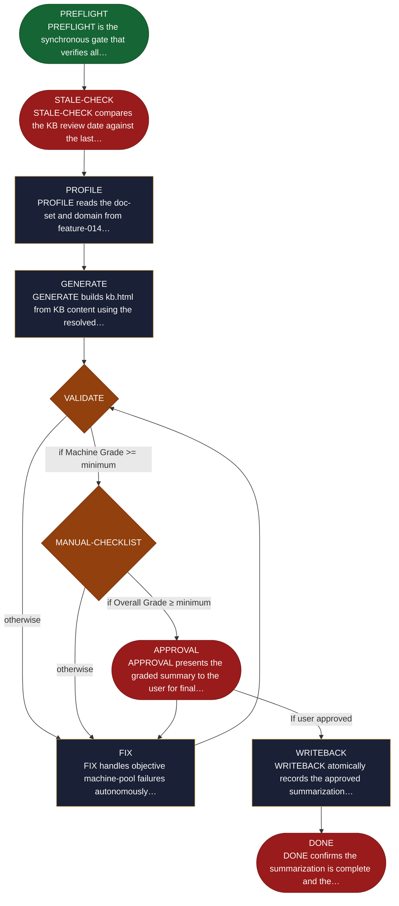

<!-- generated — do not edit; source: canonical/skills/aid-summarize/SKILL.md -->

## Frontmatter

- **`name`** — aid-summarize
- **`description`** — Generate kb.html, a single-file visual tour of the Knowledge Base. Use this skill when someone non-technical needs to read what the project knows about itself -- a newcomer, a stakeholder, anyone who will not open `.aid/knowledge/` directly. It builds one section per resolved document from that document's own frontmatter, in a light/dark themed page with click-to-expand images and WCAG AA accessibility. Two grades gate approval: script- verifiable checks score the machine grade, and an interactive checklist scores the human grade, including a mandatory visual review. Idempotent -- re-running on an unchanged Knowledge Base does nothing.
- **`allowed-tools`** — Read, Glob, Grep, Bash, Write, Edit
- **`argument-hint`** — [--grade X] override minimum  [--theme default|brand-X]  [--reset]

[Definition: `canonical/skills/aid-summarize/SKILL.md`](https://github.com/AndreVianna/aid-methodology/blob/master/canonical/skills/aid-summarize/SKILL.md)

## Flow

## Source fragments

Every node in the chart above, in chart order, with the exact `canonical/` text it was derived from.

**1 · `PREFLIGHT`** — PREFLIGHT is the synchronous gate that verifies all… · _entry_

~~~~plaintext title="canonical/skills/aid-summarize/SKILL.md#L172" wrap
| PREFLIGHT | `references/state-preflight.md` | inline | → STALE-CHECK |
~~~~

[Source: `canonical/skills/aid-summarize/SKILL.md#L172`](https://github.com/AndreVianna/aid-methodology/blob/master/canonical/skills/aid-summarize/SKILL.md#L172) · [full step: `canonical/skills/aid-summarize/references/state-preflight.md#L1-L24`](https://github.com/AndreVianna/aid-methodology/blob/master/canonical/skills/aid-summarize/references/state-preflight.md#L1-L24)

**2 · `STALE-CHECK`** — STALE-CHECK compares the KB review date against the last… · _exit_ · HALT

~~~~plaintext title="canonical/skills/aid-summarize/SKILL.md#L173" wrap
| STALE-CHECK | `references/state-stale-check.md` | inline | → PROFILE |
~~~~

[Source: `canonical/skills/aid-summarize/SKILL.md#L173`](https://github.com/AndreVianna/aid-methodology/blob/master/canonical/skills/aid-summarize/SKILL.md#L173) · [full step: `canonical/skills/aid-summarize/references/state-stale-check.md#L1-L33`](https://github.com/AndreVianna/aid-methodology/blob/master/canonical/skills/aid-summarize/references/state-stale-check.md#L1-L33)

**3 · `PROFILE`** — PROFILE reads the doc-set and domain from feature-014… · _step_

~~~~plaintext title="canonical/skills/aid-summarize/SKILL.md#L174" wrap
| PROFILE | `references/state-profile.md` | inline | → GENERATE |
~~~~

[Source: `canonical/skills/aid-summarize/SKILL.md#L174`](https://github.com/AndreVianna/aid-methodology/blob/master/canonical/skills/aid-summarize/SKILL.md#L174) · [full step: `canonical/skills/aid-summarize/references/state-profile.md#L1-L163`](https://github.com/AndreVianna/aid-methodology/blob/master/canonical/skills/aid-summarize/references/state-profile.md#L1-L163)

**4 · `GENERATE`** — GENERATE builds kb.html from KB content using the resolved… · _step_

~~~~plaintext title="canonical/skills/aid-summarize/SKILL.md#L175" wrap
| GENERATE | `references/state-generate.md` | inline | → VALIDATE |
~~~~

[Source: `canonical/skills/aid-summarize/SKILL.md#L175`](https://github.com/AndreVianna/aid-methodology/blob/master/canonical/skills/aid-summarize/SKILL.md#L175) · [full step: `canonical/skills/aid-summarize/references/state-generate.md#L1-L379`](https://github.com/AndreVianna/aid-methodology/blob/master/canonical/skills/aid-summarize/references/state-generate.md#L1-L379)

**5 · `VALIDATE`** — VALIDATE runs the machine-verifiable quality checks… · _decision_

~~~~plaintext title="canonical/skills/aid-summarize/SKILL.md#L176" wrap
| VALIDATE | `references/state-validate.md` | inline | → MANUAL-CHECKLIST (grade ≥ min) / → FIX (grade < min) |
~~~~

[Source: `canonical/skills/aid-summarize/SKILL.md#L176`](https://github.com/AndreVianna/aid-methodology/blob/master/canonical/skills/aid-summarize/SKILL.md#L176) · [full step: `canonical/skills/aid-summarize/references/state-validate.md#L1-L63`](https://github.com/AndreVianna/aid-methodology/blob/master/canonical/skills/aid-summarize/references/state-validate.md#L1-L63)

**6 · `MANUAL-CHECKLIST`** — MANUAL-CHECKLIST elicits human-judgment answers for the… · _decision_

~~~~plaintext title="canonical/skills/aid-summarize/SKILL.md#L177" wrap
| MANUAL-CHECKLIST | `references/state-manual-checklist.md` | inline | → APPROVAL |
~~~~

[Source: `canonical/skills/aid-summarize/SKILL.md#L177`](https://github.com/AndreVianna/aid-methodology/blob/master/canonical/skills/aid-summarize/SKILL.md#L177) · [full step: `canonical/skills/aid-summarize/references/state-manual-checklist.md#L1-L40`](https://github.com/AndreVianna/aid-methodology/blob/master/canonical/skills/aid-summarize/references/state-manual-checklist.md#L1-L40)

**7 · `FIX`** — FIX handles objective machine-pool failures autonomously… · _step_

~~~~plaintext title="canonical/skills/aid-summarize/SKILL.md#L178" wrap
| FIX | `references/state-fix.md` | inline | → VALIDATE |
~~~~

[Source: `canonical/skills/aid-summarize/SKILL.md#L178`](https://github.com/AndreVianna/aid-methodology/blob/master/canonical/skills/aid-summarize/SKILL.md#L178) · [full step: `canonical/skills/aid-summarize/references/state-fix.md#L1-L39`](https://github.com/AndreVianna/aid-methodology/blob/master/canonical/skills/aid-summarize/references/state-fix.md#L1-L39)

**8 · `APPROVAL`** — APPROVAL presents the graded summary to the user for final… · _exit_ · HALT

~~~~plaintext title="canonical/skills/aid-summarize/SKILL.md#L179" wrap
| APPROVAL | `references/state-approval.md` | inline | → WRITEBACK |
~~~~

[Source: `canonical/skills/aid-summarize/SKILL.md#L179`](https://github.com/AndreVianna/aid-methodology/blob/master/canonical/skills/aid-summarize/SKILL.md#L179) · [full step: `canonical/skills/aid-summarize/references/state-approval.md#L1-L56`](https://github.com/AndreVianna/aid-methodology/blob/master/canonical/skills/aid-summarize/references/state-approval.md#L1-L56)

**9 · `WRITEBACK`** — WRITEBACK atomically records the approved summarization… · _step_

~~~~plaintext title="canonical/skills/aid-summarize/SKILL.md#L180" wrap
| WRITEBACK | `references/state-writeback.md` | inline | → DONE |
~~~~

[Source: `canonical/skills/aid-summarize/SKILL.md#L180`](https://github.com/AndreVianna/aid-methodology/blob/master/canonical/skills/aid-summarize/SKILL.md#L180) · [full step: `canonical/skills/aid-summarize/references/state-writeback.md#L1-L33`](https://github.com/AndreVianna/aid-methodology/blob/master/canonical/skills/aid-summarize/references/state-writeback.md#L1-L33)

**10 · `DONE`** — DONE confirms the summarization is complete and the… · _exit_ · HALT

~~~~plaintext title="canonical/skills/aid-summarize/SKILL.md#L181" wrap
| DONE | `references/state-done.md` | inline | → halt |
~~~~

[Source: `canonical/skills/aid-summarize/SKILL.md#L181`](https://github.com/AndreVianna/aid-methodology/blob/master/canonical/skills/aid-summarize/SKILL.md#L181) · [full step: `canonical/skills/aid-summarize/references/state-done.md#L1-L45`](https://github.com/AndreVianna/aid-methodology/blob/master/canonical/skills/aid-summarize/references/state-done.md#L1-L45)
