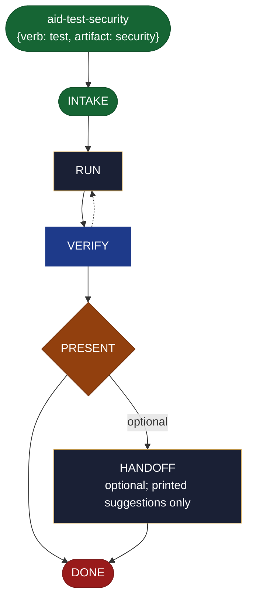

<!-- generated — do not edit; source: canonical/skills/aid-test-security/SKILL.md -->

## Frontmatter

- **`name`** — aid-test-security
- **`description`** — Run a security verification and consolidate the findings -- SAST, DAST, fuzzing, or a dependency audit. Use this skill when you need to know what is currently exploitable or outdated. Read-only; it resolves nothing, and findings hand off to /aid-fix. A thin kind-sibling of /aid-test, which defines its full behavior.
- **`allowed-tools`** — Read, Glob, Grep, Bash, Write, Edit, Agent
- **`argument-hint`** — &lt;target> -- the endpoint/module/dependency set to verify

[Definition: `canonical/skills/aid-test-security/SKILL.md`](https://github.com/AndreVianna/aid-methodology/blob/master/canonical/skills/aid-test-security/SKILL.md)

## Flow

## Source fragments

Every node in the chart above, in chart order, with the exact `canonical/` text it was derived from.

**1 · `aid-test-security`** — {verb: test, artifact: security} · _entry_

~~~~plaintext title="canonical/skills/aid-test-security/SKILL.md#L16" wrap
(`alias_of: null`, `{verb: test, artifact: security}`), `repurpose: true` (hand-authored).
~~~~

[Source: `canonical/skills/aid-test-security/SKILL.md#L16`](https://github.com/AndreVianna/aid-methodology/blob/master/canonical/skills/aid-test-security/SKILL.md#L16)

**2 · `INTAKE`** · _entry_

~~~~plaintext title="canonical/skills/aid-test/SKILL.md#L32-L54" wrap
## State: INTAKE

1. **Require a target.** Empty argument -> ask one bootstrapping question ("What should I
   test or verify?") and wait.
2. **Determine the verification kind** from the request (or the kind a sibling bound):
   functional (unit/integration/e2e), **security** (SAST/DAST/fuzz/dependency-audit),
   **performance** (workload/threshold/environment), **data-quality** (schema/freshness/
   completeness/uniqueness), or **model-eval** (run the eval harness, assert metric vs
   threshold). The framework is inferred from the KB (`test-landscape.md`).
3. **Pick the path:** **Fast** -- a clear target + kind ("run the security scan on the auth
   module", "benchmark the /orders endpoint vs the p99 SLO") -> run now. **Guided** -- vague
   -> scope target / kind / threshold first.
4. **Classify complexity (model + effort):** simple run -> `aid-reviewer` at **sonnet /
   medium**; deep security/perf analysis -> **opus / high**. Verifier tier >= producer.
5. **Consult the Work Initiation Gate, then allocate the work folder + STATE.** First run
   the gate (`canonical/aid/templates/work-initiation-gate.md`):
   `bash canonical/aid/scripts/works/enumerate-works.sh` (main tree + every git worktree).
   Empty -> allocate, no prompt. Works exist -> ask new-vs-continuation; on **continuation**
   route to the chosen work's resume door and STOP (allocate nothing); on **new work**:
   create and enter the worktree per the gate's `§ 3a` step 2
   (`worktree-lifecycle.sh create <work-id> <name>`, STOP on a non-zero exit or empty path,
   else enter the resolved path), **then** allocate (`pipeline.path: lite`, `initiator:
   aid-test`, `lifecycle: Running`, `active_skill: aid-test`; `phase` not driven).
~~~~

[Source: `canonical/skills/aid-test/SKILL.md#L32-L54`](https://github.com/AndreVianna/aid-methodology/blob/master/canonical/skills/aid-test/SKILL.md#L32-L54) · [full step: `canonical/skills/aid-test/SKILL.md#L32-L56`](https://github.com/AndreVianna/aid-methodology/blob/master/canonical/skills/aid-test/SKILL.md#L32-L56)

**3 · `RUN`** · _step_

~~~~plaintext title="canonical/skills/aid-test/SKILL.md#L60-L70" wrap
## State: RUN

Execute the verification **read-only** (Bash: the test runner, scanner, benchmark, or
data-quality check per the kind; never mutate the source), capturing raw output. Then
dispatch **`aid-reviewer`** (clean context, tiered) to **consolidate** the raw results into
the global 7-column findings ledger (`reviewer-ledger-schema.md`) at
`.aid/.temp/review-pending/<work>-test.md`, applying the kind's guidance -- security:
SAST/DAST/fuzz/audit findings + severity; performance: measured-vs-threshold with the
workload/environment noted; data-quality: per-check pass/fail with thresholds; functional:
pass/fail + failures; model-eval: metric vs threshold. Every finding cites its evidence
(the run output + a `file:line` where applicable).
~~~~

[Source: `canonical/skills/aid-test/SKILL.md#L60-L70`](https://github.com/AndreVianna/aid-methodology/blob/master/canonical/skills/aid-test/SKILL.md#L60-L70) · [full step: `canonical/skills/aid-test/SKILL.md#L60-L72`](https://github.com/AndreVianna/aid-methodology/blob/master/canonical/skills/aid-test/SKILL.md#L60-L72)

**4 · `VERIFY`** · _loop-back_

~~~~plaintext title="canonical/skills/aid-test/SKILL.md#L76-L85" wrap
## State: VERIFY

1. **Mechanical grounding check** (no dispatch): every finding cites run output / a
   `file:line`; a metric/threshold finding states its threshold + measured value.
2. **Adversarial verification** -- a clean-context **`aid-reviewer`** checks the ledger:
   findings real and grounded in the run output, correctly severity-tagged, no
   over/under-statement, and the run actually exercised the stated scope. Writes a
   review-quality ledger to `.aid/.temp/review-pending/<work>-verify.md`.
3. **Grade:** `bash canonical/aid/scripts/grade.sh --explain <ledger>`. Not clean -> loop
   to RUN/consolidate. Circuit-breaker: 3 cycles -> IMPEDIMENT + `lifecycle: Blocked`.
~~~~

[Source: `canonical/skills/aid-test/SKILL.md#L76-L85`](https://github.com/AndreVianna/aid-methodology/blob/master/canonical/skills/aid-test/SKILL.md#L76-L85) · [full step: `canonical/skills/aid-test/SKILL.md#L76-L87`](https://github.com/AndreVianna/aid-methodology/blob/master/canonical/skills/aid-test/SKILL.md#L76-L87)

**5 · `PRESENT`** — hard stop -- human · _decision_

~~~~plaintext title="canonical/skills/aid-test/SKILL.md#L91-L95" wrap
## State: PRESENT  (hard stop -- human)

Set `lifecycle: Paused-Awaiting-Input`. Present the consolidated findings, severity-ranked,
each with its evidence; state pass/fail against any threshold; and a printed suggestion:
"N issues found -- run `/aid-fix` to address them." Assert no resolution.
~~~~

[Source: `canonical/skills/aid-test/SKILL.md#L91-L95`](https://github.com/AndreVianna/aid-methodology/blob/master/canonical/skills/aid-test/SKILL.md#L91-L95) · [full step: `canonical/skills/aid-test/SKILL.md#L91-L97`](https://github.com/AndreVianna/aid-methodology/blob/master/canonical/skills/aid-test/SKILL.md#L91-L97)

**6 · `HANDOFF`** — optional; printed suggestions only · _step_

~~~~plaintext title="canonical/skills/aid-test/SKILL.md#L101-L104" wrap
## State: HANDOFF  (optional; printed suggestions only)

Printed suggestions: `/aid-fix` (address findings), `/aid-create-test` (add regression tests
for a bug found), `/aid-update*` (if a fix is a real change). Never auto-invoked.
~~~~

[Source: `canonical/skills/aid-test/SKILL.md#L101-L104`](https://github.com/AndreVianna/aid-methodology/blob/master/canonical/skills/aid-test/SKILL.md#L101-L104) · [full step: `canonical/skills/aid-test/SKILL.md#L101-L106`](https://github.com/AndreVianna/aid-methodology/blob/master/canonical/skills/aid-test/SKILL.md#L101-L106)

**7 · `DONE`** · _exit_ · UNSPECIFIED

~~~~plaintext title="canonical/skills/aid-test/SKILL.md#L110-L113" wrap
## State: DONE

Set `lifecycle: Completed`, `updated` now, append a `## Lifecycle History` row. Leave the
findings ledger on disk for `/aid-fix`. Keep the work folder as the audit record.
~~~~

[Source: `canonical/skills/aid-test/SKILL.md#L110-L113`](https://github.com/AndreVianna/aid-methodology/blob/master/canonical/skills/aid-test/SKILL.md#L110-L113) · [full step: `canonical/skills/aid-test/SKILL.md#L110-L113`](https://github.com/AndreVianna/aid-methodology/blob/master/canonical/skills/aid-test/SKILL.md#L110-L113)
