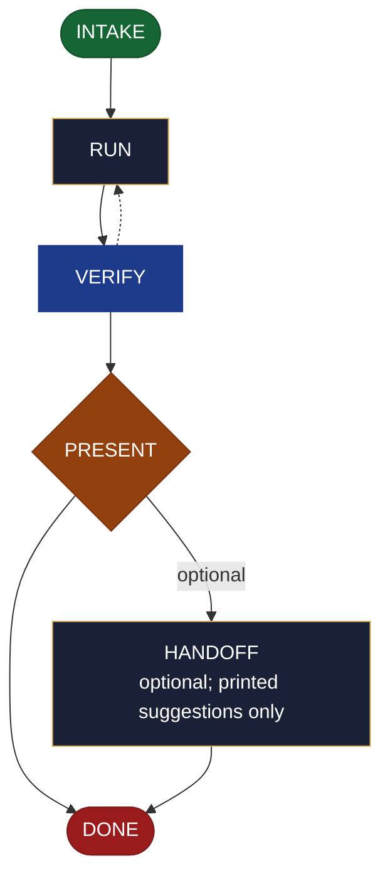

<!-- generated — do not edit; source: canonical/skills/aid-test/SKILL.md -->

## Frontmatter

- **`name`** — aid-test
- **`description`** — Run a test suite / verification NOW and consolidate the results into findings, in one pass. Generic: it runs whatever the request implies -- unit/integration/ e2e, a security scan (SAST/DAST/fuzz/dependency-audit), a performance benchmark/load/stress test, a data-quality check (schema/freshness/completeness/ uniqueness), or a model evaluation -- and reports. It RESOLVES NOTHING and is read-only on the source: findings hand off to /aid-fix; it never fixes. The skill runs the tool itself (read-only); consolidation + verification are done by the aid-reviewer agent (review-shaped). Allocates a work-NNN folder. To AUTHOR test code, use /aid-create-test (a keep-cycle create-family skill), not this.
- **`allowed-tools`** — Read, Glob, Grep, Bash, Write, Edit, Agent
- **`argument-hint`** — &lt;target> -- what to test/verify (a suite/module, or a kind: security, performance, data-quality, model-eval)

[Definition: `canonical/skills/aid-test/SKILL.md`](https://github.com/AndreVianna/aid-methodology/blob/master/canonical/skills/aid-test/SKILL.md)

## Flow

