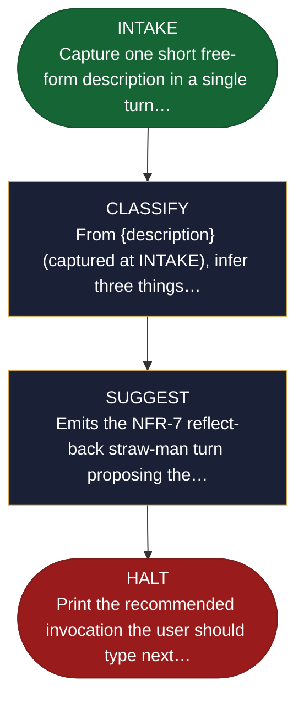

<!-- generated — do not edit; source: canonical/skills/aid-triage/SKILL.md -->

## Frontmatter

- **`name`** — aid-triage
- **`description`** — Suggest which AID entry point fits the work you are describing. Use this skill when you know what you want to change but not which skill to reach for. Give it one short free-form description; it infers the work type, judges the scope, and names the single best entry -- the matching verb-and-artifact shortcut for a known single change type, or the full path via /aid-describe for broad or ambiguous work. It reads the shortcut catalog to resolve its suggestion to a canonical, non-alias name. It suggests only: no interview, no scaffold, no work folder, and nothing written.
- **`allowed-tools`** — Read, Glob, Grep
- **`argument-hint`** — [description]  -- what you want to do; I'll point you at the right entry

[Definition: `canonical/skills/aid-triage/SKILL.md`](https://github.com/AndreVianna/aid-methodology/blob/master/canonical/skills/aid-triage/SKILL.md)

## Flow

## Source fragments

Every node in the chart above, in chart order, with the exact `canonical/` text it was derived from.

**1 · `INTAKE`** — Capture one short free-form description in a single turn… · _entry_

~~~~plaintext title="canonical/skills/aid-triage/SKILL.md#L76" wrap
| INTAKE | inline (below) | inline | CHAIN -> CLASSIFY |
~~~~

[Source: `canonical/skills/aid-triage/SKILL.md#L76`](https://github.com/AndreVianna/aid-methodology/blob/master/canonical/skills/aid-triage/SKILL.md#L76) · [full step: `canonical/skills/aid-triage/SKILL.md#L83-L104`](https://github.com/AndreVianna/aid-methodology/blob/master/canonical/skills/aid-triage/SKILL.md#L83-L104)

**2 · `CLASSIFY`** — From {description} (captured at INTAKE), infer three things… · _step_

~~~~plaintext title="canonical/skills/aid-triage/SKILL.md#L77" wrap
| CLASSIFY | `references/state-classify.md` | inline | CHAIN -> SUGGEST |
~~~~

[Source: `canonical/skills/aid-triage/SKILL.md#L77`](https://github.com/AndreVianna/aid-methodology/blob/master/canonical/skills/aid-triage/SKILL.md#L77) · [full step: `canonical/skills/aid-triage/references/state-classify.md#L1-L143`](https://github.com/AndreVianna/aid-methodology/blob/master/canonical/skills/aid-triage/references/state-classify.md#L1-L143)

**3 · `SUGGEST`** — Emits the NFR-7 reflect-back straw-man turn proposing the… · _step_

~~~~plaintext title="canonical/skills/aid-triage/SKILL.md#L78" wrap
| SUGGEST | `references/state-suggest.md` | inline | CHAIN -> HALT |
~~~~

[Source: `canonical/skills/aid-triage/SKILL.md#L78`](https://github.com/AndreVianna/aid-methodology/blob/master/canonical/skills/aid-triage/SKILL.md#L78) · [full step: `canonical/skills/aid-triage/references/state-suggest.md#L1-L98`](https://github.com/AndreVianna/aid-methodology/blob/master/canonical/skills/aid-triage/references/state-suggest.md#L1-L98)

**4 · `HALT`** — Print the recommended invocation the user should type next… · _exit_ · HALT

~~~~plaintext title="canonical/skills/aid-triage/SKILL.md#L79" wrap
| HALT | inline (below) | inline | -> halt |
~~~~

[Source: `canonical/skills/aid-triage/SKILL.md#L79`](https://github.com/AndreVianna/aid-methodology/blob/master/canonical/skills/aid-triage/SKILL.md#L79) · [full step: `canonical/skills/aid-triage/SKILL.md#L108-L132`](https://github.com/AndreVianna/aid-methodology/blob/master/canonical/skills/aid-triage/SKILL.md#L108-L132)
