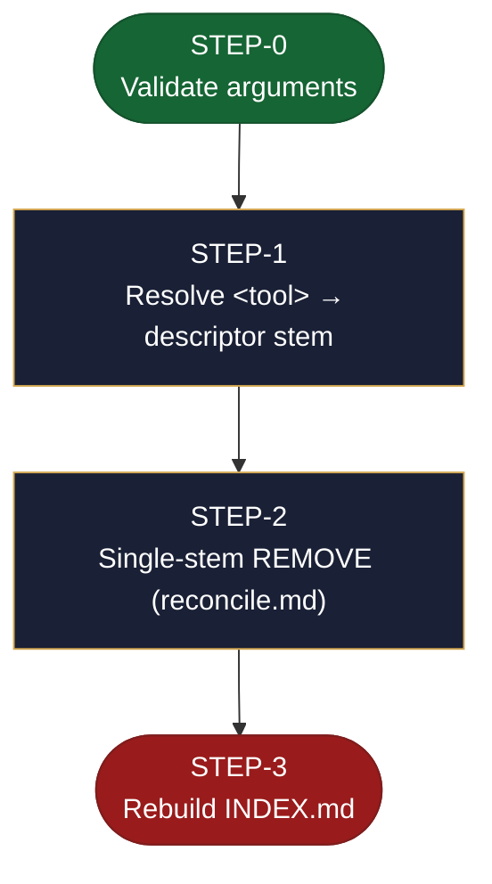

<!-- generated — do not edit; source: canonical/skills/aid-unset-connector/SKILL.md -->

## Frontmatter

- **`name`** — aid-unset-connector
- **`description`** — Remove one entry from the connector catalog. Use this skill when a project stops using an external tool and its descriptor and stored secret should go with it. Naming the tool deletes its descriptor, purges its secret, and rebuilds the catalog index from whatever remains on disk -- touching only that one stem, so every other catalogued connector is left byte-for-byte untouched. Idempotent: removing an already-absent tool is a clean no- op. It never invokes `/aid-discover`.
- **`allowed-tools`** — Read, Bash
- **`argument-hint`** — &lt;tool>  -- e.g. aid-unset-connector Jira

[Definition: `canonical/skills/aid-unset-connector/SKILL.md`](https://github.com/AndreVianna/aid-methodology/blob/master/canonical/skills/aid-unset-connector/SKILL.md)

## Flow

> **Approximate:** This chart is derived by heuristic; exact transitions may differ from runtime behaviour.

## Source fragments

Every node in the chart above, in chart order, with the exact `canonical/` text it was derived from.

**1 · `STEP-0`** — Validate arguments · _entry_

~~~~plaintext title="canonical/skills/aid-unset-connector/SKILL.md#L39" wrap
### Step 0: Validate arguments
~~~~

[Source: `canonical/skills/aid-unset-connector/SKILL.md#L39`](https://github.com/AndreVianna/aid-methodology/blob/master/canonical/skills/aid-unset-connector/SKILL.md#L39)

**2 · `STEP-1`** — Resolve &lt;tool> → descriptor stem · _step_

~~~~plaintext title="canonical/skills/aid-unset-connector/SKILL.md#L58" wrap
## Step 1: Resolve `<tool>` → descriptor stem
~~~~

[Source: `canonical/skills/aid-unset-connector/SKILL.md#L58`](https://github.com/AndreVianna/aid-methodology/blob/master/canonical/skills/aid-unset-connector/SKILL.md#L58)

**3 · `STEP-2`** — Single-stem REMOVE (reconcile.md) · _step_

~~~~plaintext title="canonical/skills/aid-unset-connector/SKILL.md#L72" wrap
## Step 2: Single-stem REMOVE (`reconcile.md`)
~~~~

[Source: `canonical/skills/aid-unset-connector/SKILL.md#L72`](https://github.com/AndreVianna/aid-methodology/blob/master/canonical/skills/aid-unset-connector/SKILL.md#L72)

**4 · `STEP-3`** — Rebuild INDEX.md · _exit_ · UNSPECIFIED

~~~~plaintext title="canonical/skills/aid-unset-connector/SKILL.md#L102" wrap
## Step 3: Rebuild `INDEX.md`
~~~~

[Source: `canonical/skills/aid-unset-connector/SKILL.md#L102`](https://github.com/AndreVianna/aid-methodology/blob/master/canonical/skills/aid-unset-connector/SKILL.md#L102)
