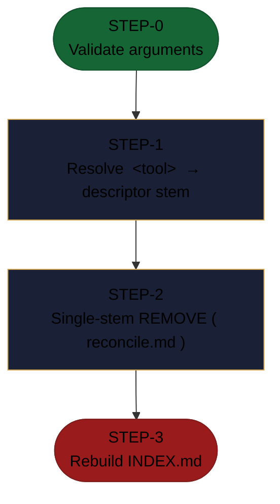

<!-- generated — do not edit; source: canonical/skills/aid-unset-connector/SKILL.md -->

## Frontmatter

- **`name`** — aid-unset-connector
- **`description`** — On-demand, off-pipeline removal from the connector catalog. `aid-unset-connector <tool>` deletes `.aid/connectors/<stem>.md` and purges its secret via connector-secret purge -- never invokes /aid-discover. Runs reconcile.md's single-stem REMOVE (purge-then-delete) so every OTHER catalogued connector is left byte-for-byte untouched, then rebuilds INDEX.md from whatever descriptors remain on disk. Idempotent: an already-absent stem is a clean no-op.
- **`allowed-tools`** — Read, Bash
- **`argument-hint`** — &lt;tool>  -- e.g. aid-unset-connector Jira

[Definition: `canonical/skills/aid-unset-connector/SKILL.md`](https://github.com/AndreVianna/aid-methodology/blob/master/canonical/skills/aid-unset-connector/SKILL.md)

## Flow

> **Approximate:** This chart is derived by heuristic; exact transitions may differ from runtime behaviour.

