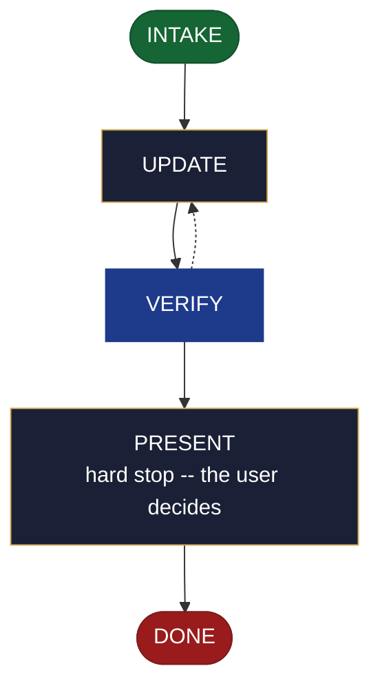

<!-- generated — do not edit; source: canonical/skills/aid-update-architecture/SKILL.md -->

## Frontmatter

- **`name`** — aid-update-architecture
- **`description`** — Revise the project's build-and-shape (C1) Knowledge Base document -- components and their responsibilities, boundaries, interactions, and the invariants a change must not break -- plus any previously created outputs you name. Use this skill when the architecture document already exists and part of it needs revising. Requires no design seed: the change you state in the run is a sufficient input. Reads and consumes an architecture seed when one is present in `.aid/design/`. When the C1 document does not yet exist, routes to `/aid-create-architecture`. To write documentation ABOUT an architecture rather than revise the KB record, use `/aid-document-architecture`. Produced by the aid-architect agent and independently verified by aid-reviewer (full verify). Allocates a work-NNN folder.
- **`allowed-tools`** — Read, Glob, Grep, Bash, Write, Edit, Agent
- **`argument-hint`** — &lt;change> -- what to revise in the architecture record

[Definition: `canonical/skills/aid-update-architecture/SKILL.md`](https://github.com/AndreVianna/aid-methodology/blob/master/canonical/skills/aid-update-architecture/SKILL.md)

## Flow

## Source fragments

Every node in the chart above, in chart order, with the exact `canonical/` text it was derived from.

**1 · `INTAKE`** · _entry_

~~~~plaintext title="canonical/skills/aid-update-architecture/SKILL.md#L38-L58" wrap
## State: INTAKE

1. **Require a stated change.** Empty argument -> ask one bootstrapping question ("What
   should change in the architecture record?") and wait.
2. **Allocate** through the Work Initiation Gate exactly as the contract's Allocation rule
   requires (`canonical/skills/aid-design/SKILL.md` INTAKE step 4 is the shape), with
   `initiator: aid-update-architecture`. `phase` is not driven.
3. **No seed is required.** The change stated in this run is a sufficient input, and this
   skill completes without a seed. **Read and consume one when present** at
   `.aid/design/architecture.md`, carrying its `## Current direction` into the destination and
   deleting it once realized.
4. **Resolve the destination by concern.** This skill binds concern **C1** (build & shape).
   Where a seed supplied a `## Destination`, use it; otherwise apply the concern rule here --
   resolve C1 against `.aid/settings.yml` `knowledge.doc_set`, falling back to the C1 row of
   `canonical/aid/templates/kb-authoring/domain-doc-matrix.md` -- and **confirm the resolution
   with the user before writing**. Never resolve silently. C1's default set holds both
   `project-structure.md` and `architecture.md`; this skill targets the document describing
   the system's shape, never `project-structure.md`.
5. **Read the whole destination**, and note its `source:` field. Absent destination -> route
   to `/aid-create-architecture` and write nothing.
6. **Classify complexity** for the `aid-architect` dispatch (verifier tier >= producer).
~~~~

[Source: `canonical/skills/aid-update-architecture/SKILL.md#L38-L58`](https://github.com/AndreVianna/aid-methodology/blob/master/canonical/skills/aid-update-architecture/SKILL.md#L38-L58) · [full step: `canonical/skills/aid-update-architecture/SKILL.md#L38-L60`](https://github.com/AndreVianna/aid-methodology/blob/master/canonical/skills/aid-update-architecture/SKILL.md#L38-L60)

**2 · `UPDATE`** · _step_

~~~~plaintext title="canonical/skills/aid-update-architecture/SKILL.md#L64-L74" wrap
## State: UPDATE

1. **Apply only the change the user named in this run**, to the owned C1 content, per the
   content rules below.
2. **Ask, every run, which derived outputs to update alongside this one.** This step is
   unconditional -- it runs on every invocation, and the answer is **stored nowhere**: no
   frontmatter backlink, no manifest, no registry, and no state carried between runs. The
   question is asked afresh each time.
3. **Write no tracking metadata** into any output this run touches -- no `derived-from`, no
   `source-doc`, no `generated-by`, no `aid-tracked` field, and no skill-attribution line.
4. **`source: generated` refuses.** A registered build script owns that content.
~~~~

[Source: `canonical/skills/aid-update-architecture/SKILL.md#L64-L74`](https://github.com/AndreVianna/aid-methodology/blob/master/canonical/skills/aid-update-architecture/SKILL.md#L64-L74) · [full step: `canonical/skills/aid-update-architecture/SKILL.md#L64-L76`](https://github.com/AndreVianna/aid-methodology/blob/master/canonical/skills/aid-update-architecture/SKILL.md#L64-L76)

**3 · `VERIFY`** · _loop-back_

~~~~plaintext title="canonical/skills/aid-update-architecture/SKILL.md#L80-L83" wrap
## State: VERIFY

**Full verify**, as `design-lifecycle.md` defines it. Not clean -> loop to UPDATE; the
3-cycle circuit breaker there escalates to IMPEDIMENT + `lifecycle: Blocked`.
~~~~

[Source: `canonical/skills/aid-update-architecture/SKILL.md#L80-L83`](https://github.com/AndreVianna/aid-methodology/blob/master/canonical/skills/aid-update-architecture/SKILL.md#L80-L83) · [full step: `canonical/skills/aid-update-architecture/SKILL.md#L80-L85`](https://github.com/AndreVianna/aid-methodology/blob/master/canonical/skills/aid-update-architecture/SKILL.md#L80-L85)

**4 · `PRESENT`** — hard stop -- the user decides · _step_

~~~~plaintext title="canonical/skills/aid-update-architecture/SKILL.md#L89-L92" wrap
## State: PRESENT (hard stop -- the user decides)

Set `lifecycle: Paused-Awaiting-Input`. Present the revision, name every output touched, and
assert that a consumed seed is gone.
~~~~

[Source: `canonical/skills/aid-update-architecture/SKILL.md#L89-L92`](https://github.com/AndreVianna/aid-methodology/blob/master/canonical/skills/aid-update-architecture/SKILL.md#L89-L92) · [full step: `canonical/skills/aid-update-architecture/SKILL.md#L89-L94`](https://github.com/AndreVianna/aid-methodology/blob/master/canonical/skills/aid-update-architecture/SKILL.md#L89-L94)

**5 · `DONE`** · _exit_ · UNSPECIFIED

~~~~plaintext title="canonical/skills/aid-update-architecture/SKILL.md#L98-L100" wrap
## State: DONE

Set `lifecycle: Completed`, `updated` now, append a `## Lifecycle History` row.
~~~~

[Source: `canonical/skills/aid-update-architecture/SKILL.md#L98-L100`](https://github.com/AndreVianna/aid-methodology/blob/master/canonical/skills/aid-update-architecture/SKILL.md#L98-L100) · [full step: `canonical/skills/aid-update-architecture/SKILL.md#L98-L100`](https://github.com/AndreVianna/aid-methodology/blob/master/canonical/skills/aid-update-architecture/SKILL.md#L98-L100)
