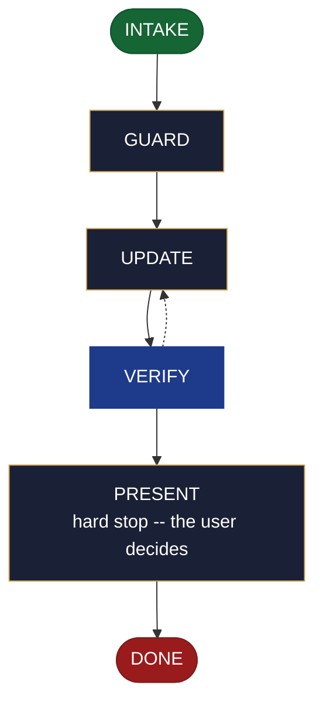

<!-- generated — do not edit; source: canonical/skills/aid-update-backlog/SKILL.md -->

## Frontmatter

- **`name`** — aid-update-backlog
- **`description`** — Revise backlog.md -- re-prioritize items, add new items, and promote accepted tech-debt.md rows into backlog.md (deleted from tech-debt.md in the same run). Use this skill when the backlog already exists and items need adding, re-grouping, or retiring. Keeps ## Next Release in step with what is actually committed. Reads and consumes a backlog seed when one is present in .aid/design/; never requires one. Asks every run which previously created outputs to update alongside it -- no stored list, no tracking metadata written. When backlog.md is absent, routes to /aid-create-backlog without writing anything.
- **`allowed-tools`** — Read, Glob, Grep, Bash, Write, Edit, Agent
- **`argument-hint`** — [&lt;change>] -- what to revise (items to add, re-prioritize, promote, or move)

[Definition: `canonical/skills/aid-update-backlog/SKILL.md`](https://github.com/AndreVianna/aid-methodology/blob/master/canonical/skills/aid-update-backlog/SKILL.md)

## Flow

## Source fragments

Every node in the chart above, in chart order, with the exact `canonical/` text it was derived from.

**1 · `INTAKE`** · _entry_

~~~~plaintext title="canonical/skills/aid-update-backlog/SKILL.md#L32-L53" wrap
## State: INTAKE

1. **Require a subject.** Empty argument -> ask one bootstrapping question ("What would
   you like to revise in the backlog -- items to add, re-prioritize, promote from
   tech-debt.md, or move between sections?") and wait.
2. **Allocate, exactly per `design-lifecycle.md § Skill shape -- Allocation`** -- the
   Work Initiation Gate, then `initiator: aid-update-backlog`, `active_skill:
   aid-update-backlog`, `pipeline.path: lite`, `lifecycle: Running`. `phase` is not
   driven.
3. **Read the destination** at `.aid/knowledge/backlog.md`. If absent, **route** to
   `/aid-create-backlog` -- name it explicitly in the response -- and write nothing.
   Set `lifecycle: Paused-Awaiting-Input`. Advance to DONE without proceeding further.
4. **Read the seed** at `.aid/design/backlog.md` if one exists. Note its presence or
   absence; do not require it.
5. **Read `tech-debt.md`** at `.aid/knowledge/tech-debt.md` if it exists. The seed or the
   user may name candidate rows to promote; know their current state before the confirm
   gate runs.
6. **Ask the derived-outputs question** -- every run, unconditionally: "Which previously
   created outputs should be updated alongside backlog.md?" Wait for the user's answer
   before proceeding. Write no stored list and no tracking metadata anywhere.
7. **Classify complexity (model + effort)** for the `aid-architect` dispatch below;
   verifier tier >= producer tier (`agent-dispatch-tiering.md`).
~~~~

[Source: `canonical/skills/aid-update-backlog/SKILL.md#L32-L53`](https://github.com/AndreVianna/aid-methodology/blob/master/canonical/skills/aid-update-backlog/SKILL.md#L32-L53) · [full step: `canonical/skills/aid-update-backlog/SKILL.md#L32-L55`](https://github.com/AndreVianna/aid-methodology/blob/master/canonical/skills/aid-update-backlog/SKILL.md#L32-L55)

**2 · `GUARD`** · _step_

~~~~plaintext title="canonical/skills/aid-update-backlog/SKILL.md#L59-L62" wrap
## State: GUARD

**Readiness gate (class-1 contract, feature-002 §3b).** Only applies when a seed was
found in INTAKE.
~~~~

[Source: `canonical/skills/aid-update-backlog/SKILL.md#L59-L62`](https://github.com/AndreVianna/aid-methodology/blob/master/canonical/skills/aid-update-backlog/SKILL.md#L59-L62) · [full step: `canonical/skills/aid-update-backlog/SKILL.md#L59-L71`](https://github.com/AndreVianna/aid-methodology/blob/master/canonical/skills/aid-update-backlog/SKILL.md#L59-L71)

**3 · `UPDATE`** · _step_

~~~~plaintext title="canonical/skills/aid-update-backlog/SKILL.md#L75-L77" wrap
## State: UPDATE

Dispatch **`aid-architect`** (clean context, tiered) to revise the document.
~~~~

[Source: `canonical/skills/aid-update-backlog/SKILL.md#L75-L77`](https://github.com/AndreVianna/aid-methodology/blob/master/canonical/skills/aid-update-backlog/SKILL.md#L75-L77) · [full step: `canonical/skills/aid-update-backlog/SKILL.md#L75-L147`](https://github.com/AndreVianna/aid-methodology/blob/master/canonical/skills/aid-update-backlog/SKILL.md#L75-L147)

**4 · `VERIFY`** · _loop-back_

~~~~plaintext title="canonical/skills/aid-update-backlog/SKILL.md#L151-L155" wrap
## State: VERIFY

**Full verify** -- exactly as `design-lifecycle.md § Skill shape -- "Full verify"`
defines it. Not clean -> loop to UPDATE; the circuit-breaker there governs escalation
to IMPEDIMENT + `lifecycle: Blocked`.
~~~~

[Source: `canonical/skills/aid-update-backlog/SKILL.md#L151-L155`](https://github.com/AndreVianna/aid-methodology/blob/master/canonical/skills/aid-update-backlog/SKILL.md#L151-L155) · [full step: `canonical/skills/aid-update-backlog/SKILL.md#L151-L157`](https://github.com/AndreVianna/aid-methodology/blob/master/canonical/skills/aid-update-backlog/SKILL.md#L151-L157)

**5 · `PRESENT`** — hard stop -- the user decides · _step_

~~~~plaintext title="canonical/skills/aid-update-backlog/SKILL.md#L161-L163" wrap
## State: PRESENT (hard stop -- the user decides)

Set `lifecycle: Paused-Awaiting-Input`. Present the revised document clearly. Assert:
~~~~

[Source: `canonical/skills/aid-update-backlog/SKILL.md#L161-L163`](https://github.com/AndreVianna/aid-methodology/blob/master/canonical/skills/aid-update-backlog/SKILL.md#L161-L163) · [full step: `canonical/skills/aid-update-backlog/SKILL.md#L161-L172`](https://github.com/AndreVianna/aid-methodology/blob/master/canonical/skills/aid-update-backlog/SKILL.md#L161-L172)

**6 · `DONE`** · _exit_ · UNSPECIFIED

~~~~plaintext title="canonical/skills/aid-update-backlog/SKILL.md#L176-L178" wrap
## State: DONE

Set `lifecycle: Completed`, `updated` now, append a `## Lifecycle History` row.
~~~~

[Source: `canonical/skills/aid-update-backlog/SKILL.md#L176-L178`](https://github.com/AndreVianna/aid-methodology/blob/master/canonical/skills/aid-update-backlog/SKILL.md#L176-L178) · [full step: `canonical/skills/aid-update-backlog/SKILL.md#L176-L178`](https://github.com/AndreVianna/aid-methodology/blob/master/canonical/skills/aid-update-backlog/SKILL.md#L176-L178)
