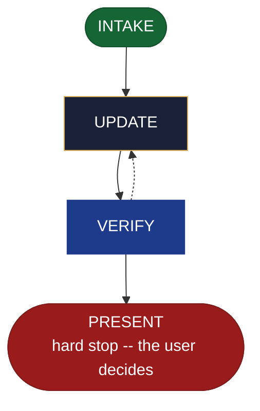

<!-- generated — do not edit; source: canonical/skills/aid-update-cicd/SKILL.md -->

## Frontmatter

- **`name`** — aid-update-cicd
- **`description`** — Revise the project's shipping (C8) Knowledge Base document -- pipeline stages and their order, triggers, environments and promotion, and the release flow -- plus any previously created outputs you name. Use this skill when the pipeline record already exists and a stage, trigger, environment or promotion rule has changed. Requires no design seed: the change you state in the run is a sufficient input. Reads and consumes a CI/CD seed when one is present in `.aid/design/`. When the C8 document does not yet exist, routes to `/aid-create-cicd`. To provision or change a resource the pipeline ships to, use `/aid-create-infra` or `/aid-update-infra`; to change a DATA pipeline rather than a delivery one, use `/aid-create-data-pipeline` or `/aid-update-data-pipeline`; to ship a built artifact now, use `/aid-deploy`. Produced by the aid-architect agent and independently verified by aid-reviewer (full verify). Allocates a work-NNN folder.
- **`allowed-tools`** — Read, Glob, Grep, Bash, Write, Edit, Agent
- **`argument-hint`** — &lt;change> -- what to revise in the delivery-pipeline record

[Definition: `canonical/skills/aid-update-cicd/SKILL.md`](https://github.com/AndreVianna/aid-methodology/blob/master/canonical/skills/aid-update-cicd/SKILL.md)

## Flow

## Source fragments

Every node in the chart above, in chart order, with the exact `canonical/` text it was derived from.

**1 · `INTAKE`** · _entry_

~~~~plaintext title="canonical/skills/aid-update-cicd/SKILL.md#L41-L62" wrap
## State: INTAKE

1. **Require a stated change.** Empty argument -> ask one bootstrapping question ("What should
   change in the delivery-pipeline record?") and wait.
2. **Allocate** through the Work Initiation Gate exactly as the contract's Allocation rule
   requires (`canonical/skills/aid-design/SKILL.md` INTAKE step 4 is the shape), with
   `initiator: aid-update-cicd`. `phase` is not driven.
3. **No seed is required.** The change stated in this run is a sufficient input, and this
   skill completes without a seed. **Read and consume one when present** at
   `.aid/design/cicd.md`, carrying its `## Current direction` into the destination and
   deleting it once realized.
4. **Resolve the destination by concern.** This skill binds concern **C8** (shipping &
   operation). Where a seed supplied a `## Destination`, use it; otherwise apply the concern
   rule here -- resolve C8 against `.aid/settings.yml` `knowledge.doc_set`, falling back to the
   C8 row of `canonical/aid/templates/kb-authoring/domain-doc-matrix.md` -- and **confirm the
   resolution with the user before writing**. Never resolve silently.
5. **Read the whole destination**, and note its `source:` field. Absent destination -> route to
   `/aid-create-cicd` and write nothing.
6. **Ask whether the user also wants production config this run.** Touching a workflow file is
   **opt-in per run and never the default**; the KB record is what this skill revises unless
   the user asks in this run.
7. **Classify complexity** for the `aid-architect` dispatch (verifier tier >= producer).
~~~~

[Source: `canonical/skills/aid-update-cicd/SKILL.md#L41-L62`](https://github.com/AndreVianna/aid-methodology/blob/master/canonical/skills/aid-update-cicd/SKILL.md#L41-L62) · [full step: `canonical/skills/aid-update-cicd/SKILL.md#L41-L64`](https://github.com/AndreVianna/aid-methodology/blob/master/canonical/skills/aid-update-cicd/SKILL.md#L41-L64)

**2 · `UPDATE`** · _step_

~~~~plaintext title="canonical/skills/aid-update-cicd/SKILL.md#L68-L78" wrap
## State: UPDATE

1. **Apply only the change the user named in this run**, to the owned C8 content, per the
   content rules below.
2. **Ask, every run, which derived outputs to update alongside this one.** This step is
   unconditional -- it runs on every invocation, and the answer is **stored nowhere**: no
   frontmatter backlink, no manifest, no registry, and no state carried between runs. The
   question is asked afresh each time.
3. **Write no tracking metadata** into any output this run touches -- no `derived-from`, no
   `source-doc`, no `generated-by`, no `aid-tracked` field, and no skill-attribution line.
4. **`source: generated` refuses.** A registered build script owns that content.
~~~~

[Source: `canonical/skills/aid-update-cicd/SKILL.md#L68-L78`](https://github.com/AndreVianna/aid-methodology/blob/master/canonical/skills/aid-update-cicd/SKILL.md#L68-L78) · [full step: `canonical/skills/aid-update-cicd/SKILL.md#L68-L80`](https://github.com/AndreVianna/aid-methodology/blob/master/canonical/skills/aid-update-cicd/SKILL.md#L68-L80)

**3 · `VERIFY`** · _loop-back_

~~~~plaintext title="canonical/skills/aid-update-cicd/SKILL.md#L84-L87" wrap
## State: VERIFY

**Full verify**, as `design-lifecycle.md` defines it. Not clean -> loop to UPDATE; the
3-cycle circuit breaker there escalates to IMPEDIMENT + `lifecycle: Blocked`.
~~~~

[Source: `canonical/skills/aid-update-cicd/SKILL.md#L84-L87`](https://github.com/AndreVianna/aid-methodology/blob/master/canonical/skills/aid-update-cicd/SKILL.md#L84-L87) · [full step: `canonical/skills/aid-update-cicd/SKILL.md#L84-L89`](https://github.com/AndreVianna/aid-methodology/blob/master/canonical/skills/aid-update-cicd/SKILL.md#L84-L89)

**4 · `PRESENT`** — hard stop -- the user decides · _exit_ · UNSPECIFIED

~~~~plaintext title="canonical/skills/aid-update-cicd/SKILL.md#L93-L97" wrap
## State: PRESENT (hard stop -- the user decides)

Set `lifecycle: Paused-Awaiting-Input`. Present the revision, say whether a workflow file was
touched and that it was asked for, name every output touched, and assert that a consumed seed
is gone.
~~~~

[Source: `canonical/skills/aid-update-cicd/SKILL.md#L93-L97`](https://github.com/AndreVianna/aid-methodology/blob/master/canonical/skills/aid-update-cicd/SKILL.md#L93-L97) · [full step: `canonical/skills/aid-update-cicd/SKILL.md#L93-L99`](https://github.com/AndreVianna/aid-methodology/blob/master/canonical/skills/aid-update-cicd/SKILL.md#L93-L99)
