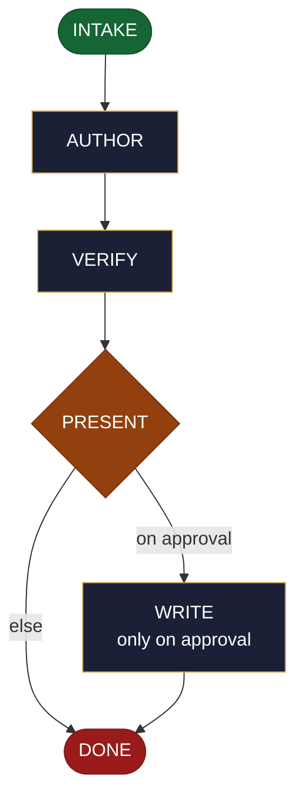

<!-- generated — do not edit; source: canonical/skills/aid-update-document/SKILL.md -->

## Frontmatter

- **`name`** — aid-update-document
- **`description`** — Update an EXISTING document NOW -- revise/extend a markdown doc, an ADR, a runbook, a changelog, a diagram, etc. -- in one pass. Reads the existing document first, then edits it, grounded in and accuracy-checked against the Knowledge Base (.aid/knowledge/) and the project source. It RESOLVES NOTHING: it drafts the change, you approve (with a diff shown), then it is written back. Produced by aid-tech-writer, verified by aid-reviewer. NEVER writes into .aid/knowledge/ (that is /aid-update-kb).
- **`allowed-tools`** — Read, Glob, Grep, Bash, Write, Edit, Agent
- **`argument-hint`** — &lt;document + change> -- which existing document to update, and how

[Definition: `canonical/skills/aid-update-document/SKILL.md`](https://github.com/AndreVianna/aid-methodology/blob/master/canonical/skills/aid-update-document/SKILL.md)

## Flow

## Source fragments

Every node in the chart above, in chart order, with the exact `canonical/` text it was derived from.

**1 · `INTAKE`** · _entry_

~~~~plaintext title="canonical/skills/aid-update-document/SKILL.md#L32-L49" wrap
## State: INTAKE

1. **Require a target document + a change.** Empty argument -> ask one bootstrapping
   question ("Which document should I update, and what change?") and wait.
2. **Locate + read the existing document.** If it cannot be resolved, ask (or, if the user
   meant a new doc, suggest `/aid-create-document`).
3. **Pick the path** (fast if the document + change are clear; guided otherwise) and
   **classify complexity** -> `aid-tech-writer` model/effort (sonnet/medium default; opus/high
   for a large rewrite). Verifier tier >= producer.
4. **Consult the Work Initiation Gate, then allocate the work folder + STATE.** First run
   the gate (`canonical/aid/templates/work-initiation-gate.md`):
   `bash canonical/aid/scripts/works/enumerate-works.sh` (main tree + every git worktree).
   Empty -> allocate, no prompt. Works exist -> ask new-vs-continuation; on **continuation**
   route to the chosen work's resume door and STOP (allocate nothing); on **new work**:
   create and enter the worktree per the gate's `§ 3a` step 2
   (`worktree-lifecycle.sh create <work-id> <name>`, STOP on a non-zero exit or empty path,
   else enter the resolved path), **then** allocate (`initiator: aid-update-document`;
   `phase` not driven).
~~~~

[Source: `canonical/skills/aid-update-document/SKILL.md#L32-L49`](https://github.com/AndreVianna/aid-methodology/blob/master/canonical/skills/aid-update-document/SKILL.md#L32-L49) · [full step: `canonical/skills/aid-update-document/SKILL.md#L32-L51`](https://github.com/AndreVianna/aid-methodology/blob/master/canonical/skills/aid-update-document/SKILL.md#L32-L51)

**2 · `AUTHOR`** · _step_

~~~~plaintext title="canonical/skills/aid-update-document/SKILL.md#L55-L59" wrap
## State: AUTHOR

Dispatch **`aid-tech-writer`** (clean context, tiered) to produce the **revised** document
(a draft in the work folder, not yet written back), grounded in and accurate to the KB +
project source, preserving the document's existing genre structure.
~~~~

[Source: `canonical/skills/aid-update-document/SKILL.md#L55-L59`](https://github.com/AndreVianna/aid-methodology/blob/master/canonical/skills/aid-update-document/SKILL.md#L55-L59) · [full step: `canonical/skills/aid-update-document/SKILL.md#L55-L61`](https://github.com/AndreVianna/aid-methodology/blob/master/canonical/skills/aid-update-document/SKILL.md#L55-L61)

**3 · `VERIFY`** · _step_

~~~~plaintext title="canonical/skills/aid-update-document/SKILL.md#L65-L69" wrap
## State: VERIFY

Same as `/aid-create-document`: mechanical grounding check + a clean-context **`aid-reviewer`**
adversarial check (accurate, complete, no fabrication, structure preserved) -> `grade.sh`
-> loop on failure (3-cycle circuit-breaker -> IMPEDIMENT + `lifecycle: Blocked`).
~~~~

[Source: `canonical/skills/aid-update-document/SKILL.md#L65-L69`](https://github.com/AndreVianna/aid-methodology/blob/master/canonical/skills/aid-update-document/SKILL.md#L65-L69) · [full step: `canonical/skills/aid-update-document/SKILL.md#L65-L71`](https://github.com/AndreVianna/aid-methodology/blob/master/canonical/skills/aid-update-document/SKILL.md#L65-L71)

**4 · `PRESENT`** — hard stop -- human final say · _decision_

~~~~plaintext title="canonical/skills/aid-update-document/SKILL.md#L75-L78" wrap
## State: PRESENT  (hard stop -- human final say)

Set `lifecycle: Paused-Awaiting-Input`. Present the revised document **as a diff against
the current file** + the target path. Await approval. Never writes `.aid/knowledge/`.
~~~~

[Source: `canonical/skills/aid-update-document/SKILL.md#L75-L78`](https://github.com/AndreVianna/aid-methodology/blob/master/canonical/skills/aid-update-document/SKILL.md#L75-L78) · [full step: `canonical/skills/aid-update-document/SKILL.md#L75-L80`](https://github.com/AndreVianna/aid-methodology/blob/master/canonical/skills/aid-update-document/SKILL.md#L75-L80)

**5 · `WRITE`** — only on approval · _step_

~~~~plaintext title="canonical/skills/aid-update-document/SKILL.md#L84-L87" wrap
## State: WRITE  (only on approval)

Write the revision back to the existing document (the diff was already reviewed at PRESENT).
Then optionally print handoffs (`/aid-update-kb`, `/aid-create*`, ...).
~~~~

[Source: `canonical/skills/aid-update-document/SKILL.md#L84-L87`](https://github.com/AndreVianna/aid-methodology/blob/master/canonical/skills/aid-update-document/SKILL.md#L84-L87) · [full step: `canonical/skills/aid-update-document/SKILL.md#L84-L89`](https://github.com/AndreVianna/aid-methodology/blob/master/canonical/skills/aid-update-document/SKILL.md#L84-L89)

**6 · `DONE`** · _exit_ · UNSPECIFIED

~~~~plaintext title="canonical/skills/aid-update-document/SKILL.md#L93-L95" wrap
## State: DONE

Set `lifecycle: Completed`, `updated` now, append a `## Lifecycle History` row.
~~~~

[Source: `canonical/skills/aid-update-document/SKILL.md#L93-L95`](https://github.com/AndreVianna/aid-methodology/blob/master/canonical/skills/aid-update-document/SKILL.md#L93-L95) · [full step: `canonical/skills/aid-update-document/SKILL.md#L93-L95`](https://github.com/AndreVianna/aid-methodology/blob/master/canonical/skills/aid-update-document/SKILL.md#L93-L95)
