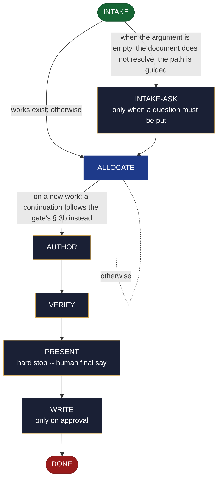

<!-- generated — do not edit; source: canonical/skills/aid-update-document/SKILL.md -->

## Frontmatter

- **`name`** — aid-update-document
- **`description`** — Revise or extend a document that already exists, in one pass. Use this skill when a document has drifted from the code, is missing a section, or needs a correction -- and you want the change drafted against the current source rather than written from memory. It reads the existing document first, then edits it, grounded in and accuracy-checked against the Knowledge Base (`.aid/knowledge/`) and the project source. It resolves nothing: it drafts the change and shows you a diff, and only after you approve is it written back. It never writes into `.aid/knowledge/` -- that is `/aid-update-kb`'s territory.
- **`allowed-tools`** — Read Glob Grep Bash Shell Terminal Write Edit Agent
- **`argument-hint`** — &lt;document + change> -- which existing document to update, and how

[Definition: `canonical/skills/aid-update-document/SKILL.md`](https://github.com/AndreVianna/aid-methodology/blob/master/canonical/skills/aid-update-document/SKILL.md)

## Flow

```mermaid
flowchart TB
  classDef aidNode color:#fff
  classDef aidEntry fill:#166534,stroke:#14532d,color:#fff
  classDef aidExit fill:#991b1b,stroke:#7f1d1d,color:#fff
  classDef aidDecision fill:#92400e,stroke:#78350f,color:#fff
  classDef aidLoopBack fill:#1e3a8a,stroke:#1e3a8a,color:#fff
  classDef aidStep fill:#1a2035,stroke:#d4a853,color:#f1f5f9
  n1(["INTAKE"])
  n2["INTAKE-ASK<br/>only when a question must be put"]
  n3["ALLOCATE"]
  n4["AUTHOR"]
  n5["VERIFY"]
  n6["PRESENT<br/>hard stop -- human final say"]
  n7["WRITE<br/>only on approval"]
  n8(["DONE"])
  n1 -->|"when the argument is empty, the document does not resolve, the path is guided"| n2
  n1 -->|"works exist; otherwise"| n3
  n2 --> n3
  n3 -. "otherwise" .- n3
  n3 -->|"on a new work; a continuation follows the gate's § 3b instead"| n4
  n4 --> n5
  n5 --> n6
  n6 --> n7
  n7 --> n8
  class n1 aidEntry
  class n2 aidStep
  class n3 aidLoopBack
  class n4 aidStep
  class n5 aidStep
  class n6 aidStep
  class n7 aidStep
  class n8 aidExit
  class n1 aidNode
  class n2 aidNode
  class n3 aidNode
  class n4 aidNode
  class n5 aidNode
  class n6 aidNode
  class n7 aidNode
  class n8 aidNode
```
## Source fragments

Every node in the chart above, in chart order, with the exact `canonical/` text it was derived from.

**1 · `INTAKE`** · _entry_

~~~~plaintext title="canonical/skills/aid-update-document/SKILL.md#L39-L51" wrap
## State: INTAKE

1. **Check the target and the change.** Note whether the argument is empty. Do not ask here.
2. **Locate + read the existing document.** Note whether it resolves; if it does not, INTAKE-ASK
   asks which document is meant (or suggests `/aid-create-document` for a new one).
3. **Pick the path** (fast if the document + change are clear; guided otherwise) and
   **classify complexity** -> `aid-tech-writer` model/effort (sonnet/medium default; opus/high
   for a large rewrite). Verifier tier >= producer.
4. **Check for works.** Run `bash .aid/runtime/scripts/works/enumerate-works.sh`
   (main tree + every git worktree). Note whether any exist. Do not prompt here.
5. **Read the design seed, if present.** If `.aid/design/document.md` exists, read it as
   prior context before drafting; it is an input, never a substitute, and is not modified
   by this run.
~~~~

[Source: `canonical/skills/aid-update-document/SKILL.md#L39-L51`](https://github.com/AndreVianna/aid-methodology/blob/master/canonical/skills/aid-update-document/SKILL.md#L39-L51) · [full step: `canonical/skills/aid-update-document/SKILL.md#L39-L54`](https://github.com/AndreVianna/aid-methodology/blob/master/canonical/skills/aid-update-document/SKILL.md#L39-L54)

**2 · `INTAKE-ASK`** — only when a question must be put · _step_

~~~~plaintext title="canonical/skills/aid-update-document/SKILL.md#L58-L60" wrap
## State: INTAKE-ASK  (only when a question must be put)

Ask one topic at a time, through the question protocol, in this order and only for what applies:
~~~~

[Source: `canonical/skills/aid-update-document/SKILL.md#L58-L60`](https://github.com/AndreVianna/aid-methodology/blob/master/canonical/skills/aid-update-document/SKILL.md#L58-L60) · [full step: `canonical/skills/aid-update-document/SKILL.md#L58-L69`](https://github.com/AndreVianna/aid-methodology/blob/master/canonical/skills/aid-update-document/SKILL.md#L58-L69)

**3 · `ALLOCATE`** · _loop-back_

~~~~plaintext title="canonical/skills/aid-update-document/SKILL.md#L73-L76" wrap
## State: ALLOCATE

Allocate the work through the gate: the Work Initiation Gate
(`.aid/runtime/templates/work-initiation-gate.md`).
~~~~

[Source: `canonical/skills/aid-update-document/SKILL.md#L73-L76`](https://github.com/AndreVianna/aid-methodology/blob/master/canonical/skills/aid-update-document/SKILL.md#L73-L76) · [full step: `canonical/skills/aid-update-document/SKILL.md#L73-L88`](https://github.com/AndreVianna/aid-methodology/blob/master/canonical/skills/aid-update-document/SKILL.md#L73-L88)

**4 · `AUTHOR`** · _step_

~~~~plaintext title="canonical/skills/aid-update-document/SKILL.md#L92-L96" wrap
## State: AUTHOR

Dispatch **`aid-tech-writer`** (clean context, tiered) to produce the **revised** document
(a draft in the work folder, not yet written back), grounded in and accurate to the KB +
project source, preserving the document's existing genre structure.
~~~~

[Source: `canonical/skills/aid-update-document/SKILL.md#L92-L96`](https://github.com/AndreVianna/aid-methodology/blob/master/canonical/skills/aid-update-document/SKILL.md#L92-L96) · [full step: `canonical/skills/aid-update-document/SKILL.md#L92-L98`](https://github.com/AndreVianna/aid-methodology/blob/master/canonical/skills/aid-update-document/SKILL.md#L92-L98)

**5 · `VERIFY`** · _step_

~~~~plaintext title="canonical/skills/aid-update-document/SKILL.md#L102-L106" wrap
## State: VERIFY

Same as `/aid-create-document`: mechanical grounding check + a clean-context **`aid-reviewer`**
adversarial check (accurate, complete, no fabrication, structure preserved) -> `grade.sh`
-> loop on failure (3-cycle circuit-breaker -> IMPEDIMENT, and the lifecycle set to `Blocked` through the writer).
~~~~

[Source: `canonical/skills/aid-update-document/SKILL.md#L102-L106`](https://github.com/AndreVianna/aid-methodology/blob/master/canonical/skills/aid-update-document/SKILL.md#L102-L106) · [full step: `canonical/skills/aid-update-document/SKILL.md#L102-L108`](https://github.com/AndreVianna/aid-methodology/blob/master/canonical/skills/aid-update-document/SKILL.md#L102-L108)

**6 · `PRESENT`** — hard stop -- human final say · _step_

~~~~plaintext title="canonical/skills/aid-update-document/SKILL.md#L112-L115" wrap
## State: PRESENT  (hard stop -- human final say)

The hard stop follows the ASK step of `skill-steps.md`. Present the revised document **as a diff against
the current file** + the target path. Await approval. Never writes `.aid/knowledge/`.
~~~~

[Source: `canonical/skills/aid-update-document/SKILL.md#L112-L115`](https://github.com/AndreVianna/aid-methodology/blob/master/canonical/skills/aid-update-document/SKILL.md#L112-L115) · [full step: `canonical/skills/aid-update-document/SKILL.md#L112-L117`](https://github.com/AndreVianna/aid-methodology/blob/master/canonical/skills/aid-update-document/SKILL.md#L112-L117)

**7 · `WRITE`** — only on approval · _step_

~~~~plaintext title="canonical/skills/aid-update-document/SKILL.md#L121-L125" wrap
## State: WRITE  (only on approval)

If the user declined, write nothing: the draft stays in the work folder, and the step goes on to
DONE. Otherwise write the revision back to the existing document (the diff was already reviewed at
PRESENT). Then optionally print handoffs (`/aid-update-kb`, `/aid-create*`, ...).
~~~~

[Source: `canonical/skills/aid-update-document/SKILL.md#L121-L125`](https://github.com/AndreVianna/aid-methodology/blob/master/canonical/skills/aid-update-document/SKILL.md#L121-L125) · [full step: `canonical/skills/aid-update-document/SKILL.md#L121-L127`](https://github.com/AndreVianna/aid-methodology/blob/master/canonical/skills/aid-update-document/SKILL.md#L121-L127)

**8 · `DONE`** · _exit_ · HALT

~~~~plaintext title="canonical/skills/aid-update-document/SKILL.md#L131-L133" wrap
## State: DONE

Finish through the writer: `bash .aid/runtime/scripts/execute/writeback-state.sh --pipeline --field Lifecycle --value Completed`, which also clears the saved skill and step.
~~~~

[Source: `canonical/skills/aid-update-document/SKILL.md#L131-L133`](https://github.com/AndreVianna/aid-methodology/blob/master/canonical/skills/aid-update-document/SKILL.md#L131-L133) · [full step: `canonical/skills/aid-update-document/SKILL.md#L131-L135`](https://github.com/AndreVianna/aid-methodology/blob/master/canonical/skills/aid-update-document/SKILL.md#L131-L135)
